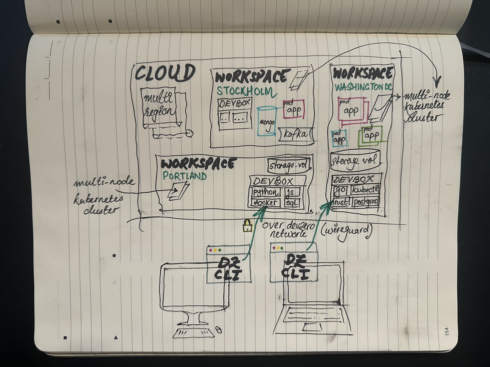

# Platform Overview

## What is DevZero?

DevZero is a [cloud development platform](https://www.devzero.io/cloud-development-environment) designed to help software engineers spend more time writing code and less time waiting on builds, troubleshooting dev [environments](references/terminology.md#environments), and fighting over shared resources.

With the DevZero platform, you can centrally define and manage cloud environment [specifications](references/terminology.md#recipe) for development, testing, CI, and more. This ensures that developer environments are always consistent, up-to-date, and secure.

Developers can use these [specifications](recipes/syntax.md) alongside our CLI to launch their own ephemeral, namespaced, and [extensible cloud environments](references/terminology.md#workspace). Developers can connect using any IDE of their choice or leverage a browser-based IDE/shell. We automatically take care of all the ergonomics, too, like shell config, dotfiles, and more, to ensure things match your preferences.

## How does it work?

<figure><figcaption>
The relationship between your computer and DevZero's workspaces and DevBoxes
</figcaption></figure>

The DevZero platform consists of the following key components:

* Management Plane:
  * The core of the DevZero system
  * Houses databases and Vault for secure secret storage
  * Includes an image registry and workspace builder
  * An API gateway that interfaces with the DevZero web console and headless clients
* Version Control Integration:
  * A GitHub application that connects to your chosen version control system
* Workspace Hosting:
  * Offers two options: a) Multi-tenant VPC b) Self-hosted VPC
  * Hosts workspaces within a virtual cluster
* Client-Side Tools:
  * Primarily consists of the DevZero CLI
  <!-- markdown-link-check-disable-next-line -->
  * Facilitates secure connectivity to workspaces via [Wireguard](https://www.wireguard.com)
* Identity Provider (IdP):
  * Utilizes Auth0 for secure, IdP-based authentication

## How can I learn more?

If you're ready to get hands-on, we recommend diving into the [quickstart.md](getting-started/quickstart.md "mention") guide. However, if you'd like to read a bit more, you can check out the [terminology.md](references/terminology.md "mention") reference sheet. You're also welcome to chat with us directly, the best way to get in touch is to email [support@devzero.io](mailto:support@devzero.io).

## Ready to Get Started?

Visit our dashboard ([devzero.io/dashboard](https://devzero.io/dashboard)) to create your free account and install our CLI. Then head to the [quickstart.md](getting-started/quickstart.md "mention") section of our docs.
