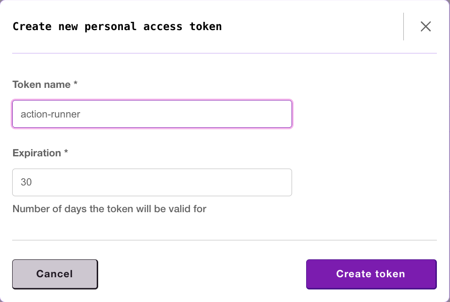
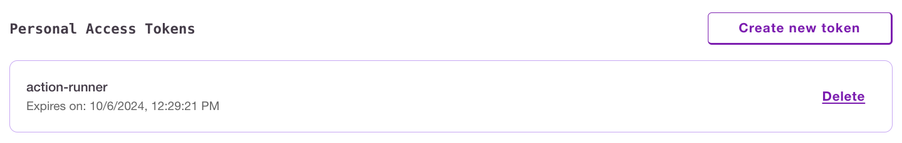

# Personal Access Tokens

## Managing Personal Access Tokens

To manage Personal access tokens, nagivate to [User Settings](https://www.devzero.io/dashboard/settings/user-settings) and find the "Personal Access Tokens" section

To create a token, click on "Create new token". Once the token is created, be sure to copy and save the token contents somewhere secure, it will not be shown again.
<figure><figcaption><p>Creating a devzero personal access token</p></figcaption></figure>

Deleting a token is performed in the same section.
<figure><figcaption><p>Creating a devzero personal access token</p></figcaption></figure>

## Using a personal access token

A personal access token can be used to authenticate the devzero cli. Simply log in passing the token contents via the `--token` flag. Upon token expiry, the cli will prompt to re-authenticate.


```
dz auth login --token <token contents>
```

