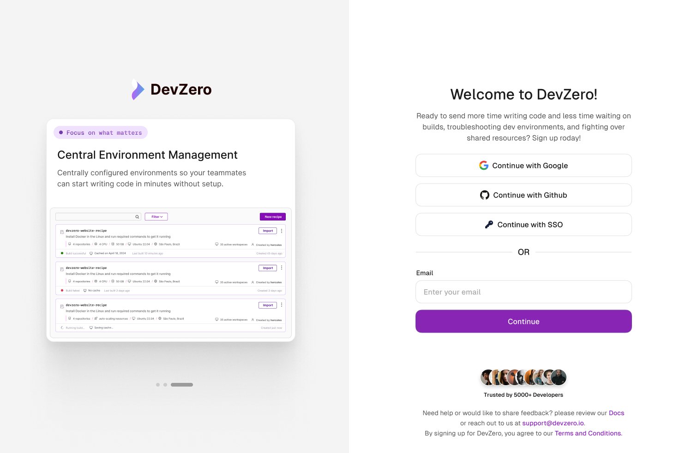

# Single Sign-on (SSO

Use-case:

- Using your company's SSO to control your team's login to the DevZero Platform

Many organizations use SSO to easily manage onboarding and offboarding of employees and contractors. Logging into your DevZero team can be placed behind your current SSO provider. Currently, corporate SSO support is in private beta. If you would like to enable SSO support for your account, send an email to [support@devzero.io](mailto:support@devzero.io) with the following information, we can enable SSO for your team!

1. Sign-on URL (might be the same as [2])
2. Issuer (might be the same as [1])
3. Public certificate
4. Signature method (eg: `RSA-SHA256`)
5. Digest method  (eg: `SHA256`)

<figure><figcaption>
Login page when SSO is enabled
</figcaption></figure>

You can also create this as a [secret GitHub Gist](https://gist.github.com/) and send us a link!


**Note...** We are aware that depending on the SSO provider you use, we might have to provide you a couple bits of information to put in your SSO Admin Portal. We will reach out to you if that's the case!

