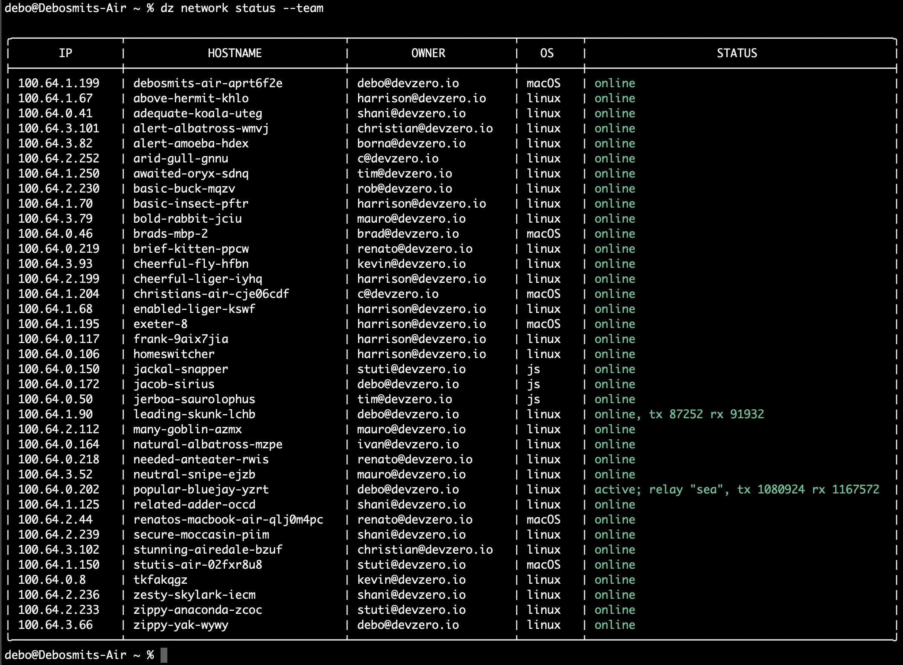

# Network Status

Currently, to see the peers that are present within your DevZero network, run

```
dz network status
```


<figure><figcaption><p>dz network status</p></figcaption></figure>

To view all the peers in your team, run

```
dz network status --team
```


<figure><figcaption><p>dz network status --team</p></figcaption></figure>
