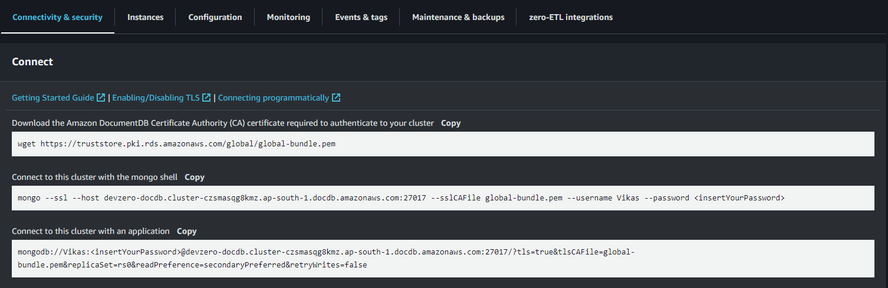

# DocumentDB
Connecting to DocumentDB running in the private subnet of AWS VPC from DevBox.

## Architecture Diagram:


## Existing Database

### Step 1: Accessing DocumentDB from a DevBox

1. Follow the [Connecting to AWS](../../existing-network/connecting-to-aws.md) guide.
2. Go to **Amazon DocumentDB > Clusters > your cluster.**
3. Select **Connectivity and Security.**

4. Go to **DevBox**.
5. Connect mongo repository using:
```
echo -e "[mongodb-org-4.0] \nname=MongoDB Repository\nbaseurl=https://repo.mongodb.org/yum/amazon/2013.03/mongodb-org/4.0/x86_64/\ngpgcheck=1 \nenabled=1 \ngpgkey=https://www.mongodb.org/static/pgp/server-4.0.asc" | sudo tee /etc/yum.repos.d/mongodb-org-4.0.repo
```
6. Now install mongo shell using:
```
sudo apt install -y mongodb-org-shell
```
7. Download certificate using:
```
wget https://truststore.pki.rds.amazonaws.com/global/global-bundle.pem
```
8. Now connect to mongo using:
```
mongo --tls --host <your-cluster-endpoint>:27017 --tlsCAFile /path/to/global-bundle.pem --username <your-username> --password <your-password>
```
where the cluster endpoint will be available in **Configuration** section. 


## New Database

### Step 1: Creating an DocumentDB Instance

1. Follow the [Connecting to AWS](../../existing-network/connecting-to-aws.md) guide.
2. Go to **Amazon DocumentDB > Create a DocumentDB cluster.**
3. Select **Instance Based Cluster.**
4. Set **Username and Password**
5. Turn on **Show advanced settings**.
6. In the **Network settings** , choose the VPC created earlier, private subnet group and assign a security group which has inbound access to only VPC.
7. Click **Create cluster**.

### Step 2: Accessing DocumentDB from DevBox

1. Go to **DevBox**.
2. Connect to mongo shell repo using:
```
echo -e "[mongodb-org-4.0] \nname=MongoDB Repository\nbaseurl=https://repo.mongodb.org/yum/amazon/2013.03/mongodb-org/4.0/x86_64/\ngpgcheck=1 \nenabled=1 \ngpgkey=https://www.mongodb.org/static/pgp/server-4.0.asc" | sudo tee /etc/yum.repos.d/mongodb-org-4.0.repo
```
3. When its complete, install the mongo shell:
```
sudo apt install -y mongodb-org-shell
```
4. Now download certificate using:
```
wget https://truststore.pki.rds.amazonaws.com/global/global-bundle.pem
```
5. Connect to mongo using:
```
mongo --tls --host <your-cluster-endpoint>:27017 --tlsCAFile /path/to/global-bundle.pem --username <your-username> --password <your-password>
```
where the cluster endpoint will be available in **Configuration** section. So now DevBox will be connected with the database.


