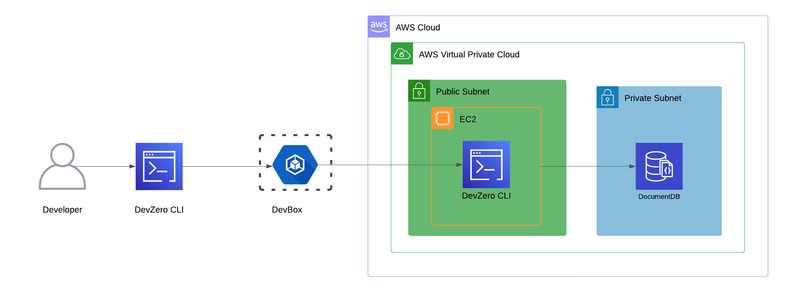
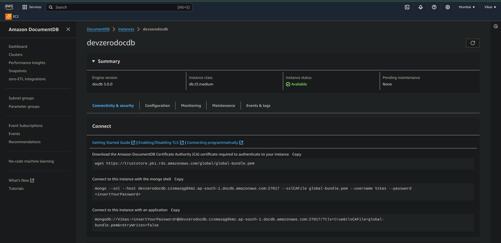
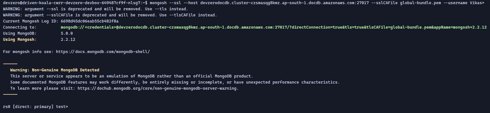
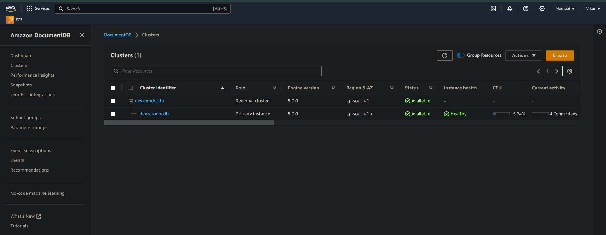

# DocumentDB

Connecting to DocumentDB running in the private subnet of AWS VPC from your DevBox.

## Architecture Diagram



## Existing Database

### Step 1: Accessing DocumentDB from a DevBox

1. Follow the [Connecting to AWS](../../existing-network/connecting-to-aws.md) guide.
2. Go to **Amazon DocumentDB > Clusters > Your Cluster**.
3. Select **Connectivity & Security**. You will see the commands and DocumentDB hostname for accessing it.



4. In your **DevBox**, import the MongoDB public GPG key:

```
curl -fsSL https://www.mongodb.org/static/pgp/server-7.0.asc | \
   sudo gpg -o /usr/share/keyrings/mongodb-server-7.0.gpg \
   --dearmor
```

5. Add MongoDB package repository source:

```
echo "deb [ arch=amd64,arm64 signed-by=/usr/share/keyrings/mongodb-server-7.0.gpg ] https://repo.mongodb.org/apt/ubuntu jammy/mongodb-org/7.0 multiverse" | sudo tee /etc/apt/sources.list.d/mongodb-org-7.0.list
```

6. Reload local package database:

```
sudo apt-get update
```

7. Install MongoDB:

```
sudo apt-get install -y mongodb-org
```

8. Download the certificate:

```
wget https://truststore.pki.rds.amazonaws.com/global/global-bundle.pem
```

9. Connect to the database:

```
mongosh --tls --host <your-cluster-endpoint>:27017 --tlsCAFile /path/to/global-bundle.pem --username <your-username> --password <your-password>
```

where the cluster endpoint will be available in **Connectivity & Security** section.



## New Database

### Step 1: Creating a DocumentDB Instance

1. Follow the [Connecting to AWS](../../existing-network/connecting-to-aws.md) guide.
2. Go to **Amazon DocumentDB > Create Cluster**.
3. Select **Instance Based Cluster**.
4. In the **Configuration** section choose **Instance Class**, number of instances for your cluster.
5. Set **Username and Password**.
6. Turn on **Show advanced settings**.
7. In the **Network settings** , choose the VPC where your bastion host is running, subnet group and assign a security group which has inbound access to only VPC.
8. Click **Create cluster**.



### Step 2: Accessing DocumentDB from a DevBox

1. In your **DevBox**, import the MongoDB public GPG key:

```
curl -fsSL https://www.mongodb.org/static/pgp/server-7.0.asc | \
   sudo gpg -o /usr/share/keyrings/mongodb-server-7.0.gpg \
   --dearmor
```

2. Add MongoDB package repository source:

```
echo "deb [ arch=amd64,arm64 signed-by=/usr/share/keyrings/mongodb-server-7.0.gpg ] https://repo.mongodb.org/apt/ubuntu jammy/mongodb-org/7.0 multiverse" | sudo tee /etc/apt/sources.list.d/mongodb-org-7.0.list
```

3. Reload local package database:

```
sudo apt-get update
```

4. Install MongoDB:

```
sudo apt-get install -y mongodb-org
```

5. Download the certificate:

```
wget https://truststore.pki.rds.amazonaws.com/global/global-bundle.pem
```

6. Connect to the database:

```
mongosh --tls --host <your-cluster-endpoint>:27017 --tlsCAFile /path/to/global-bundle.pem --username <your-username> --password <your-password>
```

where the cluster endpoint will be available in **Connectivity & Security** section.


