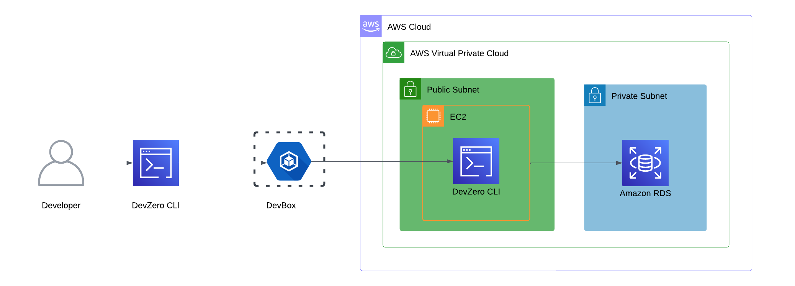
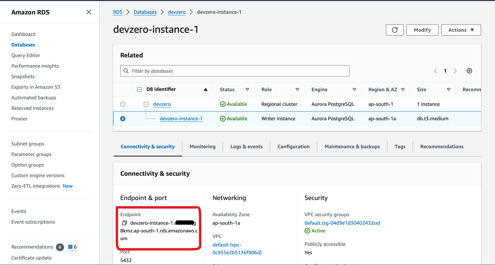
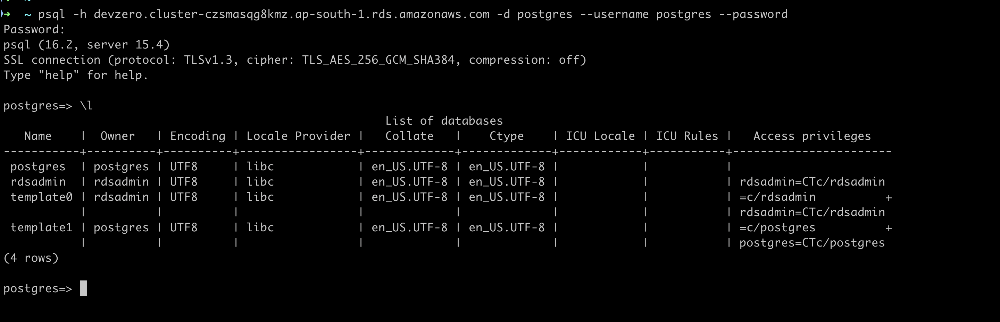
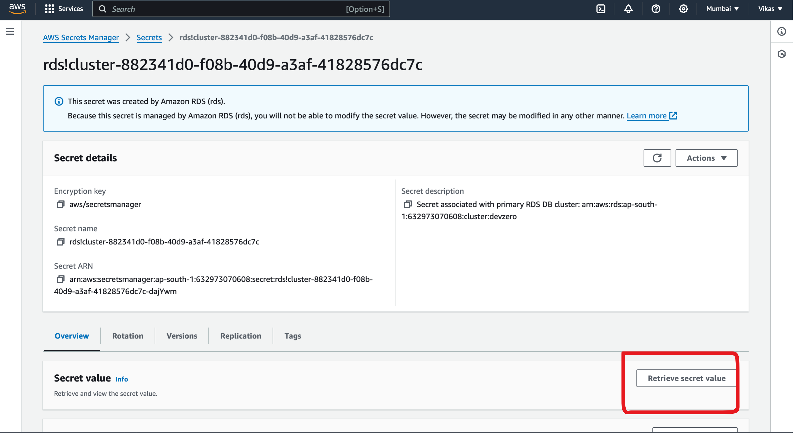

# RDS

Connecting to an RDS running in the private subnet of AWS VPC to your DevBox.

## Architecture Diagram



## Existing Database

### Step 1: Accessing RDS from a DevBox

1. Follow the [Connecting to AWS](../../existing-network/connecting-to-aws.md) guide.
2. Go to **RDS > DB Instances > DB Name.**
3. Select **Connectivity and Security.**
4. Copy **Endpoint**.



5. Go to **DevBox**.
6. Connecting to the Database.

Run the following commands as per the RDS Database Engine:



To install the mysql client cli:

```
sudo apt install mysql-client
```

To access the database:


```
mysql -h <RDS Endpoint> -u <Username> --database <Database Name> -p
```




To install the psql client cli:

```
sudo apt install postgresql-client
```

To access the database:


```
psql -h <RDS Endpoint> --username <Username> -d <Database Name> --password
```






## New Database

### Step 1: Creating an RDS Instance

1. Follow the [Connecting to AWS](../../existing-network/connecting-to-aws.md) guide.
2. Go to **RDS > DB Instances.**
3. Select **Standard Create.**
4. Use one of the [DB Engine](https://docs.aws.amazon.com/AmazonRDS/latest/UserGuide/USER_PerfInsights.Overview.Engines.html) in the Configuration.
5. Choose the **Available Versions** of the **Database.**
6. Choose the **Templates** based on your use-case. It could be **Production** or **Dev/Test.**
7. Scroll Down to the **Settings** and specify your **Database Name.**
8. Choose **Cluster Storage Configuration** and **DB Instance Class.**
9. Go to **Connectivity > VPC.**
10. Choose your **VPC** , **DB Subnet Group** and **Security Group.** Make sure the specified **Security Group** allows inbound db connections.
11. Click on **Create Database.**


### Step 2: Accessing RDS from DevBox

1. You will see two endpoints. Copy **Writer Type Endpoint.**
2. Go to the **Secrets Manager.**



3. Click on **Retrieve Secret Value**. This secret is storing your Database **Username** and **Password.**
4. Go to **DevBox.**
5. Connecting to the Database:\
   `psql -h <RDS Endpoint> --username <Username> -d <Database Name> --password`


