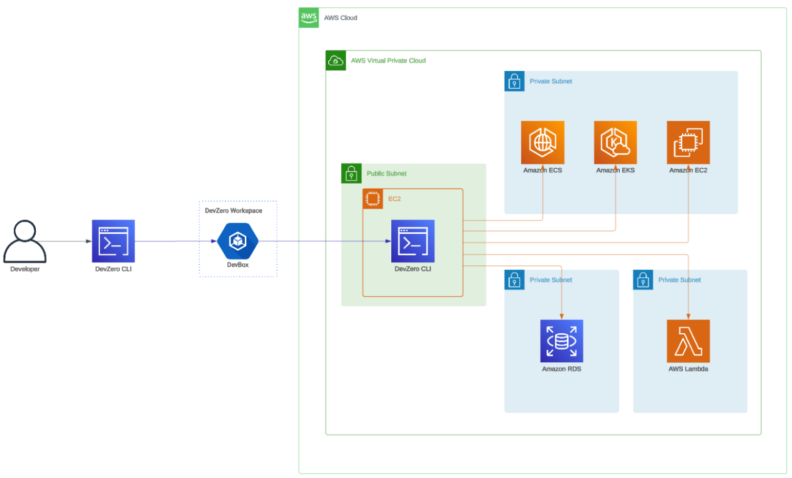
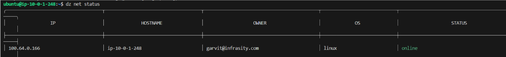
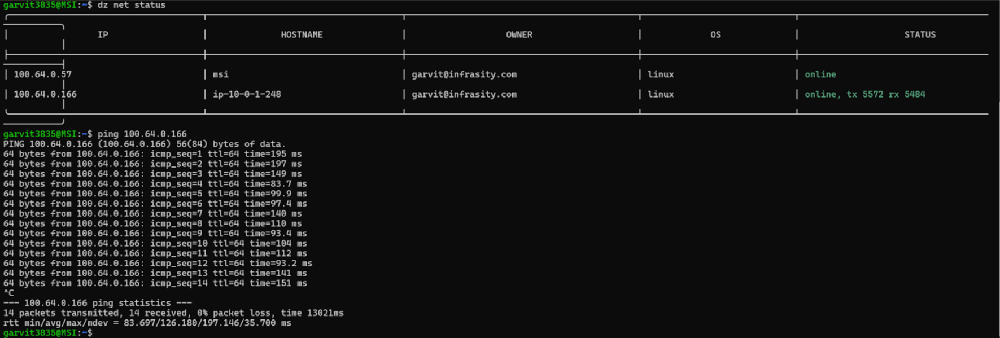

# AWS RDS Peering:
Connecting a managed AWS service (RDS in this case) in the private subnet of an AWS Virtual Private Cloud to the DevZero workspace and accessing it from the local machine.

## Architecture Diagram:




## Step1: Creating an AWS VPC:
Set up a VPC using this [AWS Documentation](https://docs.aws.amazon.com/vpc/latest/userguide/what-is-amazon-vpc.html).

## Step2: Setting Up AWS RDS:

Create the RDS database instance on a private subnet of the VPC using the following [guide](https://docs.aws.amazon.com/AmazonRDS/latest/UserGuide/USER_CreateDBInstance.html).

## Step3: Connecting the Local Machine to DevZero Workspace:

1. If you are using Windows, set up WSL2 using this [guide](https://docs.microsoft.com/en-us/windows/wsl/install), else skip to the next step.

2. Install the DevZero CLI from the script:

    ```bash
    curl -fsSL https://get.DevZero.io | sh
    ```

3. Log in to your account by executing:

    ```bash
    dz auth login
    ```

4. Connect to the DevZero network by running the script:

    ```bash
    sudo dz network connect --hostname=<some_name>
    ```

5. Verify the updated network by running:

    ```bash
    dz net status
    ```

    


## Step4: Creating a Bastion Host/EC2 Proxy Route/Jump Host:

1. Create an EC2 Bastion Host and use a Linux distribution AMI.
    - During the instance creation, choose the same VPC where your RDS is running.
    - After selecting the VPC, select the public subnet. If it does not exist, you have to create it by following this [AWS Guide](https://docs.aws.amazon.com/vpc/latest/userguide/VPC_Scenario1.html).
    - This EC2 instance will only be used as the Bastion Host, so it doesn’t need high compute power. You can use `t2.micro` as the instance type or choose based on your use case.
    - In the security group configuration, open port 22 for inbound SSH connection from the source (`0.0.0.0/0`). Don’t worry about the security; it's just for configuring EC2 as a bastion host. Later, you can remove this port from the security group inbound rules.
    - Don’t forget to download the KeyPair which you’ll be creating during the EC2 instance creation, OR feel free to choose the existing KeyPair if you already have the private key on your local.

2. Once you are done with the instance creation, move to the next step for setting up DevZero on the Bastion Host.

## Step5: Setup DevZero Environment on the Bastion Host:

1. Take the login into the EC2 instance using SSH. Use the below commands to perform this step:

    ```bash
    chmod 600 /path/to/key-pair.pem
    ssh -i /path/to/key-pair.pem ec2-user@hostname
    ```

2. After connecting to the EC2, install the DevZero CLI. Follow the below command:

    ```bash
    sudo curl -fsSL https://get.DevZero.io | sh
    ```

3. Enable IP forwarding to access resources on private subnets:

    ```bash
    echo 'net.ipv4.ip_forward = 1' | sudo tee -a /etc/sysctl.conf 
    echo 'net.ipv6.conf.all.forwarding = 1' | sudo tee -a /etc/sysctl.conf 
    sudo sysctl -p /etc/sysctl.conf
    ```

4. Connect to the DevZero network:

    ```bash
    sudo dz net connect --ssh --advertise-routes=<vpc-cidr> --hostname=<mysql-rds>
    ```

5. Verify the updated network by running:

    ```bash
    dz net status
    ```


6. Ping the local machine through the DevZero Network by running:

    ```bash
    ping <DevZero-IP-Address>
    ```

    


7. Finally, connect to the RDS Server through the DevZero Network with your local machine:

    ```bash
    psql -h <DevZero-IP-Address / Public IP> -U <your_database_user> -d <your_database_name>
    ```


NOTE: The AWS RDS in the Screenshot is currently public due to some bugs in DZ. It will be updated as soon as the bug gets fixed
