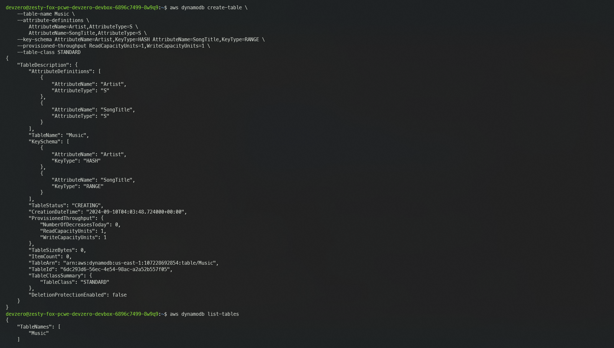

# AWS DynamoDB

This guide explains connecting to an AWS DynamoDB service running on AWS infrastructure from your DevBox.

## Architecture Diagram


<!-- markdown-link-check-disable-next-line -->
[AWS DynamoDB](https://docs.aws.amazon.com/amazondynamodb/latest/developerguide/Introduction.html) is a serverless, NoSQL, fully managed database. You will connect through the `aws` cli tool by first authenticating into your AWS Cloud account and then accessing the contents of the DynamoDB Service.

## DynamoDB Service

If you already have a DynamoDB, you can follow the steps below to access its content from the DevBox.

### Step 1: Creating a Recipe

First, we need to create a recipe for the workspace:

1. Go to the [DevZero Dashboard > Recipes](https://www.devzero.io/dashboard/recipes) and click on **New recipe**.
2. Enter the recipe name and click on **Create a recipe**.
3. Now use the below-provided snippet to create a recipe for your workspace:


```
version: "3"
build:
  steps:
    - type: apt-get
      packages: ["build-essential", "curl", "git", "nano", "software-properties-common", "ssh", "sudo", "tar", "unzip", "vim", "wget", "zip"]
    - type: command
      command: |
        curl "https://awscli.amazonaws.com/awscli-exe-linux-x86_64.zip" -o "awscliv2.zip"
        unzip awscliv2.zip
        sudo ./aws/install
```


4. Click on **Save and Build** and when the build is successful, click on **Publish**.

### Step 2: Creating a Workspace

1. Go to the [Devzero Dashboard > Workspaces](https://www.devzero.io/dashboard/workspaces) by clicking **New workspace**.
2. Enter the workspace name and click on **Select from recipe library**.
3. Select the recipe you just created above and click on **Select**.
4. Click on **Launch**, and your workspace will be ready shortly.

### Step 3: Setting up AWS CLI

Now, this is where the real task begins. After downloading the `aws' cli package, we will need to authenticate with our AWS account. To do so, follow the below steps:

1. Go to AWS Dashboard, and on the top right corner, click on the drop-down menu and select **Security credentials**.
2. Under the **Access Keys** section, click on **Create Access Key** and agree to the **Terms and Conditions**.
3. Click `create access key` and note down the **Secret Access Key** as this will only be shown once.
4. Go to your DevBox and use the following command to configure the `aws` cli:


```
aws configure
```


5. Enter the **Access Key** and **Secret Access Key** when prompted.
6. Enter your default **Region** of choice, and your `aws` cli setup will be completed.

### Step 4: Accessing the Database Service

Now, with the above steps, your AWS DynamoDB connections are completed, and you can check that with the following command:


```
aws dynamodb list-tables
```



