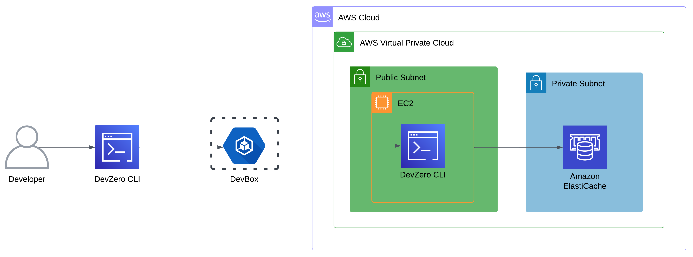
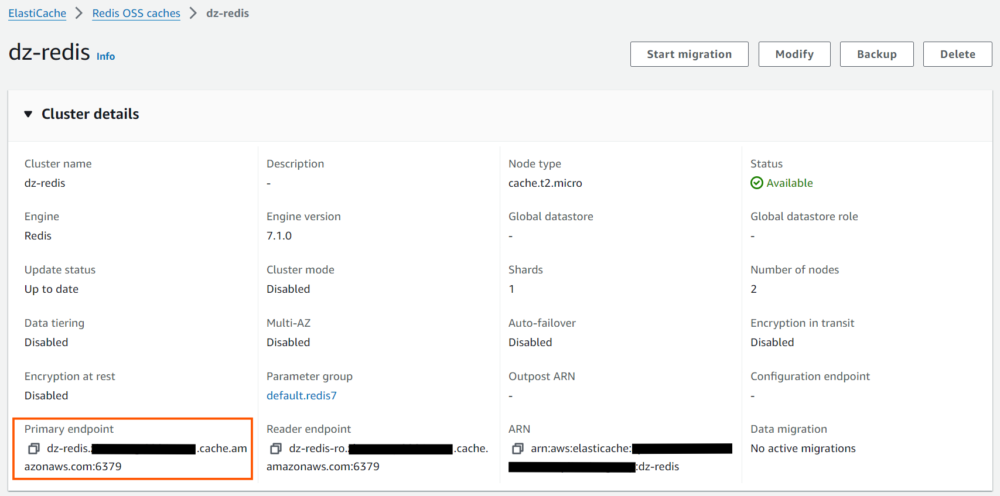
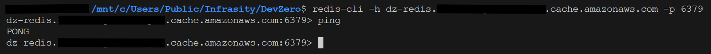

# ElastiCache

Connecting to ElastiCache running in the private subnet of AWS VPC from your DevBox.

## Architecture Diagram:



## Prerequisites:

- Follow [Connecting to AWS](../../existing-network/connecting-to-aws.md) guide.

## Existing ElastiCache Cluster

### Step 1: Accessing ElastiCache from a DevBox

1. Go to **Amazon ElastiCache > Redis/Memcached > Your Cluster**.
2. Select **Configuration & Security**.
3. Copy **Primary endpoint**.



4. Go to your **DevBox** and connect to Cache.

Run the following commands as per the Elasticache:



To install the Redis CLI:

```sh
sudo apt install redis-tools
```

To access the cluster:


```sh
redis-cli -h <redis-endpoint> -p <port>
```




To install the Memcached CLI:

```sh
sudo apt install libmemcached-tools
```

To access the cluster:


```sh
memcstat --servers=<memcached-endpoint>:<port>
```







## New ElastiCache Cluster

### Step 1: Creating an ElastiCache Cluster

1. Follow the [Connecting to AWS](../../existing-network/connecting-to-aws.md) guide.
2. Go to **Amazon ElastiCache > Create.**
3. Select **Design your own cache.**
4. Select **Cluster cache** in the **Creation method.**
5. Refer to [ElastiCache Documentation](https://docs.aws.amazon.com/elasticache/) for the Configuration.
6. Scroll Down to the **Cluster info** and specify your **Cluster Name.**
7. Choose the **Engine Version** and **Node Type** in the **Cluster settings.**
8. Go to **Connectivity** section and choose your **VPC** and **Subnet group.**
9. In the next section, choose the **Security Group.** Make sure the specified **Security Group** allows inbound connection from the VPC and click on **Create.**

### Step 2: Accessing Elasticache from DevBox
1. Go to your ElastiCache and copy **Primary endpoint.**


2. Go to **DevBox.** and connect to Cache:

```sh
redis-cli -h <Redis Endpoint> -p <Port>
```


