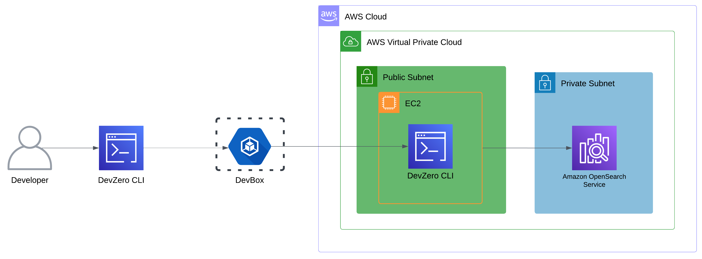
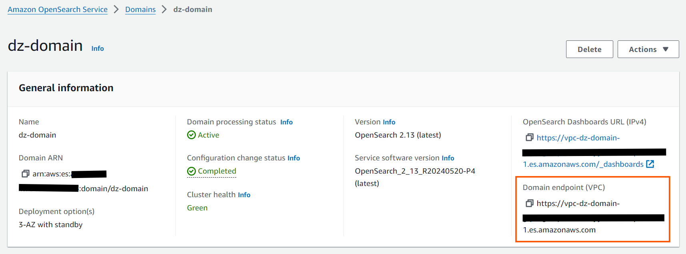
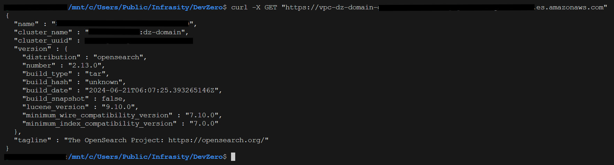

# OpenSearch

Connecting to OpenSearch running in the private subnet of AWS VPC from your DevBox.

## Architecture Diagram



## Prerequisites

- Follow [Connecting to AWS](../../existing-network/connecting-to-aws.md) guide.

## Existing OpenSearch Service

### Step 1: Accessing OpenSearch from a DevBox

1. Go to **Amazon OpenSearch Service > Domains**.
2. Select your domain and copy your **Domain Endpoint**.



3. Go to your **DevBox** and connect to Service:


```
curl -X GET "<opensearch-endpoint>"
```




## New OpenSearch Service

### Step 1: Creating an OpenSearch Service

1. Go to **Amazon OpenSearch Service > Create domain.**
2. Give a unique **Domain name.**
3. Select **Standard create** in the **Creation method.**
4. Use the default configurations for creating the service.
5. Keep the **Data nodes** according to your requirements.
6. Go to **Network** section and choose your **VPC** and **Subnets.**
7. In the next section, choose the **Security Group.** Make sure the specified **Security Group** allows inbound connection from the VPC
8. Click on **Create.**

### Step 2: Accessing OpenSearch from DevBox

1. Go to your OpenSearch and copy **Domain endpoint.**


2. Go to your **DevBox** and connect to Service:


```
curl -X GET "<opensearch-endpoint>"
```



