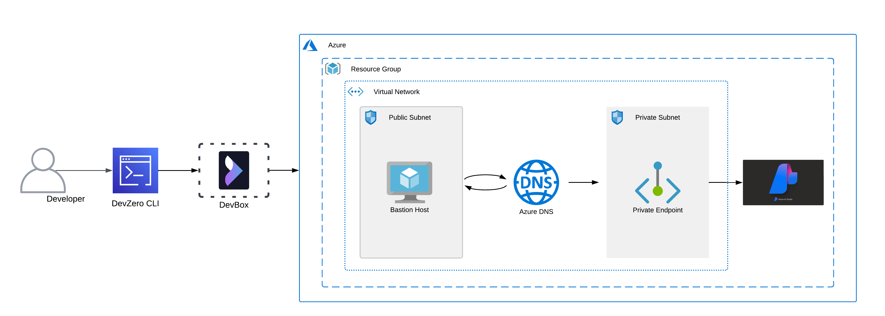
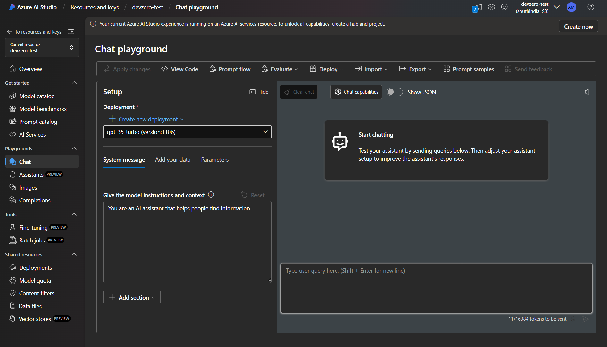
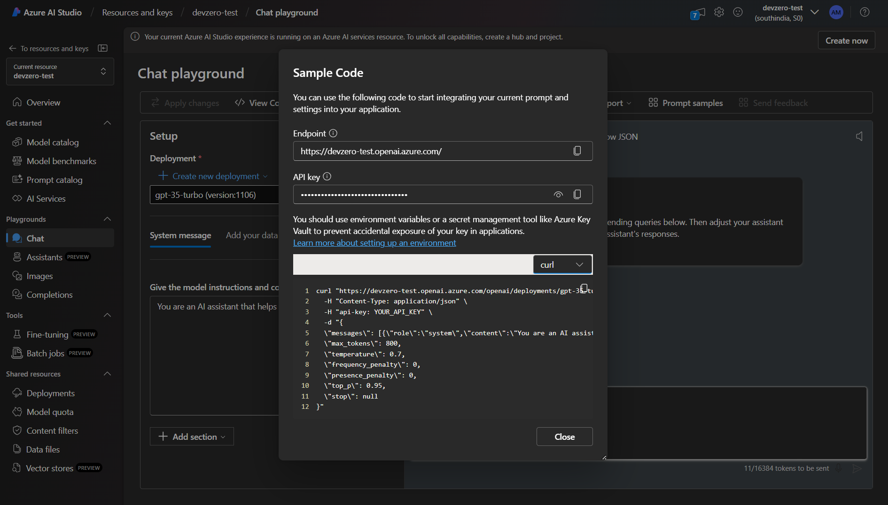
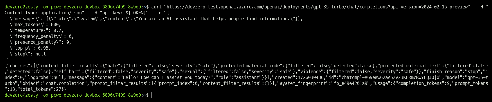
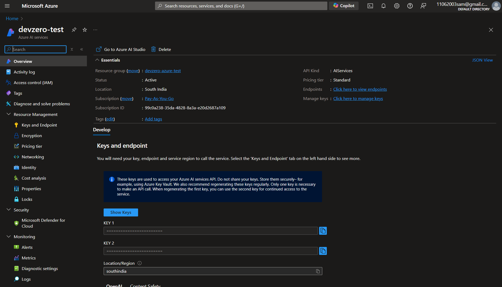

# Azure AI Services

This guide explains connecting to an Azure AI service running on Azure infrastructure from your DevBox.

## Architecture Diagram



<!-- markdown-link-check-disable-next-line -->
[Azure AI Services](https://azure.microsoft.com/en-us/products/ai-services/) is a suite of cloud-based artificial intelligence (AI) services that help developers and organizations create intelligent, cutting-edge, market-ready, and responsible applications with out-of-the-box and pre-built tools, APIs, and models.

This connection between the Azure AI Service Playground and your DevBox would occur by setting up a bastion host that advertises the private routes to your DevZero network so you can access the private service through network tunneling. You must also set up a DNS Private Resolver to access the AI Services's Private Endpoint from your DevBox.

## Prerequisites

1. Before you begin, follow the [Connecting to Azure](../../existing-network/connecting-to-azure.md) guide to set up the Bastion Host to access your private Azure services.
2. Following the above criteria, follow the [Setting up DNS Private Resolver](./setting-up-dns-private-resolver.md) guide to access the DNS Private Zones.

## Existing Azure AI Services

To connect to an Azure AI Playground, ensure it is within the same **Resource Group** containing the Bastion Host.

### Step 1: Creating a Recipe

First, we need to create a recipe for the workspace:

1. Go to the [DevZero Dashboard > Recipes](https://www.devzero.io/dashboard/recipes) and click on **New recipe**.
2. Enter the recipe name and click on **Create a recipe**.
3. Now use the below-provided snippet to create a recipe for your workspace:


```
version: "3"

build:
  steps:
    - type: apt-get
      packages: ["build-essential", "curl", "git", "nano", "software-properties-common", "ssh", "sudo", "tar", "unza ip", "vim", "wget", "zip"]
    - type: command
      command: |
        sudo curl -sL https://aka.ms/InstallAzureCLIDeb | sudo bash
```


4. Click on **Save and Build** and when the build is successful, click on **Publish**.

### Step 2: Creating a Workspace

1. Go to the [Devzero Dashboard > Workspaces](https://www.devzero.io/dashboard/workspaces) and click on **New workspace**.
2. Enter the workspace name and click on **Select from recipe library**.
3. Select the recipe you just created and click on **Select**.
4. Click on **Launch**, and your workspace will be ready shortly.

### Step 3: Creating a Private Endpoint

To access the service privately, we need to restrict public access and assign it a private endpoint:

1. Go to [Azure Portal](https://portal.azure.com) and open your AI Service.
2. Go to the **Networking** section and click on `Disabled` under the **Allow access from** section.
3. Go to the **Private endpoint connections** tab and click on **Private Endpoint**.
4. After that, go to **Networking > Private endpoint connections** and click on **Private endpoint**.
5. Choose your **Resource group** and enter the instance name.
6. Click **Resource** and select your desired `Target sub-resource` for your private endpoint. Remember that if you have more than one sub-resource type, you need to create a separate endpoint for each one.
7. Click on **Virtual Network** and select your Virtual Network (VNET), which houses the bastion host and DNS Private Resolver.
8. Select a compatible subnet, then click on **Next**, and leave the rest of the settings as default.
9. Click on **Create**, and your Private Endpoint will be created.

### Step 4: Accessing the AI Services

Now follow the below steps to access the AI Services on your DevBox:

<!-- markdown-link-check-disable-next-line -->
1. Open [Azure AI Studio](https://ai.azure.com/resource/playground) and click on **Create New Deployment**.



2. Choose a base or fine-tuned model and modify the configurations according to your needs.
3. Click on **Deploy** to create and deploy the model to your playground.
4. Select the **Deployment** you just created and click on **View Code**.



5. Copy the API Key and export it to your environmental variables using the following command:


```
export TOKEN=<api-key>
```


6. Below that, you will find code snippets for several languages and frameworks. For this guide, we will demonstrate the secure connection with `curl`.
7. Copy the code snippet and place it in your **TOKEN** environmental variable.
8. A successful connection will show the same output as below.



## New AI Services

If you need to make a new AI Services and access it through DevBox, then follow the below steps:

### Step 1: Creating an AI Services

Firstly, you must set up the DNS Private Resolver by following the [Setting up DNS Private Resolver](./setting-up-dns-private-resolver.md) guide.

After the steps mentioned earlier are completed, you may go ahead and create a file share for AI Services by following these steps:

1. Go to **Home > AI Services** and click on **Create**.
2. In the **Basics** section, select the **Resource group** you previously selected for your **VNET**.
3. Then enter your **Region**, **Name**, and **Pricing tier**.
4. In the **Networking** section click on `Disabled` and then click on **Add Private Endpoint**.
5. Choose your **Resource group** and enter the instance name.
6. Click **Resource** and select your desired `Target sub-resource` for your private endpoint. Remember that if you have more than one sub-resource type, you need to create a separate endpoint for each one.
7. Click on **Virtual Network** and select your Virtual Network (VNET), which houses the bastion host and DNS Private Resolver.
8. Select a compatible subnet, then click on **Next**, and leave the rest of the settings as default.
9. Click on **Create**, and your Private Endpoint will be created.
10. After setting up the private endpoint, click on **Review + Create** and click on **Create**.



### Step 2: Creating a Recipe

First, we need to create a recipe for the workspace:

1. Go to the [DevZero Dashboard > Recipes](https://www.devzero.io/dashboard/recipes) and click on **New recipe**.
2. Enter the recipe name and click on **Create a recipe**.
3. Now use the below-provided snippet to create a recipe for your workspace:


```
version: "3"

build:
  steps:
    - type: apt-get
      packages: ["build-essential", "curl", "git", "nano", "software-properties-common", "ssh", "sudo", "tar", "unzip", "vim", "wget", "zip"]
    - type: command
      command: |
        sudo curl -sL https://aka.ms/InstallAzureCLIDeb | sudo bash
```


4. Click on **Save and Build** and when the build is successful, click on **Publish**.

### Step 3: Creating a Workspace

1. Go to the [Devzero Dashboard > Workspaces](https://www.devzero.io/dashboard/workspaces) and click on **New workspace**.
2. Enter the workspace name and click on **Select from recipe library**.
3. Select the recipe you just created and click on **Select**.
4. Click on **Launch**, and your workspace will be ready shortly.

### Step 4: Accessing the AI Services

Now follow the below steps to access the AI Services on your DevBox:

<!-- markdown-link-check-disable-next-line -->
1. Open [Azure AI Studio](https://ai.azure.com/resource/playground) and click on **Create New Deployment**.


2. Choose a base or fine-tuned model and modify the configurations according to your needs.
3. Click on **Deploy** to create and deploy the model to your playground.
4. Select the **Deployment** you just created and click on **View Code**.


5. Copy the API Key and export it to your environmental variables using the following command:


```
export TOKEN=<api-key>
```


6. Below, you will find code snippets for several languages and frameworks. This guide will demonstrate the secure connection with `curl`.
7. Copy the code snippet and place it in your **TOKEN** environmental variable.
8. A successful connection will show the same output as below.


