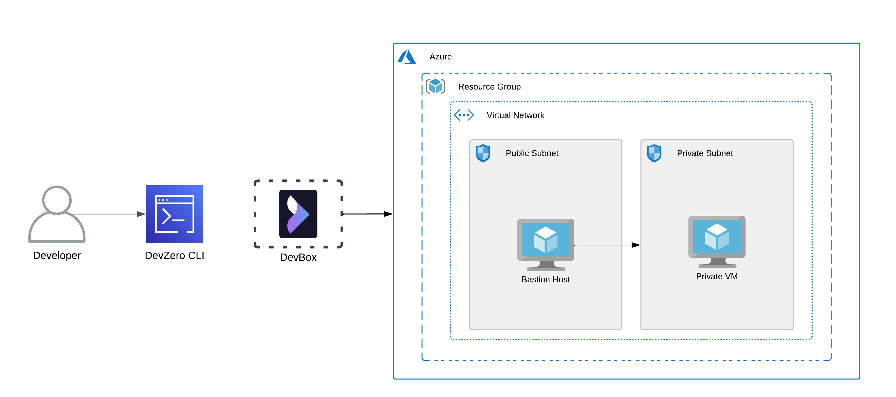
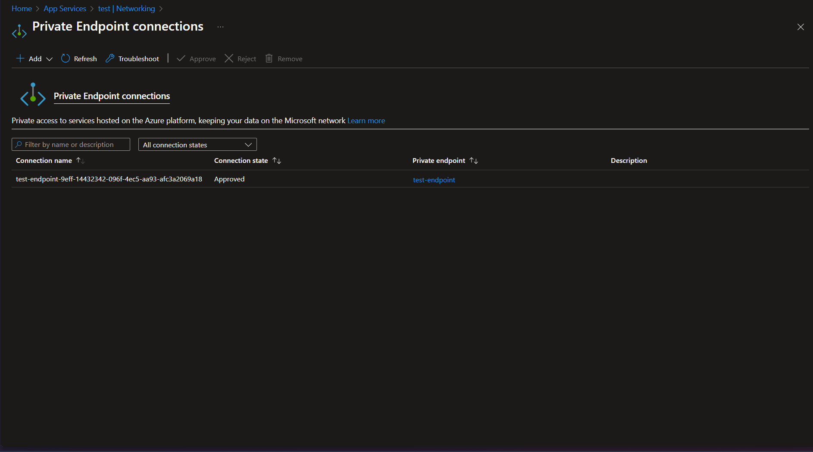
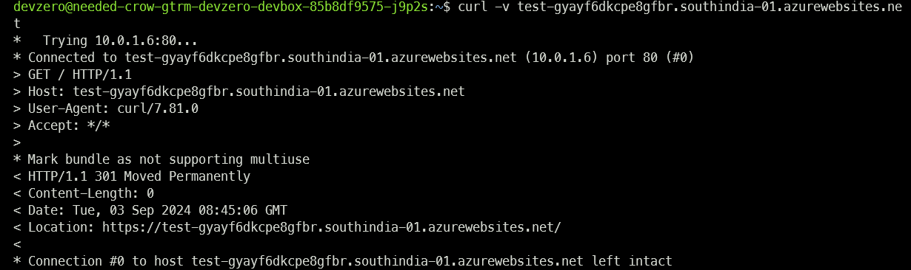

# Azure App Services

You are connecting to a App Service running on your Azure infrastructure from your DevBox.

## Architecture Diagram



Here, you will connect to a virtual machine running in a private subnet from your DevBox. This would be done by setting up a bastion host that advertises the VNET CIDR to your DevZero network so that you can access the private service through the network tunneling.

## Prerequisites

1. Before you begin, follow the [Connecting to Azure](../../existing-network/connecting-to-azure.md) guide to set up the Bastion Host to access your private Azure services.
2. Following the above criteria, follow the [Setting up DNS Private Resolver](./setting-up-dns-private-resolver.md) guide to access the DNS Private Zones.

## Existing Azure App Services

To connect to a App Service running in the private subnet, ensure it is within the same **Resource Group** and **VNET** containing the Bastion Host.

### Step 1: Creating a Private Endpoint

1. Navigate to **Networking** and open **Private Endpoints** page.
2. Click on **Add > Express** and then enter the name of your private endpoint.
3. Then select the VNET and a compatible subnet. Turn on the **Integrate with private DNS zone** option.
4. Click on **Ok** and your private connection for your private web app will be deployed.



### Step 2: Accessing virtual machine from DevBox

1. Go to **DevBox**.
2. Copy the **Default domain** of the **App Service** you want to access.
3. Connect to the **App Service**:


```
curl -X GET <default-domain>
```




## New Azure App Service




If you need to make a new App Service running in a private subnet and access it through DevZero's network, then follow the below steps:

### Step 1: Creating a Web App Service

1. Go to **Home > App Services** and click on **Create > Web App**.
2. In the **Basics** section, select the resource group you previously selected for your VNET.
3. Enter the **Name** of the web app, choose the **Publishing Model** between **Code**, **Container**.




4. Select your **Runtime Stack**, **Operating System**, **Region** and then configure your **Pricing Plans** accordingly.
5. In the **Container** page, choose Choose your desired Image source between Quickstart images, Azure Container Registry, and Other registry.
5. For this guide, we will be working with Quickstart images. Then select or input the Image for your container.
6. In the **Networking** section, choose the **off** option under the **Enable public access** section.
7. Click on **Review + Create** and then click on **Create**.
8. After the app is deployed, open to the app service you just created, then navigate to **Deployment > Deployment Center**.
9. Select a **Code Source** and then enter the **Organisation**, **Repository**, and **branch** name. After you are done with your configuration, click on **Save**.
10. Navigate to **Networking** and open **Private Endpoints** page.
11. Click on **Add > Express** and then enter the name of your private endpoint.
12. Then select the VNET and a compatible subnet. Turn on the **Integrate with private DNS zone** option.
13. Click on **Ok** and your private connection for your private web app will be deployed.





4. Select your **Operating System**, **Region** and then configure your **Pricing Plans** accordingly.
5. In the **Deployment** page, choose whether you want to enable **Continuous deployment** or not. If enabled, Enter your GitHub Repository details for your source code such as **Organization** name, **Repository** name, and **Branch**.
6. In the **Networking** section, choose the **off** option under the **Enable public access** section.
7. Click on **Review + Create** and then click on **Create**.
8. After the web app is created, navigate to **Networking** and open **Private Endpoints** page.
9. Click on **Add > Express** and then enter the name of your private endpoint.
10. Then select the VNET and a compatible subnet. Turn on the **Integrate with private DNS zone** option.
11. Click on **Ok** and your private connection for your private web app will be deployed.








If you need to make a new App Service with database integration, then follow the below steps:

### Step 1: Creating a Web App + Database Service

1. Go to **Home > App Services** and click on **Create > Web App + Database**.
2. In the **Basics** section, select the resource group you previously selected for your VNET.
3. Enter the **Web App** name, and **Runtime** stack.
4. After this, select the database **Engine**, **Server name**, and **Database name**.
5. Select the **Azure Cache for Redis** option if you want to and then choose your **Hosting plan**.
6. Click on **Review + Create** and click on **Create**. 
7. After the app is deployed, open to the app service you just created, then navigate to **Deployment > Deployment Center**.
8. Select a **Code Source** and then enter the **Organisation**, **Repository**, and **branch** name. After you are done with your configuration, click on **Save**.
9. Navigate to **Networking** and open **Private Endpoints** page.
10. Click on **Add > Express** and then enter the name of your private endpoint.
11. Then select the VNET and a compatible subnet. Turn on the **Integrate with private DNS zone** option.
12. Click on **Ok** and your private connection for your private web app will be deployed.




### Step 2: Accessing virtual machine from DevBox

1. Go to **DevBox**.
2. Copy the **Default domain** of the **App Service** you want to access.
3. Connect to the **App Service**:


```
curl -X GET <default-domain>
```



