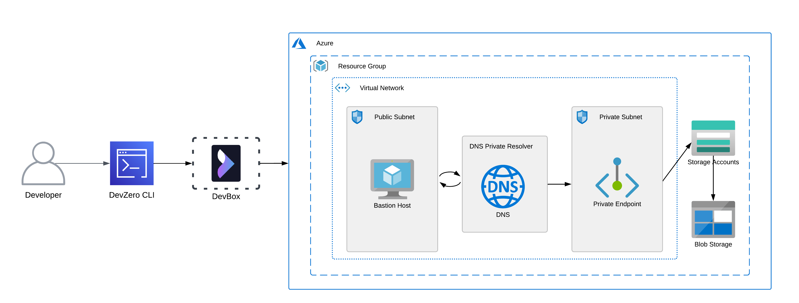
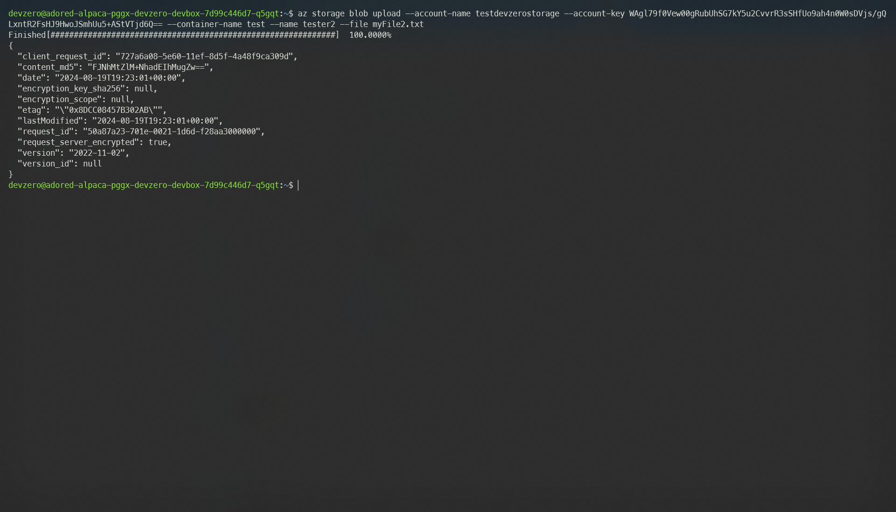
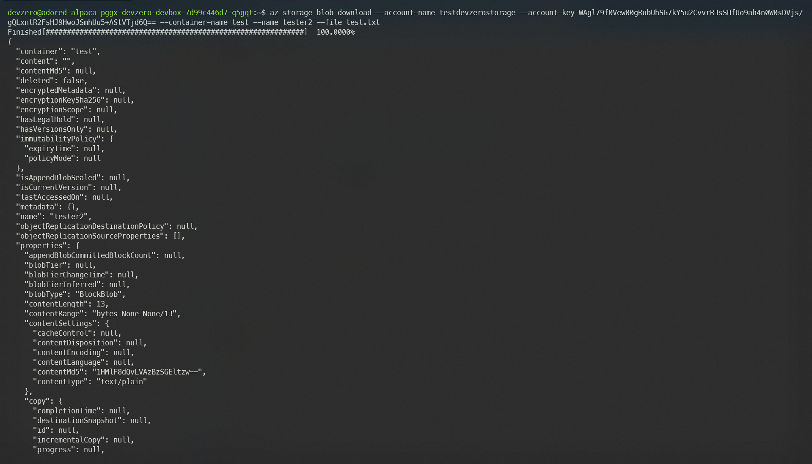
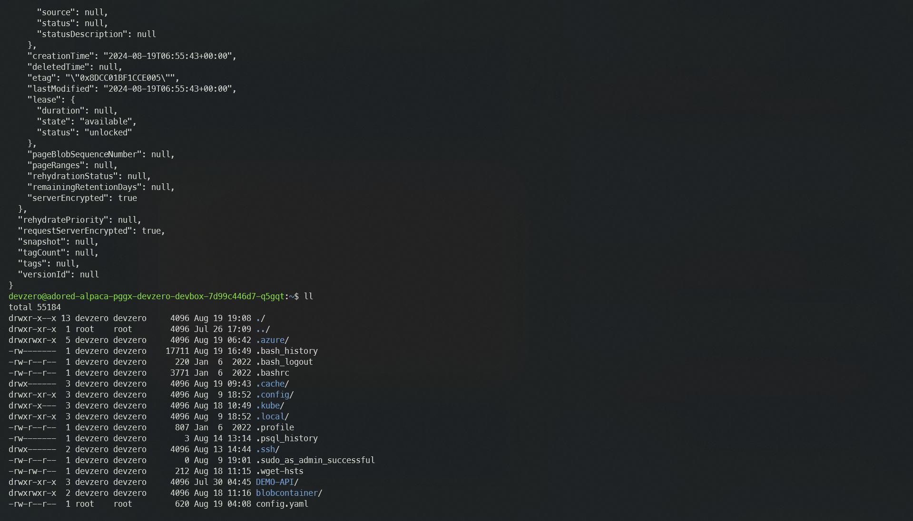
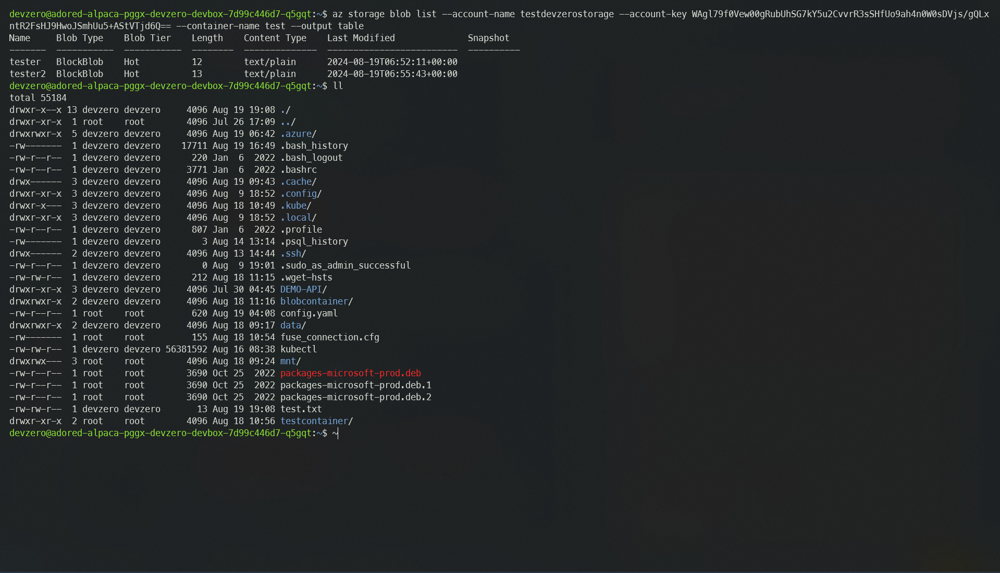

# Azure Blob Storage

Connecting to a Azure Blob Storage (Container) from your DevBox.

## Architecture Diagram



Here, you will connect to a Blob Storage from your DevBox. This would be done by setting up a bastion host that advertises the private routes to your DevZero network so that you can access the private service through network tunneling. You must also set up a DNS Private Resolver to access the Blob Storage's Private Endpoint from your DevBox.

## Prerequisites

1. Before you begin, follow the [Connecting to Azure](../../existing-network/connecting-to-azure.md) guide to set up the Bastion Host to access your private Azure services.
2. Following the above criteria, follow the [Setting up DNS Private Resolver](./setting-up-dns-private-resolver.md) guide to access the DNS Private Zones.
3. After successfully setting up the DNS Private Resolver, follow the [Configuring Storage Account](./configuring-storage-account.md) guide to access the storage account endpoint.

## Existing Azure Blob Storage

To connect to a Storage Account, ensure it is within the same **Resource Group** containing the Bastion Host.

### Step 1: Accessing the Blob Storage

Now follow the below steps to access the Blob Storage on your DevBox:

1. Go to DevBox and install the Azure CLI tool using the following command:


```bash
sudo curl -sL https://aka.ms/InstallAzureCLIDeb | sudo bash
```


2. Login into your Azure account using the `login` command:


```bash
az login
```


3. After you have completed your authentication, go to **Home > Storage Accounts** and select your storage account.
4. Then go to the **Security + Networking > Access Keys** section and note down either of the two access keys presented to you.
5. After you have acquired the access key, you may use the following command to Upload, Download, or list the blob in the container:




To Upload a file as Blob to the container, use the following command:


```bash
az storage blob upload \
    --account-name <storage-account> \
    --account-key <access-key> \
    --container-name <container> \
    --name myFile.txt \
    --file myFile.txt \
```








To Download a Blob from the container, use the following command:


```bash
az storage blob download \
    --account-name <storage-account> \
    --account-key <access-key> \
    --container-name <container> \
    --name myFile.txt \
    --file myFile.txt \
```









To list all the blobs in the container, use the following command:


```bash
az storage blob list \
    --account-name <storage-account> \
    --account-key <access-key> \
    --container-name <container> \
    --output table
```







## New Blob Storage

If you need to make a new Blob Storage and access it through DevZero's network, then follow the below steps:

### Step 1: Creating a Storage Account

Firstly, you need to follow the [Connecting to Storage Account](./connecting-to-storage-account.md) guide to create a new storage account and configure it. After the setup is completed, you also need to set up the DNS Private Resolver by following the [Setting up DNS Private Resolver](./setting-up-dns-private-resolver.md) guide.

After the above mentioned steps are completed, you may go ahead and create a container for Blob Storage by following these steps:

1. Go to **Home > Storage Accounts** and click on your storage account.
2. Go to the **Data Storage** tab and click on **Containers**.
3. Create a new container by entering the container name and clicking on **Create**.
4. After creating the container, go to the **Security + Networking > Access Keys** section and note down either access key.

### Step 2: Accessing the Blob Storage

After creating the container, you must install and authenticate your Azure CLI to easily access Blob Storage. To do so, you may follow the below steps:

1. Go to DevBox and install the Azure CLI tool using the following command:


```bash
sudo curl -sL https://aka.ms/InstallAzureCLIDeb | sudo bash
```


2. Login into your Azure account using the `login` command:


```bash
az login
```


3. You may use the following command to Upload, Download, or list the Blob in the container:




To Upload a file as Blob to the container, use the following command:


```bash
az storage blob upload \
    --account-name <storage-account> \
    --account-key <access-key> \
    --container-name <container> \
    --name myFile.txt \
    --file myFile.txt \
```







To Download a file from the container, use the following command:


```bash
az storage blob download \
    --account-name <storage-account> \
    --account-key <access-key> \
    --container-name <container> \
    --name myFile.txt \
    --file myFile.txt \
```







To list all the blobs in the container, use the following command:


```bash
az storage blob list \
    --account-name <storage-account> \
    --account-key <access-key> \
    --container-name <container> \
    --output table
```





