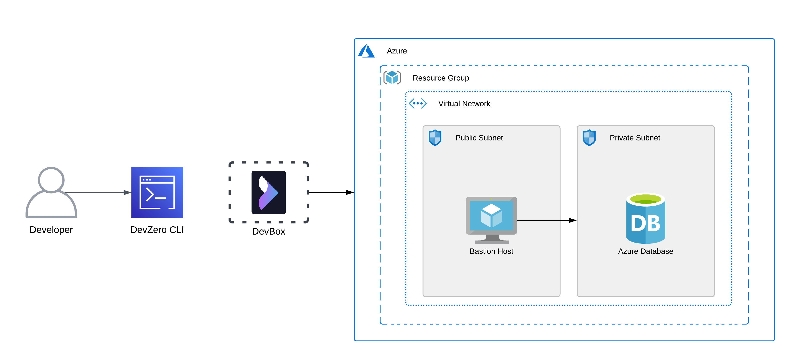
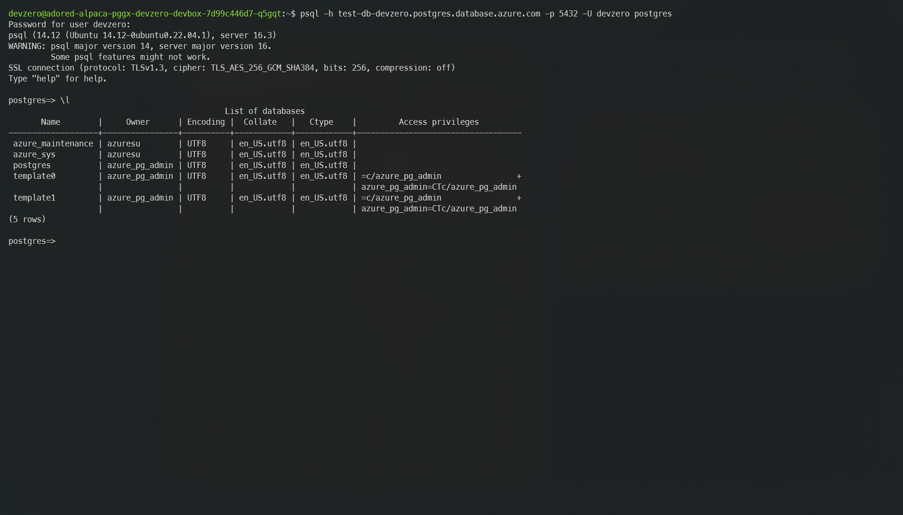
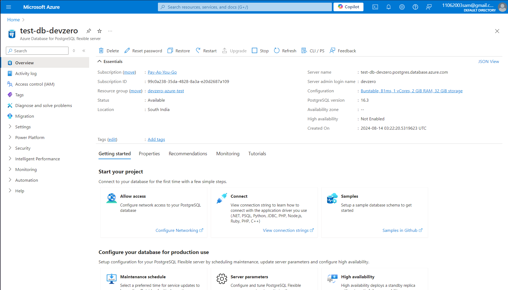

# Azure Database

You are connecting to a Azure database instance running in the private subnet of Azure Virtual Network (VNET) from your DevBox.

## Architecture Diagram



Here, you will connect to a private Azure database instance from your DevBox. This would be done by setting up a bastion host that advertises the private routes to your DevZero network so that you can access the private service through network tunneling.

## Prerequisites

Before you begin, follow the [Connecting to Azure](../../existing-network/connecting-to-azure.md) guide to set up the Bastion Host to access your private Azure services.

## Existing Azure Database

To connect to a database running in the private subnet, ensure it is within the same **Resource Group** and **VNET** containing the Bastion Host.

If the above criteria is followed then follow the [Setting up DNS Private Resolver](./setting-up-dns-private-resolver.md) guide to access the DNS Private Zones.

Now follow the below steps to access the Database instance on your DevBox:

1. Go to **DevBox**.
2. To Setup Database client and connect to the instance, follow these steps:




To install the mysql client cli:

```
sudo apt install mysql-client
```

To access the database:


```
mysql -h <Endpoint> -u <Username> --database <Database-Name> -p
```




To install the psql client cli:

```
sudo apt install postgresql-client
```

To access the database:


```
psql -h <Endpoint> --username <Username> -d <Database-Name> --password
```






## New Azure Database

If you need to make a new database running in a private subnet and access it through DevZero's network, then follow the below steps:

### Step 1: Creating a Database




1. Go to **Home > Azure Database for MySQL servers** and click on **Create**.
2. In the **Basics** section, select the **Resource group** you previously selected for your **VNET**.
3. Then input your database **Server name**, **Region** and the desired **MySQL version**.

*Remember to select the region where your VNET resides.*

4. Under the **Authentication** section, Enter your **Admin Username** and **password**.
5. Go to the **Networking** page and under **Network connectivity** choose **Private access (VNet Integration)** option as we need to make the instance private.
6. In the **Virtual Network** section, select the **VNET** and **Private Subnet**.
7. Click on Review + Create and click on Create to create the database.





1. Go to **Home > Azure Database for PostgresSQL servers** and click on **Create**.
2. In the **Basics** section, select the **Resource group** you previously selected for your **VNET**.
3. Then input your database **Server name**, **Region** and the desired **PostgresSQL version**.

*Remember to select the region where your VNET resides.*

4. Under the **Authentication** section, Enter your **Admin Username** and **password**.
5. Go to the **Networking** page and under **Network connectivity** choose **Private access (VNet Integration)** option as we need to make the instance private.
6. In the **Virtual Network** section, select the **VNET** and **Private Subnet**.
7. Click on **Review + Create** and click on **Create** to create the database.






After creating the database, you need to follow the [Setting up DNS Private Resolver](./setting-up-dns-private-resolver.md) guide to access the DNS Private Zones which houses your database's private domain endpoint for easy access.

### Step 2: Connecting to the database from DevBox

Now you just need to follow the below steps to install the database clients and connect to DevBox:

1. Go to **DevBox**.
2. To Setup Database client and connect to the instance, follow the steps:




To install the mysql client cli:

```
sudo apt install mysql-client
```

To access the database:


```
mysql -h <Endpoint> -u <Username> --database <Database-Name> -p
```




To install the psql client cli:

```
sudo apt install postgresql-client
```

To access the database:


```
psql -h <Endpoint> --username <Username> -d <Database-Name> --password
```





