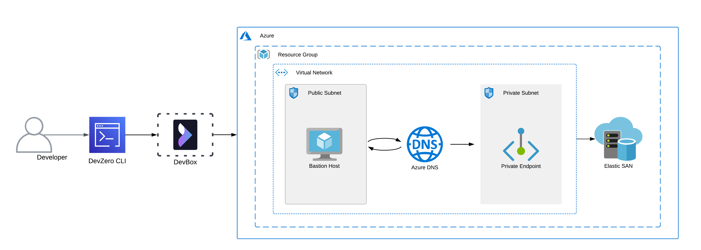
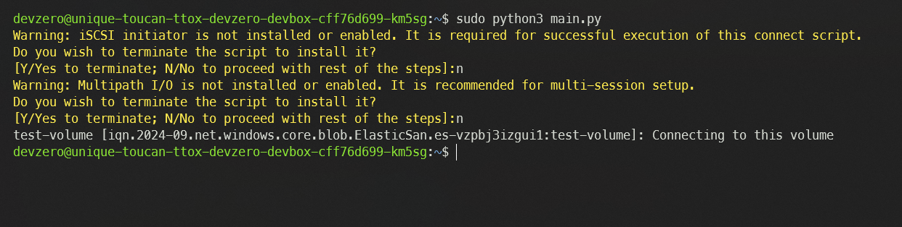
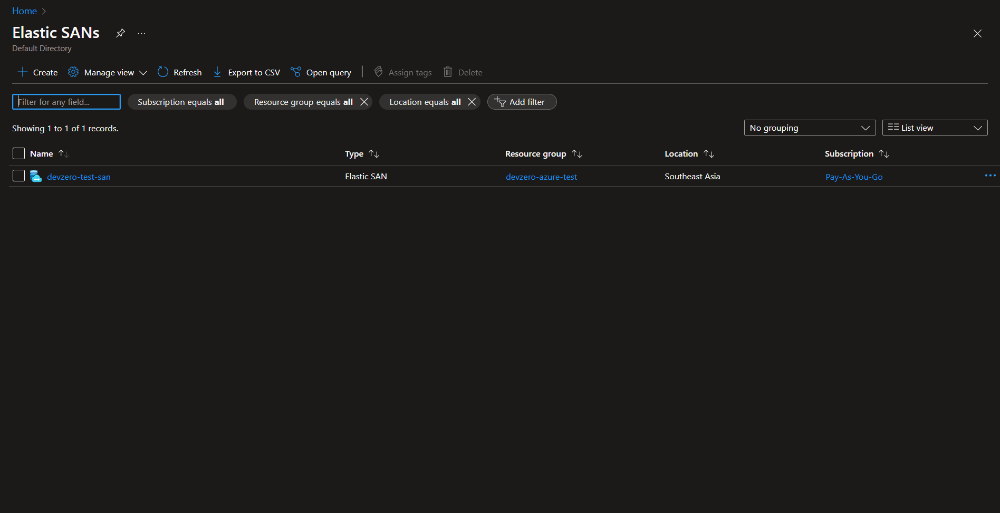

# Azure Elastic SAN

You connect to an Azure Elastic SAN Service running on Azure infrastructure from your DevBox.

## Architecture Diagram



<!-- markdown-link-check-disable-next-line -->
[Azure Elastic SAN](https://learn.microsoft.com/en-us/azure/storage/elastic-san/elastic-san-introduction) is a fully integrated solution that simplifies deploying, scaling, managing, and configuring a SAN while also offering built-in cloud capabilities like high availability. This connection will occur by setting up a bastion host that advertises the private routes to your DevZero network so you can access the private service through network tunneling. You must also set up a DNS Private Resolver to access the Elastic SAN's Private Endpoint from your DevBox.

## Prerequisites

1. Before you begin, follow the [Connecting to Azure](../../existing-network/connecting-to-azure.md) guide to set up the Bastion Host to access your private Azure services.
2. Following the above criteria, follow the [Setting up DNS Private Resolver](./setting-up-dns-private-resolver.md) guide to access the DNS Private Zones.

## Existing Azure Elastic SAN

Ensure the existing SAN is in the same resource group that houses the **Bastion Host**.

### Step 1: Creating a Recipe

First, we need to create a recipe for the workspace:

1. Go to the [DevZero Dashboard > Recipes](https://www.devzero.io/dashboard/recipes) and click on **New recipe**.
2. Enter the recipe name and click on **Create a recipe**.
3. Now use the below-provided snippet to create a recipe for your workspace:


```
version: "3"

build:
  steps:
    - type: apt-get
      packages: ["build-essential", "curl", "git", "nano", "software-properties-common", "ssh", "sudo", "tar", "unzip", "vim", "wget", "zip", "python3", "libpython3-dev"]
```


4. Click on **Save and Build** and when the build is successful, click on **Publish**.

### Step 2: Creating a Workspace

1. Go to the [Devzero Dashboard > Workspaces](https://www.devzero.io/dashboard/workspaces) by clicking **New workspace**.
2. Enter the workspace name and click on **Select from recipe library**.
3. Select the recipe you just created above and click on **Select**.
4. Click on **Launch**, and your workspace will be ready shortly.

### Step 3: Creating Volume Groups private endpoint

To connect to the Elastic SAN volumes, we first need to create a Volume Group and give it private endpoint access:

1. Go to **Home > Azure Elastic SAN** and click on the SAN you want to access.
2. Go to **Volume groups** and click on **Create**.
3. Enter the **Volume group name** and click on **Next**.
4. Click on **Create a private endpoint** and enter the **Resource group**, **Location**, **Name** and select the **Volume group** you just created.
5. Select the **Virtual network** and choose an available subnet.
6. Select **Yes** for **Integrate with private DNS zone** option, and click on **Ok**.
7. After creating the endpoint, click on **Create**.


You can also add your VNET by clicking on **Create** under the **Virtual Networks** section and entering the details of the VNET, which exists in the same region as the Elastic SAN instance.


### Step 4: Creating a Volume

Now, with everything set, we need to create a volume and generate the connection script:

1. Go to **Home > Azure Elastic SAN** and click on the SAN you want to access.
2. Go to **Volumes** and click on **Create volume**.
3. Choose the **Volume group** and enter the **Volume name**, **Source type** and **Size** of the volume.
4. Click on **Create** and wait for it to initialize.
5. After creating the volume, select the volume and click on **Connect**.
6. Note down the script code for **Linux** as we will use it to connect Azure infrastructure and the DevBox.

### Step 5: Connecting to the Elastic SAN from DevBox

Now you need to follow the below steps to connect to DevBox:

1. Connect to the workspace from your terminal.
2. Create a Python script by using the following command:


```
sudo nano <file-name>.py
```


3. Paste in the connection script we got from the volume.
4. Run the Python file with elevated access to make the connection:


```
sudo python3 <file-name>.py
```




## New Azure Elastic SAN

If you need to make a new Elastic SAN instance and access it through DevZero's network, then follow the below steps:

### Step 1: Creating a Elastic SAN

1. Go to **Home > Azure Elastic SAN** and click on **Create**.
2. In the **Basics** section, select the **Resource group** you previously selected for your **VNET**.
3. Then input your SAN **Name**, **Region**, and **Redundancy** type.
4. You can allocate the desired SAN size in the **Resource provisioning on Elastic SAN** section.


Remember that the size of your SAN is directly proportional to the IOPS (Input/Output operations per second) and bandwidth allocated to the instance.


5. In the **Networking** section, choose the **Disabled** option for **Public network access**.


You can also choose the **Enabled** option and connect to a VNET if you have a VNET in the same **Region** as the Elastic SAN instance.


6. Click on **Review + Create** and click on **Create**.



### Step 2: Creating a Recipe

1. Go to the [DevZero Dashboard > Recipes](https://www.devzero.io/dashboard/recipes) and click on **New recipe**.
2. Enter the recipe name and click on **Create a recipe**.
3. Now use the below-provided snippet to create a recipe for your workspace:


```
version: "3"

build:
  steps:
    - type: apt-get
      packages: ["build-essential", "curl", "git", "nano", "software-properties-common", "ssh", "sudo", "tar", "unzip", "vim", "wget", "zip", "python3", "libpython3-dev"]
```


4. Click on **Save and Build** and when the build is successful, click on **Publish**.

### Step 3: Creating a Workspace

1. Go to the [Devzero Dashboard > Workspaces](https://www.devzero.io/dashboard/workspaces) and click on **New workspace**.
2. Enter the workspace name and click on **Select from recipe library**.
3. Select the recipe you just created and click on **Select**.
4. Click on **Launch**, and your workspace will be ready shortly.

### Step 4: Creating Volume Groups private endpoint

To connect to the Elastic SAN volumes, we first need to create a Volume Group and give it private endpoint access:

1. Go to **Home > Azure Elastic SAN** and click on the SAN you want to access.
2. Go to **Volume groups** and click on **Create**.
3. Enter the **Volume group name** and click on **Next**.
4. Click on **Create a private endpoint** and enter the **Resource group**, **Location**, **Name** and select the **Volume group** you just created.
5. Select the **Virtual network** and choose an available subnet.
6. Select **Yes** for **Integrate with private DNS zone** option, and click on **Ok**.
7. After creating the endpoint, click on **Create**.


You can also add your VNET by clicking on **Create** under the **Virtual Networks** section and entering the details of the VNET, which exists in the same region as the Elastic SAN instance.


### Step 5: Creating a Volume

Now, with everything set, we need to create a volume and generate the connection script:

1. Go to **Home > Azure Elastic SAN** and click on the SAN you want to access.
2. Go to **Volumes** and click on **Create volume**.
3. Choose the **Volume group** and enter the **Volume name**, **Source type** and **Size** of the volume.
4. Click on **Create** and wait for it to initialize.
5. After creating the volume, select the volume and click on **Connect**.
6. Note down the script code for **Linux** as we will use it to connect Azure infrastructure and the DevBox.

### Step 6: Connecting to the Elastic SAN from DevBox

Now, you need to follow the below steps to connect to DevBox:

1. Connect to the workspace from your terminal.
2. Create a Python script by using the following command:


```
sudo nano <file-name>.py
```


3. paste in the connection script we got from the volume.
4. Run the Python file with elevated access to make the connection:


```
sudo python3 <file-name>.py
```



