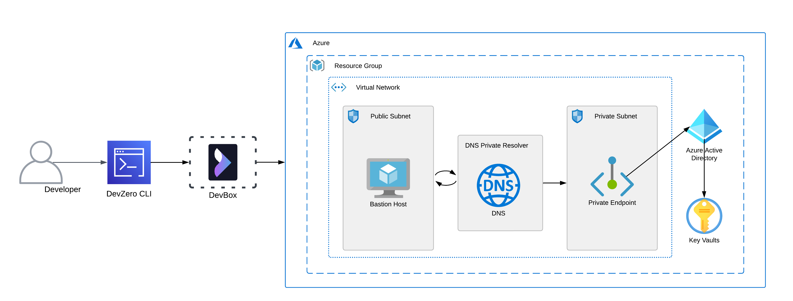
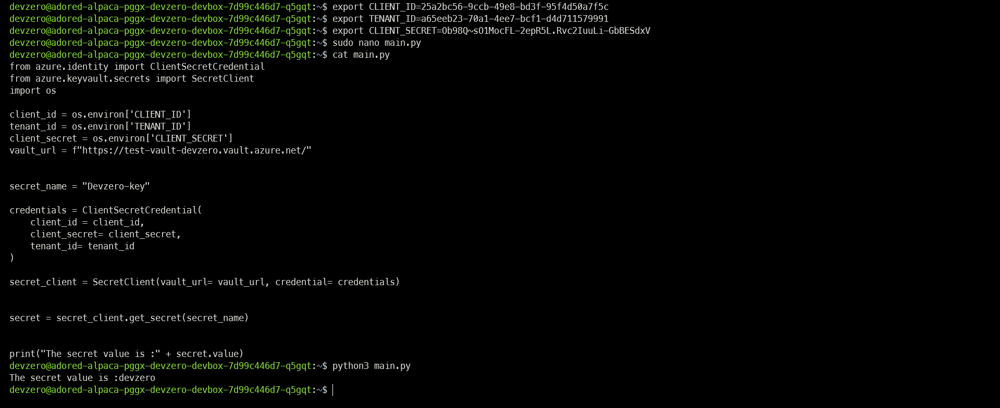
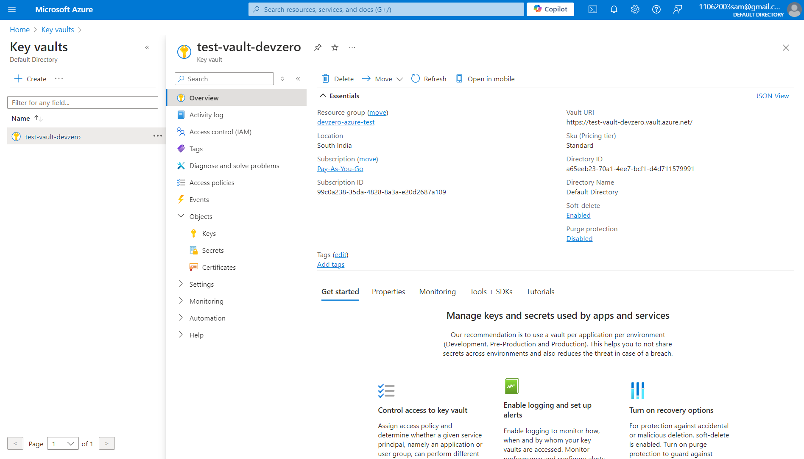
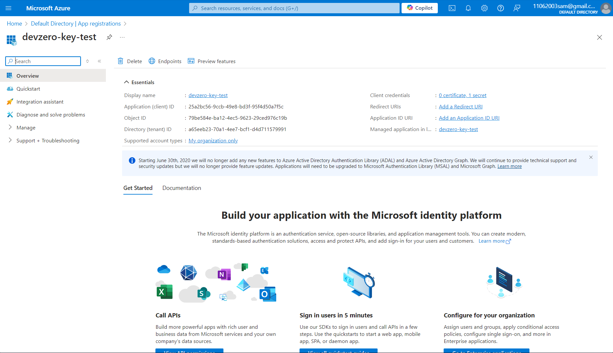

# Azure Database

You are connecting to a Azure Key Vault from your DevBox.

## Architecture Diagram



Here, you will connect to a Key Vault from your DevBox. This would be done by setting up a bastion host that advertises the private routes to your DevZero network so that you can access the private service through network tunneling.

## Prerequisites

1. Before you begin, follow the [Connecting to Azure](../../existing-network/connecting-to-azure.md) guide to set up the Bastion Host to access your private Azure services.
2. Following the above criteria, follow the [Setting up DNS Private Resolver](./setting-up-dns-private-resolver.md) guide to access the DNS Private Zones.

## Existing Key Vault

To connect to an exisiting Key Vault, ensure it is within the same **Resource Group** that houses the Bastion Host.

### Step 1: Configuring the Key Vault

Now you need to configure the key vault and install dependencies in our DevBox to carry out the connection.

1. Go to **Home > Key Vaults** and click on the key vault you just created.
2. Then go to **Access Control (IAM)** and click on **Add role assignment**.
3. Click on the **Key Vault Administrator** role and click on next.
4. Click on **Select Members** and the select the users you want to give access to the Key Vault as an administrator. Click on **Select**.
5. Then click on **Next** and then click on **Review + Assign** to assign the role.
6. Now go to **Obejcts > Secrets** and click on **Generate/Import**.
7. Enter the **Name** and **Secret Value** and click on **Create**.
8. If you get any error or if you are not able to create the key then turn the access to **Public** in the **Settings > Networking** section and try again. After the creation you can again turn the network public access to **Disabled**.

### Step 2: Setting up Service Principals

Now to add or retrieve the secrets through a client or script, you need to setup **Service Principals** on the Azure Portal using the below steps:

1. Go to **Microsoft Entra ID** and click on **App registrations**.
2. Click on **New registration** and enter the app name as you like and click on **Register**.
3. Go to **All applications** and click on the app you just created.
4. Copy the **Client ID** and **Tenant ID** and add it to the DevBox environmental variables.


```bash
export AZURE_CLIENT_ID=<client-id>
export AZURE_TENANT_ID=<tenant-id>
```


5. Click on **Client credentials** and click on **New client secret**.
6. Enter the description if you want to and the click on **Add**.
7. Copy the **Value** of the client secret you just created and add it to the environmental variables of your DevBox by using the following command.


```bash
export AZURE_CLIENT_SECRET=<client-secret>
```


### Step 3: Setting up dependencies in DevBox

After configuring the vault and setting up the service principal, you need to install the necessary packages in python to write the script by following the below steps:

1. Install the required packages using the following command:


```bash
pip install azure-identity
pip install azure-keyvault-secrets
```


2. Write the following python script to retreive the secret:


```python
from azure.identity import ClientSecretCredential
from azure.keyvault.secrets import SecretClient
import os

client_id = os.environ['CLIENT_ID']
tenant_id = os.environ['TENANT_ID']
client_secret = os.environ['CLIENT_SECRET']
vault_url = f"https://test-vault-devzero.vault.azure.net/"


secret_name = "Devzero-key"

credentials = ClientSecretCredential(
    client_id = client_id,
    client_secret= client_secret,
    tenant_id= tenant_id
)

secret_client = SecretClient(vault_url= vault_url, credential= credentials)

secret = secret_client.get_secret(secret_name)

print("The secret value is :" + secret.value)
```





## New Azure Database

If you need to make a new Key Vault and access it through DevBox, then follow the below steps:

### Step 1: Creating a Key Vault

1. Go to **Home > Key vaults** and click on **Create**.
2. In the **Basics** section, select the **Resource group** you previously selected for your **VNET**.
3. Then input your database **Key Vault name**, **Region** and the desired **Pricing Tier**.

4. you can set the **Days to retain deleted vaults** duration as you like.
5. Go to the **Networking** page and uncheck the **Enable public access** checkbox.
6. Below the checkbox, you will find the **Private Endpoint section**.
7. Click on **Create a private endpoint** and enter the **Resource group**, **Location**, **Name**, and **Target sub-resource** type of the endpoint.
8. In the **Networking** part, choose the virtual network (VNET) you used for setting up the DNS resolver and Bastion Host.
9. You choose a compatible subnet or can create a new one and a new private DNS zone will be created for you.
10. Click on **Ok** and the click on **Review + Create**.
11. Click on **Create** to initialize the deployment for the key vault.




### Step 2: Configuring the Key Vault

Now that you have setup the Key Vault, you need to configure it and install dependencies in our DevBox to carry out the connection.

1. Go to **Home > Key Vaults** and click on the key vault you just created.
2. Then go to **Access Control (IAM)** and click on **Add role assignment**.
3. Click on the **Key Vault Administrator** role and click on next.
4. Click on **Select Members** and the select the users you want to give access to the Key Vault as an administrator. Click on **Select**.
5. Then click on **Next** and then click on **Review + Assign** to assign the role.
6. Now go to **Obejcts > Secrets** and click on **Generate/Import**.
7. Enter the **Name** and **Secret Value** and click on **Create**.
8. If you get any error or if you are not able to create the key then turn the access to **Public** in the **Settings > Networking** section and try again. After the creation you can again turn the network public access to **Disabled**.

### Step 3: Setting up Service Principals

Now to add or retrieve the secrets through a client or script, you need to setup **Service Principals** on the Azure Portal using the below steps:

1. Go to **Microsoft Entra ID** and click on **App registrations**.
2. Click on **New registration** and enter the app name as you like and click on **Register**.
3. Go to **All applications** and click on the app you just created.
4. Copy the **Client ID** and **Tenant ID** and add it to the DevBox environmental variables.


```bash
export AZURE_CLIENT_ID=<client-id>
export AZURE_TENANT_ID=<tenant-id>
```


5. Click on **Client credentials** and click on **New client secret**.
6. Enter the description if you want to and the click on **Add**.
7. Copy the **Value** of the client secret you just created and add it to the environmental variables of your DevBox by using the following command.


```bash
export AZURE_CLIENT_SECRET=<client-secret>
```





### Step 4: Setting up dependencies in DevBox

After configuring the vault and setting up the service principal, you need to install the necessary packages in python to write the script by following the below steps:

1. Install the required packages using the following command:


```bash
pip install azure-identity
pip install azure-keyvault-secrets
```


2. Write the following python script to retreive the secret:


```python
from azure.identity import ClientSecretCredential
from azure.keyvault.secrets import SecretClient
import os

client_id = os.environ['CLIENT_ID']
tenant_id = os.environ['TENANT_ID']
client_secret = os.environ['CLIENT_SECRET']
vault_url = f"https://test-vault-devzero.vault.azure.net/"


secret_name = "Devzero-key"

credentials = ClientSecretCredential(
    client_id = client_id,
    client_secret= client_secret,
    tenant_id= tenant_id
)

secret_client = SecretClient(vault_url= vault_url, credential= credentials)

secret = secret_client.get_secret(secret_name)

print("The secret value is :" + secret.value)
```



