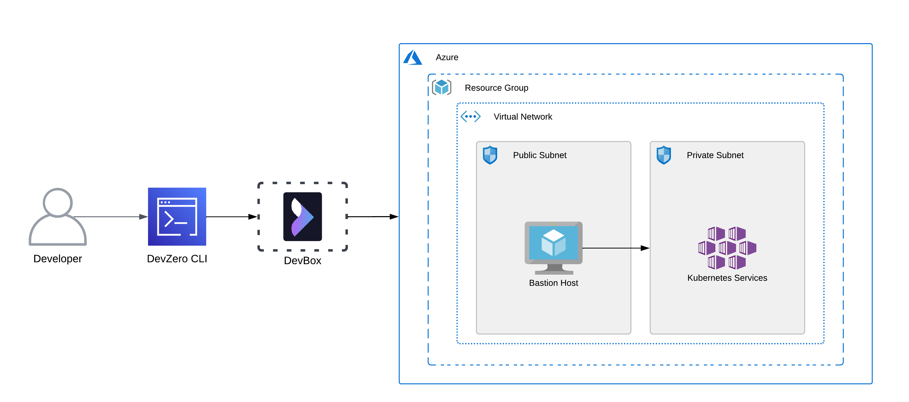
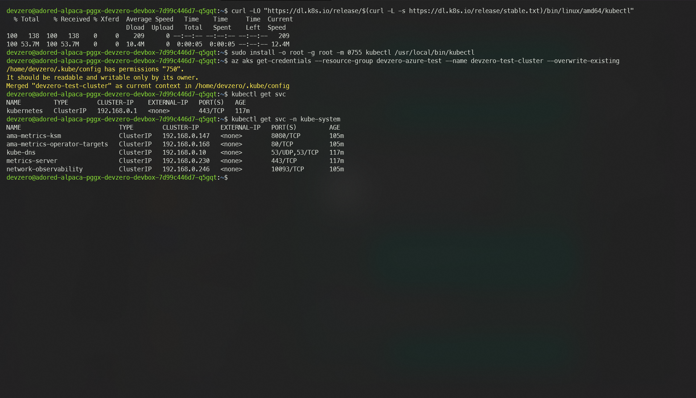

# Azure Kubernetes Service

You are connecting to a Kubernetes cluster running in the private subnet of Azure Virtual Network (VNET) from your DevBox.

## Architecture Diagram



Here, you will connect to a Kubernetes cluster running on a private subnet from your DevBox. This would be done by setting up a bastion host that advertises the VNET CIDR to your DevZero network so that you can access the private service through the network tunneling.

## Prerequisites

Before you begin, follow the [Connecting to Azure](../../existing-network/connecting-to-azure.md) guide to set up the Bastion Host to access your private Azure services.

## Existing Azure Kubernetes Cluster

To connect to a Kubernetes Cluster running in the private subnet, ensure it is within the same **Resource Group** and **VNET** containing the Bastion Host.

If the above criteria are followed, then log into your DevBox and follow these steps:

1. Go to your **DevBox** and install Azure ClI:


```bash
sudo curl -sL https://aka.ms/InstallAzureCLIDeb | sudo bash
```


2. After the installation is successful, you need to authenticate your Microsoft Azure account with Azure Cli using the following command:


```
az login
```


3. Following your setup with Azure Cli, you also need to download the **kubectl** binaries:


```bash
curl -LO "https://dl.k8s.io/release/$(curl -L -s https://dl.k8s.io/release/stable.txt)/bin/linux/amd64/kubectl"
```


4. Install **kubectl**:


```bash
sudo install -o root -g root -m 0755 kubectl /usr/local/bin/kubectl
```


After your initial setup for Azure Cli (`az`) and Kubernetes Cli tool (`kubectl`) is done, your DevBox should be ready for accessing the cluster:

1. Firstly, you need to select your **Subscription ID** in Azure Cli with the following command:


```bash
az account set --subscription <subscription-id>
```


2. Use the following command to connect to your cluster:


```bash
az aks get-credentials --resource-group <resource-group-name> --name <cluster-name> --overwrite-existing
```


2. Check if the cluster is accessible:


```bash
kubectl get svc
```




## New Azure Kubernetes Cluster

If you need to make a new Azure Kubernetes Cluster running in a private subnet and access it through DevZero's network, then follow the below steps:

### Step 1: Creating a Kubernetes Cluster

1. Go to **Home > Kubernetes Services** or you can search for **Azure Kuberntes Service** in the search bar and click on **Create Kubernetes Cluster**.
2. In the **Basics** section, select the resource group you previously selected for your VNET.
3. Enter your Cluster name and region and choose your desired node image.
4. Select your desired **Node Pool** machine configuration in the **Node Pools** section.
5. Go to the **Networking** section and check the `Enable private cluster` and `Bring your own Azure virtual network` options, respectively.
6. After checking these two options, you will be asked to choose your VNET. Then, create a new subnet dedicated to Kubernetes and choose that subnet.
7. Enter a **Kubernetes service address range** that doesn't overlap with your VNET CIDR. For Example, if your VNET CIDR Range is 10.0.0.0/16, then it is recommended that you make your Kubernetes service address range 192.168.0.0/16.
8. Provide a Kubernetes DNS service IP Address and enter your **DNS name prefix**.
9. Click on **Review + Create** and click on **Create** to create Kubernetes Cluster.

### Step 2: Setting up DevBox

Now that you have created the cluster, you need to authenticate your DevBox with the `az` cli tool:

1. Go to your **DevBox** and install Azure CLI:


```bash
sudo curl -sL https://aka.ms/InstallAzureCLIDeb | sudo bash
```


2. After the installation is successful, you need to authenticate your Microsoft Azure account with Azure Cli using the following command:


```
az login
```


3. Following your setup with Azure Cli, you also need to download the **kubectl** binaries:


```
curl -LO "https://dl.k8s.io/release/$(curl -L -s https://dl.k8s.io/release/stable.txt)/bin/linux/amd64/kubectl"
```


4. Install **kubectl**:


```
sudo install -o root -g root -m 0755 kubectl /usr/local/bin/kubectl
```


### Step 3: Accessing your Azure Kubernetes Cluster from DevBox

After your initial setup for Azure Cli (`az`) and Kubernetes Cli tool (`kubectl`) is done, your DevBox should be ready for accessing the cluster:

1. Firstly, you need to select your **Subscription ID** in Azure Cli with the following command:


```bash
az account set --subscription <subscription-id>
```


2. Use the following command to connect to your cluster:


```bash
az aks get-credentials --resource-group <resource-group-name> --name <cluster-name> --overwrite-existing
```


2. Check if the cluster is accessible:


```bash
kubectl get svc
```



