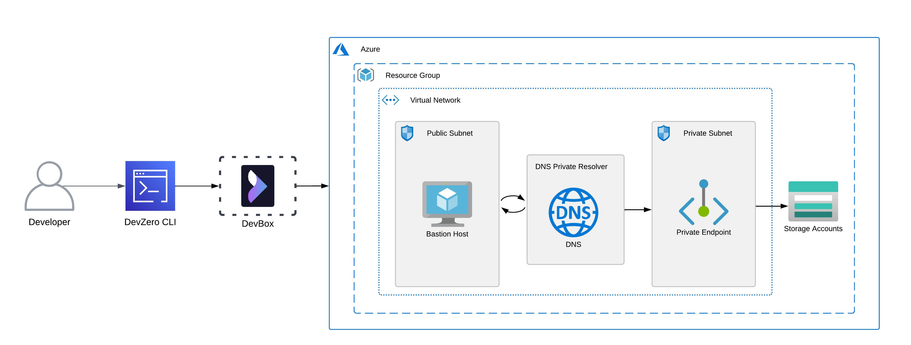
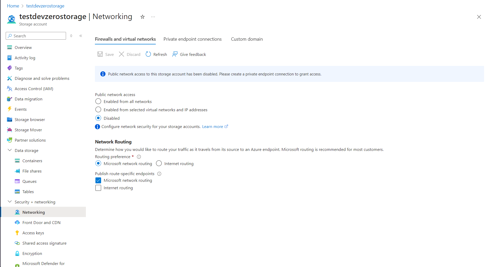
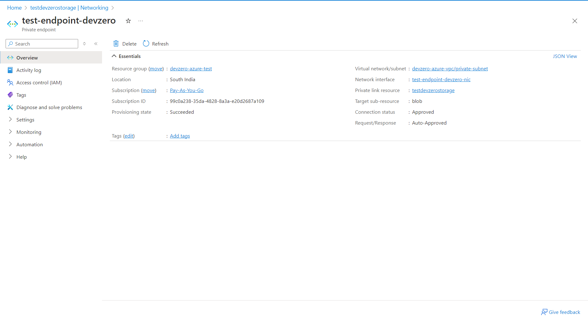
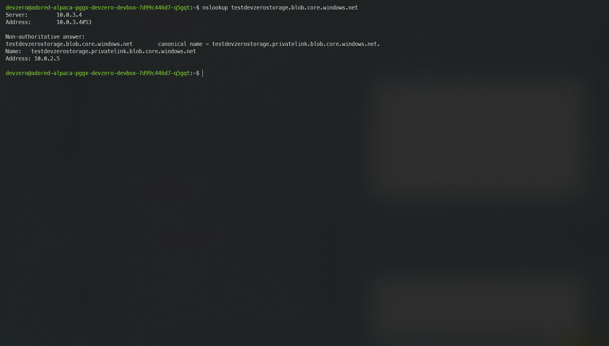

# Azure Storage Account

Connecting to a Storage Account from your DevBox.

## Architecture Diagram



Here, you will connect to a Storage Account from your DevBox. This would be done by setting up a bastion host that advertises the private routes to your DevZero network so that you can access the private service through network tunneling. You would also need to setup a DNS Private Resolver to access the Storage Account's Private Endpoint from your DevBox.

## Prerequisites

Before you begin, follow the [Connecting to Azure](../../existing-network/connecting-to-azure.md) guide to set up the Bastion Host to access your private Azure services.

## Existing Azure Storahe Account

To connect to a Storage Account, ensure it is within the same **Resource Group** containing the Bastion Host.

If the above criteria is followed then follow the [Setting up DNS Private Resolver](./setting-up-dns-private-resolver.md) guide to access the DNS Private Zones.

Now follow the below steps to access the Storage Account on your DevBox:

1. Go to **Home > Storage Accounts** and click on the Storage Account to want to access through the DevBox.
2. Go to **Networking > Firewalls and virtual networks** tab in the **Security + Networking** section and under `Public network access` choose the `Disabled` option. Click on **Save**. This will make your storage account completely private.



3. After that, go to **Networking > Private endpoint connections** and click on **Private endpoint**.
4. Choose your **Resource group** and enter the instance name.
5. Click **Resource** and then select the desired `Target sub-resource` you want for your private endpoint. Remember that if you have more than one sub-resouce type then you need to create a seperate endpoint for each one of them.
6. Click on **Virtual Network** and select your Virtual Network (VNET) which houses the bastion host and DNS Private Resolver.
7. Select a compatible subnet and then simply click on **Next** and leave the rest of the settings as default.
8. Click on **Create** and Your Private Endpoint will be created.



9. To check if you can access the storage account endpoint from your DevBox, just use the folllowing command:


```
nslookup <storage-account-name>.<sub-resource>.core.windows.net
```




## New Storage Account

If you need to make a new Storage Account and access it through DevZero's network, then follow the below steps:

### Step 1: Creating a Storage Account

1. Go to **Home > Storage Accounts** and click om **Create**.
2. In the **Basics** section, select the resource group you previously selected for your VNET.
3. Then input your account name and region and choose your desired performance type.
4. Go to the **Networking** section and choose `Disable public access and use private access` option in **Network access**.
5. Click on **Add private endpoint** and enter the **Name**, ****Storage sub-resource** type.
6. In the **Networking** section, select the VNET which houses the bastion host.
7. Select a compatible subnet and then choose your private DNS zone.
8. Click on **OK** and then click on **Review + Create**. Finally click on **Create**.

### Step 2: Accessing the Storage Account

If the above steps is completed then follow the [Setting up DNS Private Resolver](./setting-up-dns-private-resolver.md) guide to access the DNS Private Zones.

To Check if you can access the Storage Account, follow the below steps:

1. Go to the **DevBox**.
2. Use the following command to see if the private endpoint is accessible to you:


```
nslookup <storage-account-name>.<sub-resource>.core.windows.net
```


