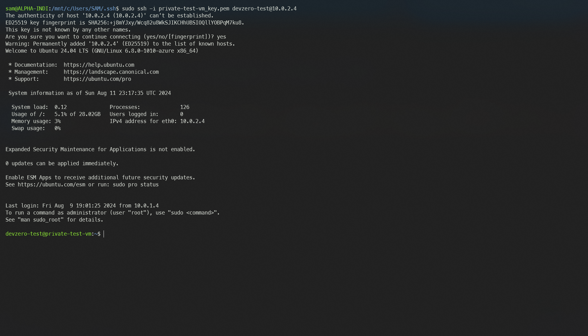

# Azure Virtual Machine

You are connecting to a Virtual Machine running in the private subnet of Azure VNET from your DevBox.

## Architecture Diagram


Here, you will connect to a private virtual machine instance from your DevBox. This would be done by setting up a bastion host that advertises the VNET CIDR to your DevZero network so that you can access the private service through the network tunneling.

## Prerequisites

Before you begin, follow the [Connecting to Azure](../../existing-network/connecting-to-azure.md) guide to set up the Bastion Host to access your private Azure services.

## Existing Azure Virtual Machine

To connect to a Virtual Machine running in the private subnet, ensure it is within the same **Resource Group** and **VNET** containing the Bastion Host. 

If the above criteria are followed, then log into your DevBox and SSH into the private VM by following these steps:

1. Go to **DevBox**.
3. Copy the private SSH key within the `.ssh` directory.
4. Connect to virtual machine:


```
ssh -i "path/to/private/key" username@instance-private-ip
```




## New Azure Virtual Machine

If you need to make a new virtual machine running in a private subnet and access it through DevZero's network, then follow the below steps:

### Step 1: Creating a Virtual Machine

1. Go to **Home > Virtual Machines > Create a virtual machine**.
2. In the **Basics** section, select the resource group you previously selected for your VNET.
3. Then input your VM name and region and choose your desired image. You can view the available images [here](https://azuremarketplace.microsoft.com/en-us/marketplace/apps?filters=virtual-machine-images).

4. Enter your desired username and select the *allow selected ports* for the **Public inbound ports** option.
5. Go to the **Networking** section and enter your Virtual Network (VNET). Please remember to choose **None** in the public IP option because we must make the instance private.
6. Select the **Basic** option for the **NIC network security group**. It will create a security group for you that allows port access for SSH.
7. Click on **Review + Create** and click on **Create** to create virutal machine.
8. Download the SSH private key when prompted. This will help you SSH into the Bastion Host later.

### Step 2: Accessing virtual machine from DevBox

1. Go to **DevBox** and make a copy of the key pair.
2. Connect to the Virtual Machine using ssh and the new key pair:


```
ssh -i "path/to/private/key" username@instance-ip
```



