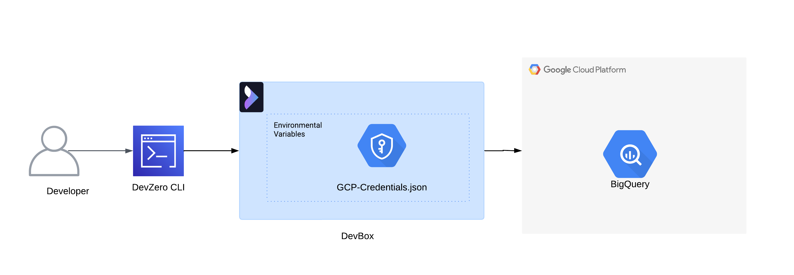
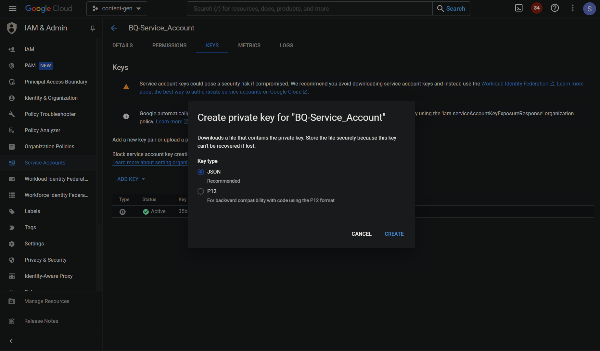
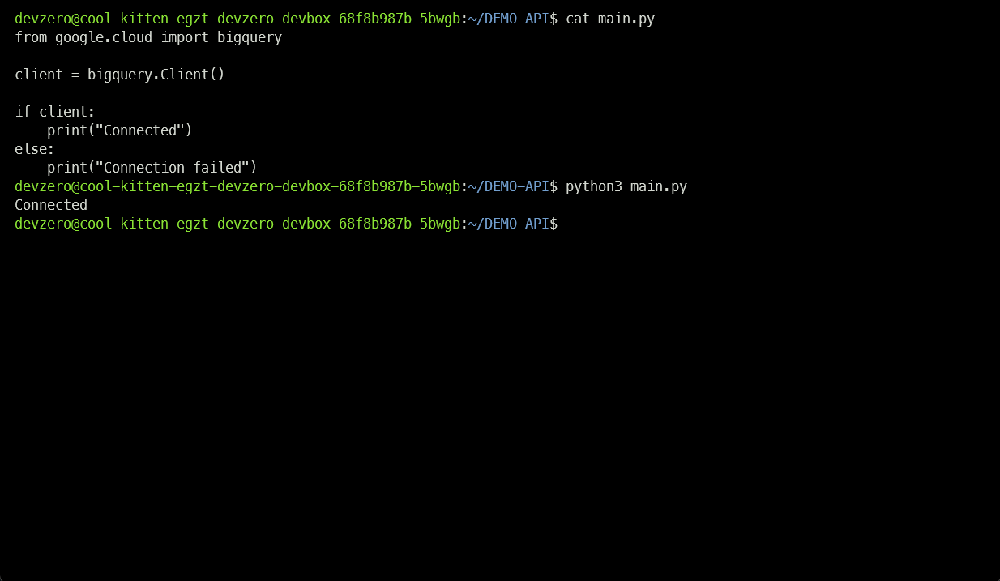

# BigQuery

Connecting to GCP BigQuery Service from your DevBox.

## Architecture Diagram



## Devzero Workspace

### Step 1: Generating Google Authentication Credentials for BigQuery

1. Go to **IAM & Admin > Service Accounts**.
2. Click on **Create Service Account**, enter the **Service Account Name** and click on **Create and Continue**.
3. Click on **Select a role**, select **BigQuery Admin**, and click on **Continue**.
4. Select the new service account and go to **Keys**.
5. Click on **Add Key > Create a new key** and click on **Create**.



### Step 2: Connecting to BigQuery through Python API

1. Connect to your Devzero workspace.
2. Store the **Google Authentication Credentials** on the workspace.
3. Install **Python** and **PIP**:


```
sudo apt update
sudo apt install python3 python3-dev python3-venv
sudo apt-get install wget
wget https://bootstrap.pypa.io/get-pip.py
```


4. Install **BigQuery API**:


```
pip install google-cloud-bigquery
```


5. Set the **GOOGLE_APPLICATION_CREDENTIALS** environment variable.


```
export GOOGLE_APPLICATION_CREDENTIALS=/path/to/the/key.json
```


6. Write a Python scipt to test the BigQuery API Connection:


```python
from google.cloud import bigquery

client = bigquery.Client()

if client:
    print("Connected")
else:
    print("Connection failed")
```


7. Run the Python Script:


```
python3 <file-name>.py
```


If the connection is successful, you should see **"Connected"** printed in the terminal output.


