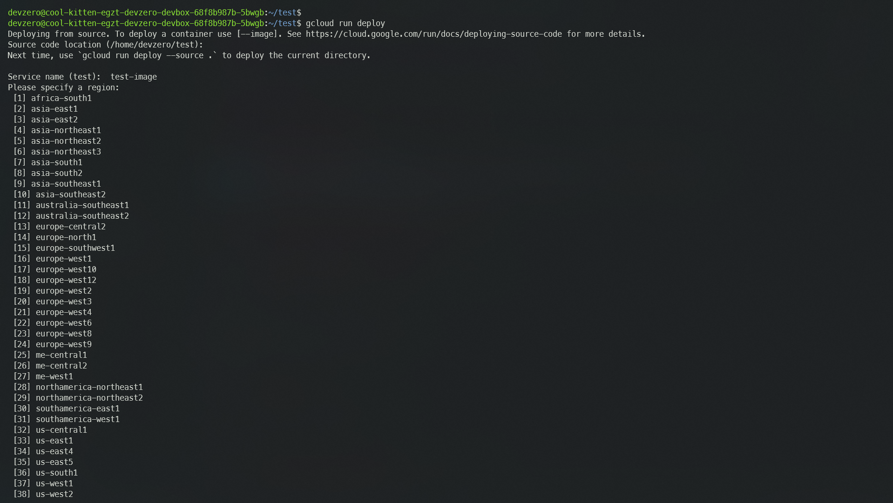
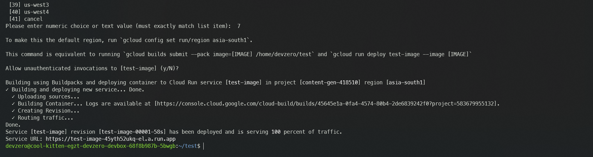

# Cloud Run

### Connecting to GCP Cloud Run Service from your DevBox's Project Directory.

Cloud Run provides a fully managed container platform that enables you to deploy your project directly on GCP's infrastructure. 

## Architecture Diagram:


In this we will be setting up a pipeline for our project within DevBox, it will be routed through Cloud Run and and then depending on the type of project, we can either make it externally accessable on the web or can access it through the internal VPC of Google Cloud Infrastructure.

## Working with Existing Project

### Step 1: Navigating to the project directory

First of all we need to access our DevZero workspace.


```bash
sudo dz ws connect <workspace-name>
```


Then we will navigate to the project folder using the `cd <path/to/folder>` command.

### Step 2: Setting up cloud SDK

Now this is where the real task begins. We will first need to download and install `gcloud` SDK package so that we can access the build tools for **Artifact Repository**.


```bash
sudo apt-get update
sudo apt-get install apt-transport-https ca-certificates gnupg curl
sudo apt-get update && sudo apt-get install google-cloud-cli
```


After the `gcloud` package is downloaded, we will need to authenticate with our google cloud account. For this we just need to run the simple command.


```bash
gcloud init
```


After running the command, you will given various options for choosing your **Google account**, default **Project** and default **Compute Region and Zone**. You can choose as per your preference.

### Step 3: Deploy your Project

We will need to enable the **Cloud Run Admin** API first so that we can access cloud run from the commandline. After doing this a **Compute Engine default service account** is automatically created.

For Cloud Build to be able to build your sources, grant the Cloud Build Service Account role to the Compute Engine default service account by running the following:


```bash
gcloud projects add-iam-policy-binding PROJECT_ID \
    --member=serviceAccount:PROJECT_NUMBER-compute@developer.gserviceaccount.com \
    --role=roles/cloudbuild.builds.builder
```


*replace the PROJECT_ID and PROJECT_NUMBER with your Google Cloud Project ID and Google Cloud Project Number respectively*

Now since everything is setup, we can finally finish this all off with the deploy command:


```bash
gcloud run deploy
```


Since you are already in the project directory, just press **ENTER** when prompted for the ource code location. 

Then enter your service name when prompted and select the region of your choice.

Finally you will be prompted with *allow unauthenticated invocations* message, here you can choose `y` if you want the container to be publicly accessable on the web, otherwise you can choose `N`.

Done! you might need to wait for a few minutes until the deployment is complete. On success, you will be displayed the service URL which you can use to access the service.


