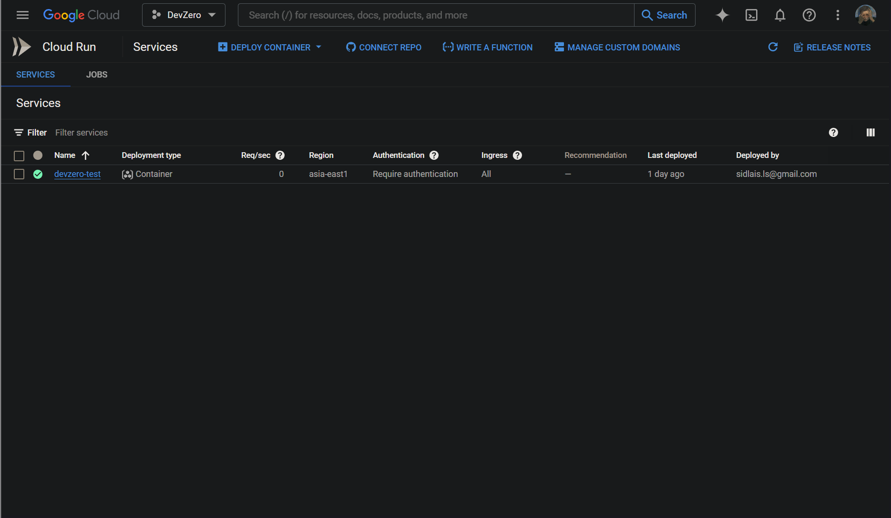

# Cloud Run

### Connecting to GCP Cloud Run Service from your DevBox's Project Directory.

Cloud Run provides a fully managed container platform that enables you to deploy your project directly on GCP's infrastructure. 

## Architecture Diagram:


<!-- markdown-link-check-disable-next-line -->
[GCP Cloud Run](https://cloud.google.com/run/docs) is a serverless service offered by GCP to manage a computing platform that enables you to run invocable containers via requests or events.
In this, we will set up a pipeline for our project within DevBox; it will be routed through Cloud Run. Then, depending on the type of project, we can either access it through the web or through the internal VPC of Google Cloud Infrastructure.

## Existing Cloud Run Application

If you have an existing Cloud Run Container deployed, follow the steps below to access its content from the DevBox. Ensure the Cloud Run Deployment has the `Require authentication` option selected in the **Security** section.

### Step 1: Creating a Recipe

First, we need to create a recipe for the workspace:

1. Go to the [DevZero Dashboard > Recipes](https://www.devzero.io/dashboard/recipes) and click on **New recipe**.
2. Enter the recipe name and click on **Create a recipe**.
3. Now use the below-provided snippet to create a recipe for your workspace:


```
version: "3"

build:
  steps:
    - type: apt-get
      packages: ["build-essential", "curl", "git", "nano", "software-properties-common", "ssh", "sudo", "tar", "unzip", "vim", "wget", "zip", "python3", "libpython3-dev"]
    - type: command
      command: |
        sudo apt-get update
        sudo apt-get install apt-transport-https ca-certificates gnupg curl
        curl https://packages.cloud.google.com/apt/doc/apt-key.gpg | sudo gpg --dearmor -o /usr/share/keyrings/cloud.google.gpg
        echo "deb [signed-by=/usr/share/keyrings/cloud.google.gpg] https://packages.cloud.google.com/apt cloud-sdk main" | sudo tee -a /etc/apt/sources.list.d/google-cloud-sdk.list
        sudo apt-get update && sudo apt-get install google-cloud-cli
```


4. Click on **Save and Build** and when the build is successful, click on **Publish**.

### Step 2: Creating a Workspace

1. Go to the [Devzero Dashboard > Workspaces](https://www.devzero.io/dashboard/workspaces) by clicking **New workspace**.
2. Enter the workspace name and click on **Select from recipe library**.
3. Select the recipe you just created above and click on **Select**.
4. Click on **Launch**, and your workspace will be ready shortly.

### Step 3: Setting up cloud SDK

Now, this is where the real task begins. We will first need to download and install the `gcloud` SDK package to access the build tools for **Artifact Repository**.


```bash
sudo apt-get update
sudo apt-get install apt-transport-https ca-certificates gnupg curl
sudo apt-get update && sudo apt-get install google-cloud-cli
```


After downloading the' cloud' package, we will need to authenticate with our Google Cloud account. To do this, we just need to run the simple command.


```bash
gcloud init
```


After running the command, you will be given various options for choosing your **Google account**, default **Project**, and default **Compute Region and Zone**. You can choose according to your preference.

### Step 4: Accessing the Container

To access your Cloud Run container privately, you need to send a `GET` request with an authentication token.

Follow the below steps to generate the Authentication token and access the Cloud Run application:

1. Use the below command to get the token:


```bash
gcloud auth print-identity-token
```


2. Export the token to an environmental variable:


```bash
export TOKEN=$(gcloud auth print-identity-token)
```


3. Now that everything is set, we can finally finish this all off by accessing the applications with the `curl` command:


```bash
curl -H "Authorization: Bearer ${TOKEN}" <cloud-run-application-endpoint-url>
```



## New Cloud Run Application

If you want to create a new Cloud Run Container, just follow the steps below to access its content from the DevBox.

### Step 1: Creating the Container

1. Go to **Cloud Run > Services** and click **Deploy Container**.
2. Choose a deployment method between **Deploy one revision from an existing container image**, **Continuously deploy from a repository (source or function)**.


We are creating a container with an existing demo container image for this guide.




3. Enter your **Container Image URL** or select by clicking on **Select**.



3. Click on **Set Up with Cloud Build** and follow the instructions.



4. Then Enter your **Service Name** and **Region** of deployment.
5. Select **Require authentication** option in the **Authentication** section.
6. Leave the remaining configurations as default and click on **Create**.



### Step 2: Creating a Recipe

First, we need to create a recipe for the workspace:

1. Go to the [DevZero Dashboard > Recipes](https://www.devzero.io/dashboard/recipes) and click on **New recipe**.
2. Enter the recipe name and click on **Create a recipe**.
3. Now use the below-provided snippet to create a recipe for your workspace:


```
version: "3"

build:
  steps:
    - type: apt-get
      packages: ["build-essential", "curl", "git", "nano", "software-properties-common", "ssh", "sudo", "tar", "unzip", "vim", "wget", "zip", "python3", "libpython3-dev"]
    - type: command
      command: |
        sudo apt-get update
        sudo apt-get install apt-transport-https ca-certificates gnupg curl
        curl https://packages.cloud.google.com/apt/doc/apt-key.gpg | sudo gpg --dearmor -o /usr/share/keyrings/cloud.google.gpg
        echo "deb [signed-by=/usr/share/keyrings/cloud.google.gpg] https://packages.cloud.google.com/apt cloud-sdk main" | sudo tee -a /etc/apt/sources.list.d/google-cloud-sdk.list
        sudo apt-get update && sudo apt-get install google-cloud-cli
```


4. Click on **Save and Build** and when the build is successful, click on **Publish**.

### Step 3: Creating a Workspace

1. Go to the [Devzero Dashboard > Workspaces](https://www.devzero.io/dashboard/workspaces) by clicking **New workspace**.
2. Enter the workspace name and click on **Select from recipe library**.
3. Select the recipe you just created above and click on **Select**.
4. Click on **Launch**, and your workspace will be ready shortly.

### Step 4: Setting up cloud SDK

Now, this is where the real task begins. We will first need to download and install the `gcloud` SDK package to access the build tools for the Artifact Repository.


```bash
sudo apt-get update
sudo apt-get install apt-transport-https ca-certificates gnupg curl
sudo apt-get update && sudo apt-get install google-cloud-cli
```


After downloading the' cloud' package, we must authenticate with our Google Cloud account. To do this, we just need to run the simple command.


```bash
gcloud init
```


After running the command, you will be given various options for choosing your **Google account**, default **Project**, and default **Compute Region and Zone**. You can choose according to your preference.

### Step 5: Accessing the Container

To access your Cloud Run container privately, you need to send a `GET` request with an authentication token.

Follow the below steps to generate the Authentication token and access the Cloud Run application:

1. Use the below command to get the token:


```bash
gcloud auth print-identity-token
```


2. Export the token to an environmental variable:


```bash
export TOKEN=$(gcloud auth print-identity-token)
```


3. Now that everything is set, we can finally finish this all off by accessing the applications with the `curl` command:


```bash
curl -H "Authorization: Bearer ${TOKEN}" <cloud-run-application-endpoint-url>
```



