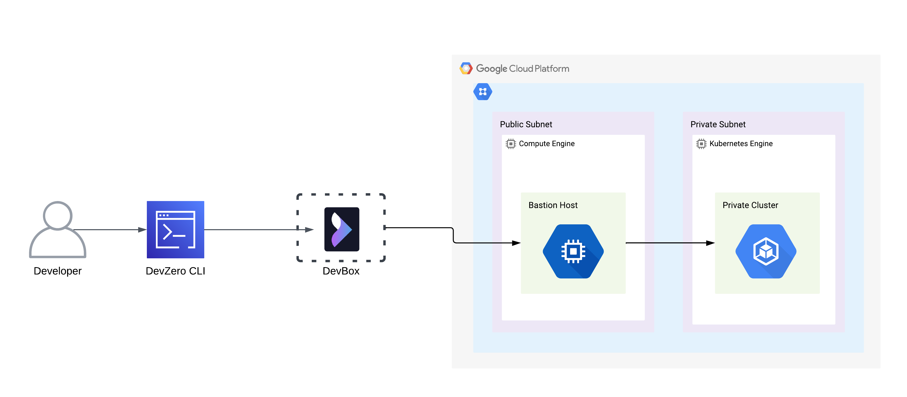
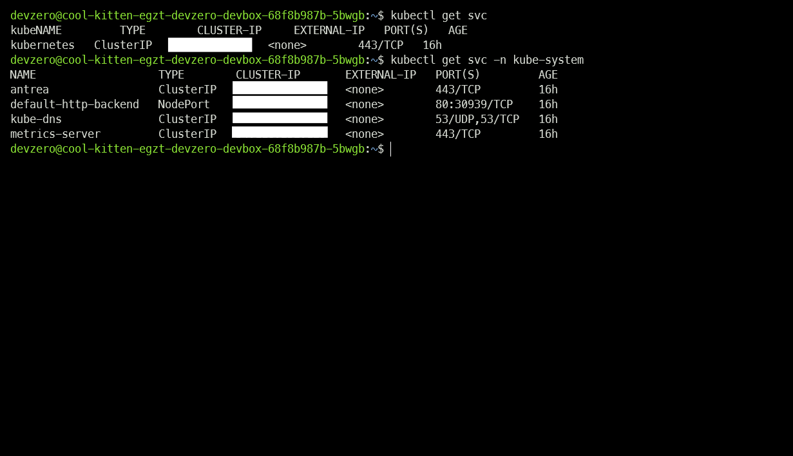
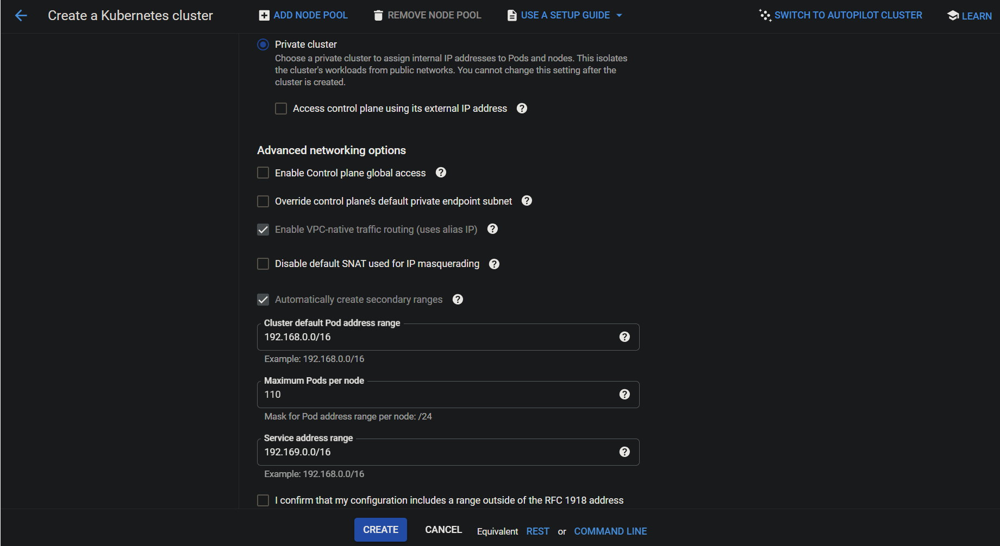
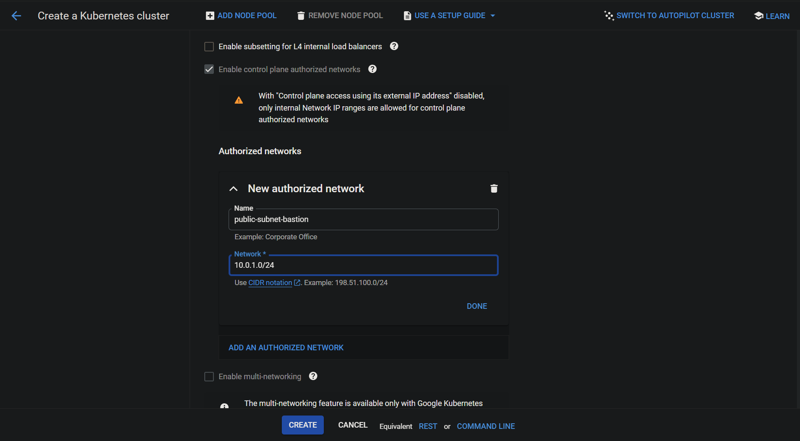
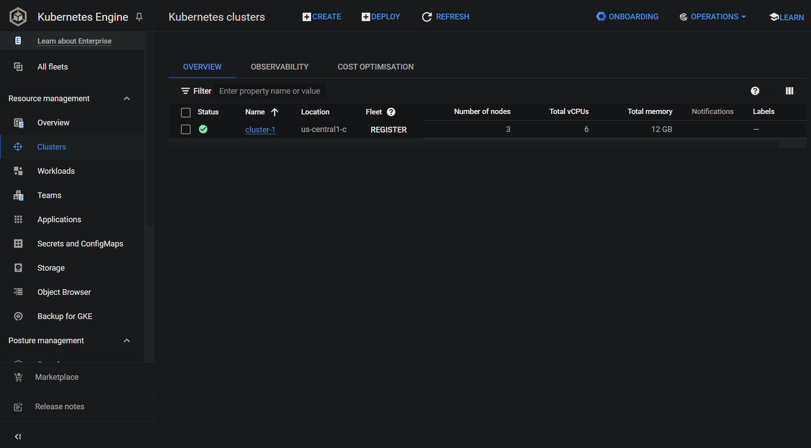

# GCP Kubernetes Engine

Connecting to GCP Kubernetes Cluster running in the private subnet of GCP VPC from your DevBox.

## Architecture Diagram



## Prerequisites

- Follow [Connecting to GCP](../../existing-network/connecting-to-gcp.md) guide.

## Existing GKE Cluster

### Step 1: Accessing GKE Cluster from a DevBox

1. Go to your **DevBox** and install Gcloud SDK:


```
sudo apt-get update
sudo apt-get install apt-transport-https ca-certificates gnupg curl
sudo apt-get update && sudo apt-get install google-cloud-cli
```


2. Authenticate your GCP account with Gcloud SDK:


```
gcloud init
```


3. Download the **kubectl** binaries:


```
curl -LO "https://dl.k8s.io/release/$(curl -L -s https://dl.k8s.io/release/stable.txt)/bin/linux/amd64/kubectl"
```


4. Install **kubectl**:


```
sudo install -o root -g root -m 0755 kubectl /usr/local/bin/kubectl
```


5. Connect to the cluster:


```
gcloud container clusters get-credentials <cluster-name> --zone <zone-name> --project <project-name>
```


6. Check if the cluster is accessible:


```
kubectl get svc
```




## New GKE Cluster

### Step 1: Creating a GKE Cluster

1. Go to **Kubernetes Engine > Kubernetes Cluster > Create**.
2. Select the standard Cluster, enter the name of the cluster and assign a **Regional** location where your **Private Subnet** is located.
3. Click on **Next**. In the **Node Pool > Default Pool > Nodes > Configure node settings** section, choose the desired **Machine Configuration** for the nodes.
4. Go to **Cluster > Networking** and select the Network VPC along with the **Private Subnet** for the cluster. Choose **Private cluster** in the **IPv4 network access** and uncheck the **Access control plane using its external IP address** checkbox.
5. Enter a desired **Default pod address range** and **service address range**. Here we have taken **192.168.0.0/16** and **192.169.0.0/16** for **pod address range** and **service address range** repectively.



6. Enter the **Bastion Host's CIDR Range** in the **Authorized Networks** section.



7. Click on **Create**.



### Step 2: Installing the necessary tools

1. Go to your **DevBox** and install Gcloud SDK:


```
sudo apt-get update
sudo apt-get install apt-transport-https ca-certificates gnupg curl
sudo apt-get update && sudo apt-get install google-cloud-cli
```


2. Authenticate your GCP account with Gcloud SDK:


```
gcloud init
```


3. Download **kubectl** binaries:


```
curl -LO "https://dl.k8s.io/release/$(curl -L -s https://dl.k8s.io/release/stable.txt)/bin/linux/amd64/kubectl"
```


4. Install **kubectl**:


```
sudo install -o root -g root -m 0755 kubectl /usr/local/bin/kubectl
```


### Step 3: Accessing the GKE Cluster

1. Connect to the cluster:


```
gcloud container clusters get-credentials <cluster-name> --zone <zone-name> --project <project-name>
```


2. Check if the cluster is accessible:


```
kubectl get svc
```



