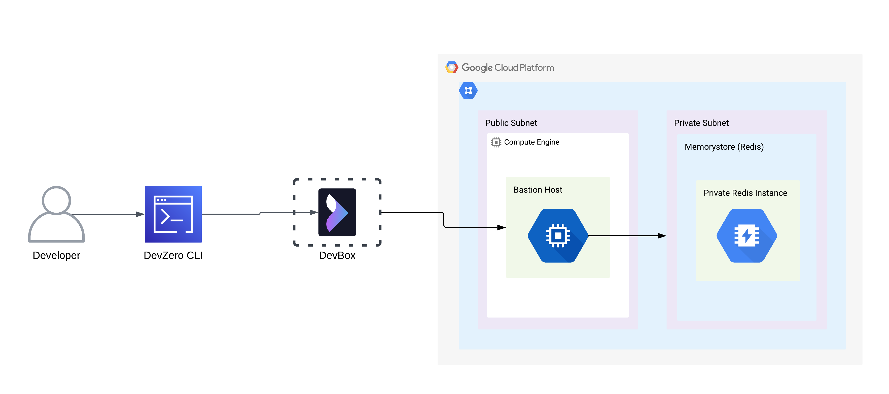
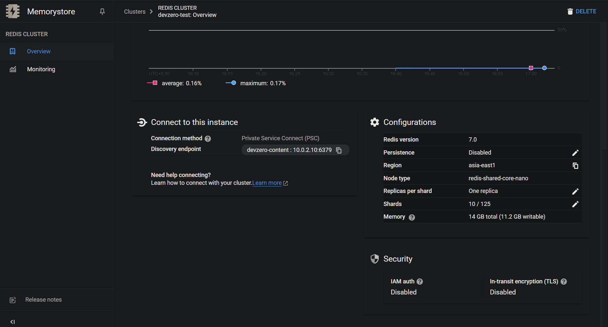
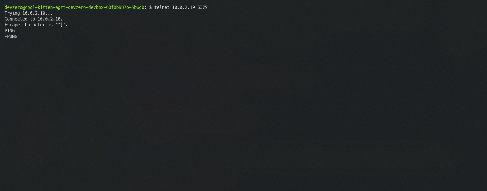
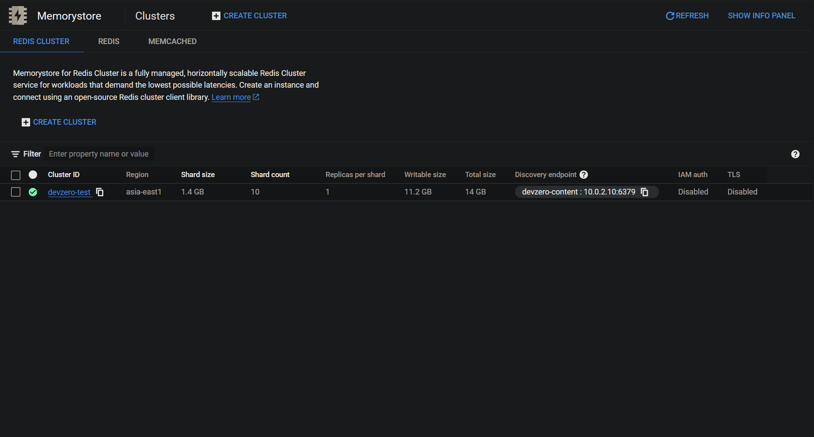

# Memorystore

Connecting to Memorystore running in the private subnet of GCP VPC from your DevBox.

## Architecture Diagram:



## Prerequisites:

- Follow [Connecting to GCP](../../existing-network/connecting-to-gcp.md) guide.

## Existing Memorystore Service

### Step 1: Accessing Memorystore from a DevBox

1. Go to **Memorystore > Clusters**.
2. Select your Instance and copy your **Domain Endpoint**.



3. Go to your **DevBox** and connect to Service:


```bash
telnet <domain-endpoint> 6379
```





## New Memorystore Service

### Step 1: Creating an Memorystore Service

1. Go to **Memorystore > Clusters** and click on **Create Instance**.
2. Enter the **Cluster ID** and choose the **region**.
3. Choose the **Node type**, **Cluster Size** and **Replicas**.
4. Choose the **VPC Network** under the **Set up connection** section.
5. Setup the service connection policy if prompted.
6. Fill in the network name and the **private subnet** in the policy section.
7. After setting up the connection  policy, click on **Create Cluster**.



### Step 2: Accessing Memorystore from DevBox

1. Go to **Memorystore > Clusters**.
2. Select your Instance and copy your **Domain Endpoint**.


3. Go to your **DevBox** and connect to Service:


```bash
telnet <domain-endpoint> 6379
```



