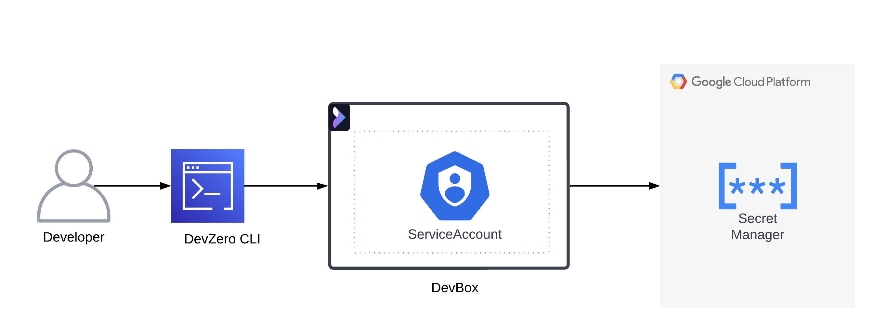
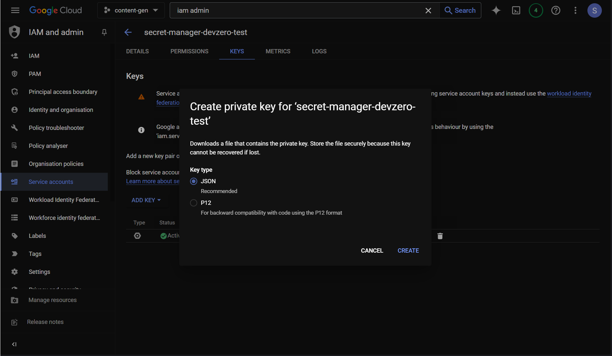
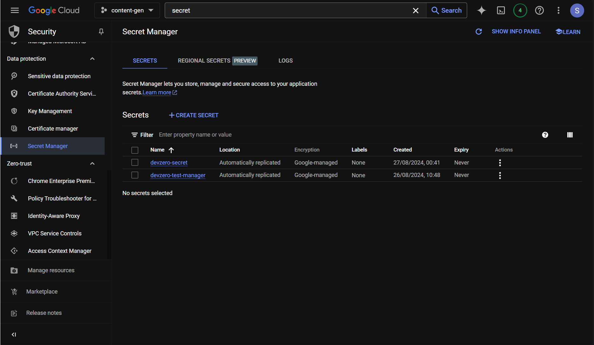

# GCP Secret Manager

You are connecting to an GCP Secret Manager from your DevBox.

## Architecture Diagram



Here, you will connect to a GCP Secret Manager from your DevBox. This can be done using any programming language API but for this demo we would be going forward with Python.

## Existing Key Vault

To connect to an existing Secret Manager, Follow the below steps:

### Step 1: Generating Google Authentication Credentials for Secret Manager

To make the connection, you need to set up the IAM service account.

1. Go to **IAM & Admin > Service Accounts*** and click on **Create Service Account**.
2. enter the **Service Account Name** and click on **Create and Continue**.
3. Click on **Select a role**, select `Secret Manager Admin`, and click on **Continue**.
4. Select the new service account and go to **Keys**.
5. Click on **Add Key > Create a new key** and click on **Create**.



### Step 2: Connecting to Secret Manager through Python API

Now, to retrieve the value from the secrets using the API, you need to authenticate the `gcloud` CLI and verify the process with the access key we just downloaded by following below steps:

1. Go to **DevBox** and store the **Google Authentication Credentials** on the workspace.
2. Install **Python** and **PIP**:


```
sudo apt update
sudo apt install python3 python3-dev python3-venv
sudo apt-get install wget
wget https://bootstrap.pypa.io/get-pip.py
```


3. Install **Secret Manager API**:


```
pip install google-cloud-secret-manager
```


4. Set the **GOOGLE_APPLICATION_CREDENTIALS** environment variable by using the following command:


```
export GOOGLE_APPLICATION_CREDENTIALS=/path/to/the/key.json
```


5. Write a Python scipt to test the BigQuery API Connection:


```
from google.cloud import bigquery

client = bigquery.Client()

if client:
    print("Connected")
else:
    print("Connection failed")
```


7. Run the Python Script:


```
python3 <file-name>.py
```


If the connection is successful, you should see **Secret** printed in the terminal output.


## New GCP Secret Manager

If you need to make a new Secret Manager and access it through DevBox, then follow the below steps:

### Step 1: Creating a new Secret Manager

1. Go to **Security > Secret Manager** and click on **Create Secret**.
2. Enter the **Name** of the secret and then either upload your **Secret** or enter it within the box provided.
3. If you are storing a API Key secret then it is advisable to check the box for **Set rotation period** under the Rotation section.



### Step 2: Generating Google Authentication Credentials for Secret Manager

To make the connection, you need to set up the IAM service account.

1. Go to **IAM & Admin > Service Accounts*** and click on **Create Service Account**.
2. enter the **Service Account Name** and click on **Create and Continue**.
3. Click on **Select a role**, select `Secret Manager Admin`, and click on **Continue**.
4. Select the new service account and go to **Keys**.
5. Click on **Add Key > Create a new key** and click on **Create**.


### Step 3: Connecting to Secret Manager through Python API

Now, to retrieve the value from the secrets using the API, you need to authenticate the`gcloud` CLI and verify the process with the access key we just downloaded by following below steps:

1. Go to **DevBox** and store the **Google Authentication Credentials** on the workspace.
2. Install **Python** and **PIP**:


```
sudo apt update
sudo apt install python3 python3-dev python3-venv
sudo apt-get install wget
wget https://bootstrap.pypa.io/get-pip.py
```


3. Install **Secret Manager API**:


```
pip install google-cloud-secret-manager
```


4. Set the **GOOGLE_APPLICATION_CREDENTIALS** environment variable by using the following command:


```
export GOOGLE_APPLICATION_CREDENTIALS=/path/to/the/key.json
```


5. Write a Python scipt to test the BigQuery API Connection:


```
from google.cloud import bigquery

client = bigquery.Client()

if client:
    print("Connected")
else:
    print("Connection failed")
```


7. Run the Python Script:


```
python3 <file-name>.py
```


If the connection is successful, you should see **Secret** printed in the terminal output.

