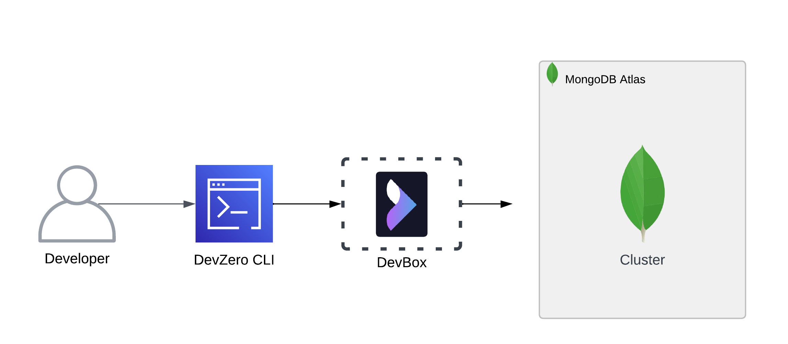
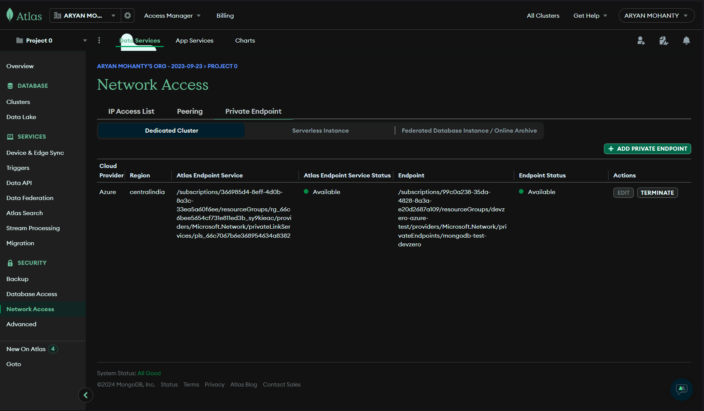
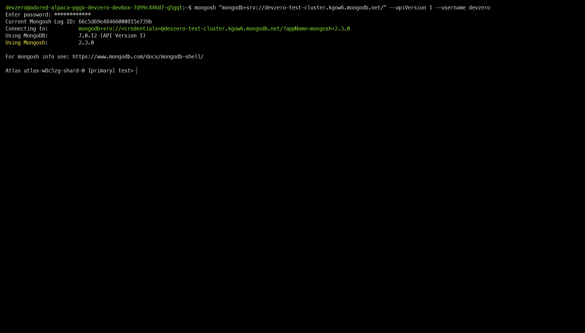
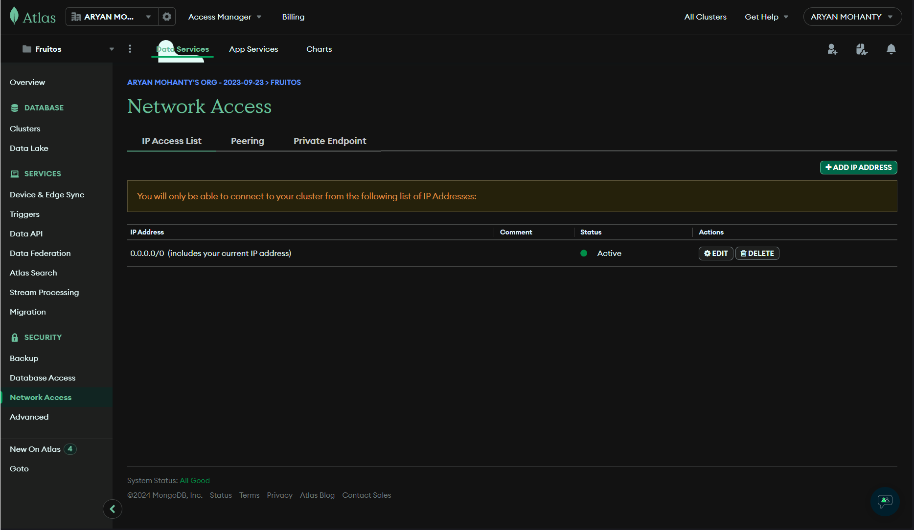
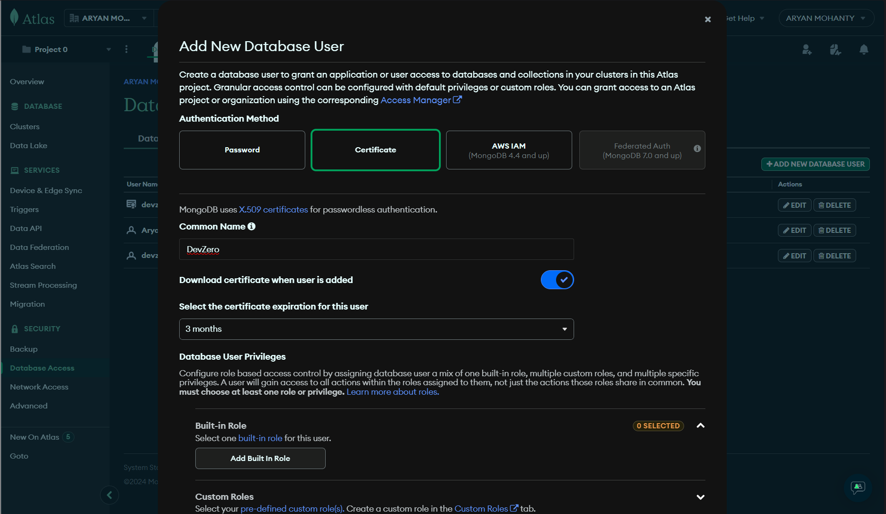
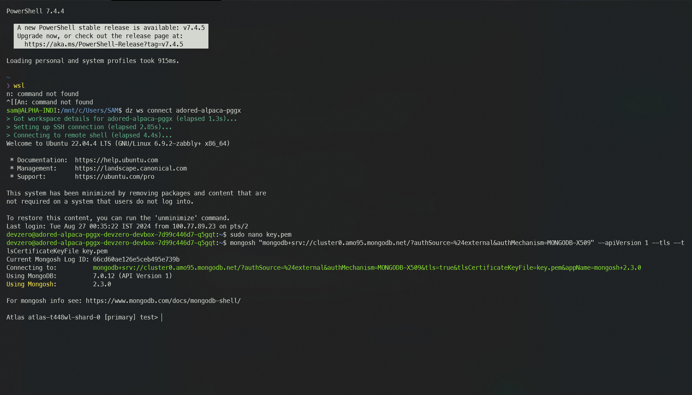

# MongoDB Atlas

Comprehensive guide for connecting to a MongoDB Cluster from your DevBox.

## Architecture Diagram



This would be done by setting up the cluster in your Atlas dashboard through one of 3 available cloud providers (AWS, Azure, or GCP) and accessing it through DevBox.

## Prerequisites

Before you begin, create your account with [MongoDB](https://account.mongodb.com/account/login).

**_NOTE:_**  MongoDB only supports Private Endpoint access for **Dedicated** or **Serverless** clusters. Private Endpoint access for the **Shared** cluster is not yet supported.  

## Existing MongoDB Cluster




### Step 1: Creating a Private Endpoint

To connect to a database cluster, you must create a private endpoint with one of MongoDB's three supported cloud providers (AWS, GCP, Azure).

To check and configure the same, follow the below steps:

1. Go to **[MongoDB Atlas](https://cloud.mongodb.com/v2)**.
2. Go to **Security > Network Access** and open the **Private Endpoint** tab.
3. Click on **Add Private Endpoint** and choose your cloud provider. For this tutorial, we will be using Azure.

**_NOTE:_** You must provide the billing information in the Edit Payment Method form if you still need to get the payment method configured for your organization.

4. Click on **Next** and choose the **Region** where you want to deploy your endpoint.
5. Enter your **Resource Group Name**, **Virtual Network Name**, **Subnet Name**, and the name you want to give to your endpoint.
6. Copy and run this PrivateLink Endpoint Command where your Azure CLI is configured. Remember that you can only copy the command once Atlas finishes creating VNET resources in the background for internal use.


7. After creating the private endpoint, copy the **Private Endpoint Resource ID** and **Private Endpoint IP Address** and paste them into the **MongoDB Private Endpoint** Dialog box.
8. Click on **Create**, and your private endpoint will be created.



### Step 2: Installing dependencies in DevBox

We need to install the `mongosh` shell tool to connect with the cluster.

Follow the below steps to do so:

1. Install `gnupg` and `curl` if they are not already:


```
sudo apt-get install gnupg curl
```


2. Get the **MongoDB public GPG key**:


```
curl -fsSL https://www.mongodb.org/static/pgp/server-7.0.asc | \
   sudo gpg -o /usr/share/keyrings/mongodb-server-7.0.gpg \
   --dearmor
```


3. Create a list file for MongoDB:


```
echo "deb [ arch=amd64,arm64 signed-by=/usr/share/keyrings/mongodb-server-7.0.gpg ] https://repo.mongodb.org/apt/ubuntu jammy/mongodb-org/7.0 multiverse" | sudo tee /etc/apt/sources.list.d/mongodb-org-7.0.list
sudo apt-get update
```


4. Install the MongoDB Package:


```bash
sudo apt-get install -y mongodb-org
```


5. verify if `mongosh` is installed or not:


```bash
mongosh
```


### Step 3: Connecting to the Cluster

To connect to the MongoDB cluster, follow the below steps:

1. Go to **[MongoDB Atlas](https://cloud.mongodb.com/v2)**.
2. Go to **Database > Clusters** and select the Cluster you want to access.
3. Click on **Connect** and choose the private endpoint option.
4. Then Click on **Shell**, copy the connection string, and paste it into your DevBox:


```bash
mongosh "mongodb+srv://<cluster-name>.<cluster-id>.mongodb.net/" --apiVersion 1 --username <db_username>
```


5. Enter the password when prompted, and you will see the MongoDB cluster is connected.







### Step 1: Configuring Network Access

To connect to a database cluster, please make sure it is allowed inbound access from anywhere.

To check and configure the same, follow the below steps:

1. Go to **[MongoDB Atlas](https://cloud.mongodb.com/v2)**.
2. Go to **Security > Network Access** and click on **Add IP Address**.
3. In the **Access List Entry**, enter `0.0.0.0/0` to allow inbound access from anywhere.



### Step 2: Installing MongoDB Shell in DevBox

To connect with the Cluster, we need to install the `mongosh` shell tool.

Follow the below steps to do so:

1. Install `gnupg` and `curl` if they are not already:


```bash
sudo apt-get install gnupg curl
```


2. Get the **MongoDB public GPG key**:


```bash
curl -fsSL https://www.mongodb.org/static/pgp/server-7.0.asc | \
   sudo gpg -o /usr/share/keyrings/mongodb-server-7.0.gpg \
   --dearmor
```


3. Create a list file for MongoDB:


```bash
echo "deb [ arch=amd64,arm64 signed-by=/usr/share/keyrings/mongodb-server-7.0.gpg ] https://repo.mongodb.org/apt/ubuntu jammy/mongodb-org/7.0 multiverse" | sudo tee /etc/apt/sources.list.d/mongodb-org-7.0.list
```


4. Install the MongoDB Package:


```bash
sudo apt-get install -y mongodb-org
```


5. verify if `mongosh` is installed or not:


```bash
mongosh
```


### Step 3: Creating a X.509 Certificate (OPTIONAL)

**_NOTE:_** You can skip this step if you prefer to use password-based authentication. We are using an X.509 certificate authentication to add an extra layer of security because a shared type cluster allows all internet traffic, which also requires code changes.

To add a layer of security, we will authenticate it with an X.509 certificate. You may follow the below steps to do so:

1. Go to **Database Access** and click on **Add new database user**.
2. Select **Certificate** and enter the username.
3. Check the **Download certificate when the user is added** and then choose the certificate expiration duration.
4. Click on **Add user** and save the certificate to your DevBox.



### Step 4: Connecting with the Cluster

To connect to the MongoDB cluster, follow the below steps:

1. Go to **[MongoDB Atlas](https://cloud.mongodb.com/v2)**.
2. Go to **Database > Clusters** and select the cluster you want to connect to.
3. Click on **Connect** and then choose the **Standard connection** and click on **Shell**.



4. Choose the **Password (SCRAM)** option and copy the connection string and paste it into your DevBox CLI:


```bash
mongosh "mongodb+srv://<cluster-name>.<cluster-id>.mongodb.net/" --apiVersion 1 --username <db_username>
```




4. Choose the **X.509** Certificate option and copy the connection string and paste it into your DevBox CLI:


```bash
mongosh "mongodb+srv://<cluster-name>.<cluster-id>.mongodb.net/?authSource=%24external&authMechanism=MONGODB-X509" --apiVersion 1 --tls --tlsCertificateKeyFile /path/to/certificate.pem
```




5. You will see the mongosh shell if the connection is authenticated.






## New MongoDB Cluster

If you need to make a new database cluster and access it through DevBox, then follow the below steps:




### Step 1: Creating a Cluster

1. Go to **[MongoDB Atlas](https://cloud.mongodb.com/v2)**.
2. Go to **Database > Clusters** and click on **Create**.
3. Choose between **Dedicated** or **Serverless** database cluster type.
4. Enter the **Instance name**, **Provider**, and **Region**.
5. Click on **Create Deployment** and give it time to deploy the infrastructure.
6. Go to **Security > Network Access** and open the **Private Endpoint** tab.
7. Click on **Add Private Endpoint** and choose your cloud provider. For this tutorial, we will be using Azure.

**_NOTE:_** You must provide the billing information in the Edit Payment Method form if you don't have a payment method already configured for your organization.

8. Click on **Next** and choose the **Region** where you want to deploy your endpoint.
9. Enter your **Resource Group Name**, **Virtual Network Name**, **Subnet Name**, and the name you want to give to your endpoint.
10. Copy and run this PrivateLink Endpoint Command where your Azure CLI is configured. Remember that you can only copy the command once Atlas finishes creating VNET resources in the background for internal use.


11. Copy the **Private Endpoint Resource ID** and **Private Endpoint IP Address** and paste them into the **MongoDB Private Endpoint** Dialog box after creating the private endpoint.
12. Click on **Create**, and your private endpoint will be created.


### Step 2: Installing MongoDB Shell tool in DevBox

To connect with the cluster, we need to install the `mongosh` shell tool.

Follow the below steps to do so:

1. Install `gnupg` and `curl` if they are not already:


```bash
sudo apt-get install gnupg curl
```


2. Get the **MongoDB public GPG key**:


```bash
curl -fsSL https://www.mongodb.org/static/pgp/server-7.0.asc | \
   sudo gpg -o /usr/share/keyrings/mongodb-server-7.0.gpg \
   --dearmor
```


3. Create a list file for MongoDB:


```bash
echo "deb [ arch=amd64,arm64 signed-by=/usr/share/keyrings/mongodb-server-7.0.gpg ] https://repo.mongodb.org/apt/ubuntu jammy/mongodb-org/7.0 multiverse" | sudo tee /etc/apt/sources.list.d/mongodb-org-7.0.list
```


4. Install the MongoDB Package:


```bash
sudo apt-get install -y mongodb-org
```


5. verify if `mongosh` is installed or not:


```bash
mongosh
```


### Step 3: Connecting with the Cluster

To connect to the MongoDB cluster, follow the below steps:

1. Go to **[MongoDB Atlas](https://cloud.mongodb.com/v2)**.
2. Go to **Database > Clusters** and select the cluster you want to connect to.
3. Click on **Connect** and choose the private endpoint option.
4. Then Click on **Shell**, copy the connection string, and paste it into your DevBox CLI:


```bash
mongosh "mongodb+srv://<cluster-name>.<cluster-id>.mongodb.net/" --apiVersion 1 --username <db_username>
```


5. Enter the password when prompted, and you will see the mongosh shell if the connection is authenticated.






### Step 1: Creating a Shared Cluster

1. Go to **[MongoDB Atlas](https://cloud.mongodb.com/v2)**.
2. Go to **Database > Clusters** and click on **Create**.
3. Choose **Shared** database cluster type.
4. Enter the **Instance name**, **Provider**, and **Region**.
5. Click on **Create Deployment** and give it time to deploy the infrastructure.
6. Go to **Security > Network Access** and open the **IP Access List** tab.
7. In the **Access List Entry**, enter `0.0.0.0/0` to allow inbound access from anywhere.


### Step 2: Installing packages in DevBox

To connect with the cluster, we need to install the `mongosh` shell tool.

Follow the below steps to do so:

1. Install `gnupg` and `curl` if they are not already:


```bash
sudo apt-get install gnupg curl
```


2. Get the **MongoDB public GPG key**:


```bash
curl -fsSL https://www.mongodb.org/static/pgp/server-7.0.asc | \
   sudo gpg -o /usr/share/keyrings/mongodb-server-7.0.gpg \
   --dearmor
```


3. Create a list file for MongoDB:


```bash
echo "deb [ arch=amd64,arm64 signed-by=/usr/share/keyrings/mongodb-server-7.0.gpg ] https://repo.mongodb.org/apt/ubuntu jammy/mongodb-org/7.0 multiverse" | sudo tee /etc/apt/sources.list.d/mongodb-org-7.0.list
```


4. Install the MongoDB Package:


```bash
sudo apt-get install -y mongodb-org
```


5. verify if `mongosh` is installed or not:


```bash
mongosh
```


### Step 3: Creating an X.509 Certificate (OPTIONAL)

**_NOTE:_** You can skip this step if you prefer to use password-based authentication. We are using an X.509 certificate authentication to add an extra layer of security because a shared type cluster allows all internet traffic, which also requires code changes.

To add a layer of security, we will authenticate it with an X.509 certificate. You may follow the below steps to do so:

1. Go to **Database Access** and click on **Add new database user**.
2. Select **Certificate** and enter the username.
3. Check the **Download certificate when the user is added** and then choose the certificate expiration duration.
4. Click on **Add user** and save the certificate to your DevBox.


### Step 4: Connecting with the Shared Cluster

To connect to the MongoDB cluster, follow the below steps:

1. Go to **[MongoDB Atlas](https://cloud.mongodb.com/v2)**.
2. Go to **Database > Clusters** and select the cluster you want to connect to.
3. Click on **Connect** and then choose the **Standard connection** and click on **Shell**.



4. Choose the **Password (SCRAM)** option and copy the connection string and paste it into your DevBox CLI:


```bash
mongosh "mongodb+srv://<cluster-name>.<cluster-id>.mongodb.net/" --apiVersion 1 --username <db_username>
```




4. Choose the **X.509** Certificate option and copy the connection string and paste it into your DevBox CLI:


```bash
mongosh "mongodb+srv://<cluster-name>.<cluster-id>.mongodb.net/?authSource=%24external&authMechanism=MONGODB-X509" --apiVersion 1 --tls --tlsCertificateKeyFile /path/to/certificate.pem
```




5. You will see the mongosh shell if the connection is authenticated.




