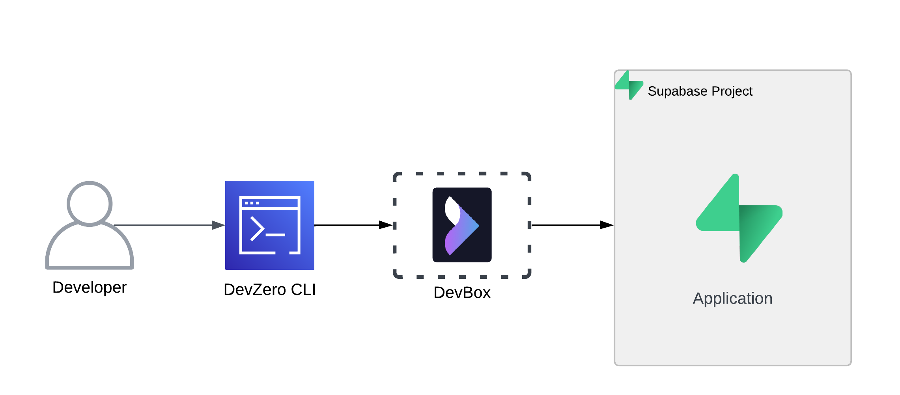
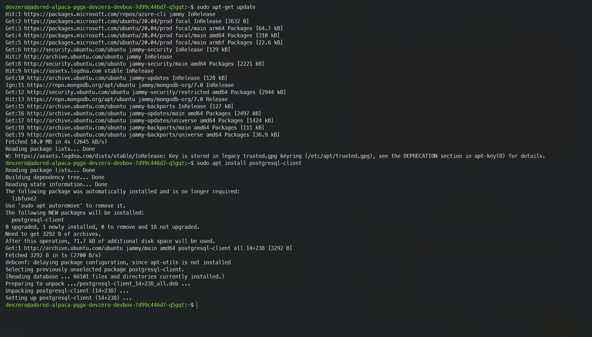
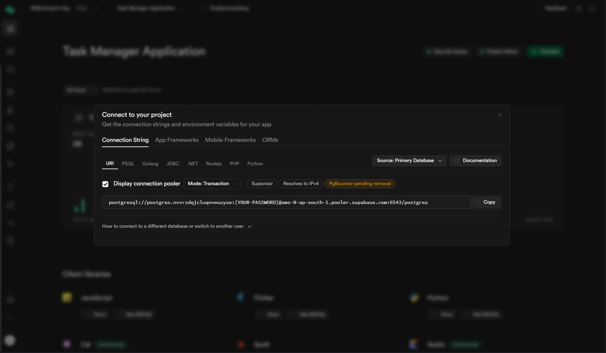
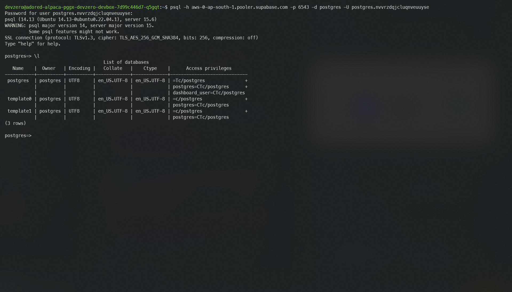
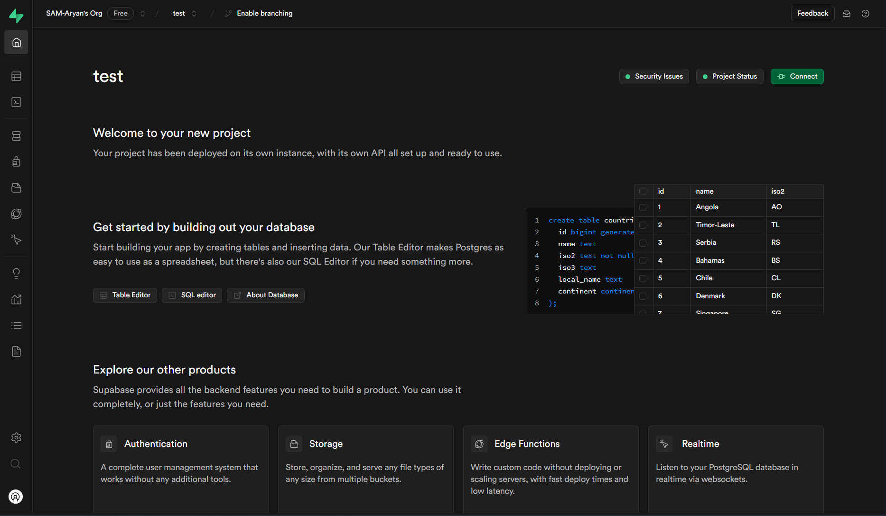

# Supabase

Comprehensive guide for connecting to a Supabase Project from your DevBox.

## Architecture Diagram



Here, you will connect to a Supabase Project from your DevBox. This would be done by setting up the cluster in your Project dashboard and accessing it through `psql` client tool.

## Prerequisites

Before you begin, you should create your account with [Supabase](https://supabase.com/dashboard/sign-in) and create a new organisation.

## Existing Supabase Project

### Step 1: Installing dependencies in DevBox

Now we need to install the Postgres `psql` client tool.

Follow the below steps to do so:

1. Use the following command to reload the local package database:


```bash
sudo apt-get update
```


2. Install the PostgresSQL :


```bash
sudo apt install postgresql-client
```




### Step 2: Connecting with the Project

To make the connection, follow the below steps:

1. Go to **[Supabase Dashboard](https://supabase.com/dashboard/projects)**.
2. Open the project which you want to access through the DevBox.
3. Click on connect and copy the connection string for `PSQL`.



4. Now in your DevBox, simply paste the connection string and enter the password when prompted.



## New Supabase Project

If you need to make a new Supabase database and access it through DevBox, then follow the below steps:

### Step 1: Creating a Project

1. Go to **[Supabase Dashboard](https://supabase.com/dashboard/projects)**.
2. Click on **New Project** and enter the **Organisation**, **Project name** and a strong **Database Password**.
3. Choose your region and click on **Create new project**.
4. Give it a few moments and your project will be ready to use.



### Step 2: Installing dependencies in DevBox

Now we need to install the Postgres `psql` client tool.

Follow the below steps to do so:

1. Use the following command to reload the local package database:


```bash
sudo apt-get update
```


2. Install the PostgresSQL :


```bash
sudo apt install postgresql-client
```



### Step 3: Connecting with the Project

To make the connection, follow the below steps:

1. Go to **[Supabase Dashboard](https://supabase.com/dashboard/projects)**.
2. Open the project which you want to access through the DevBox.
3. Click on connect and copy the connection string for `PSQL`.


4. Now in your DevBox, simply paste the connection string and enter the password when prompted.

