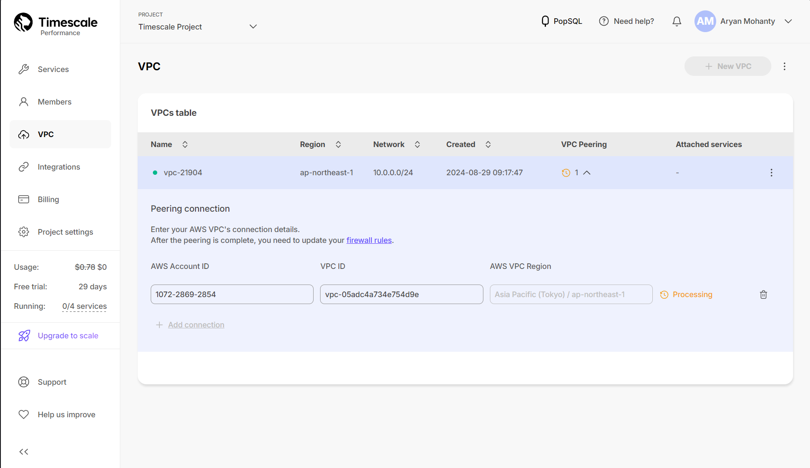
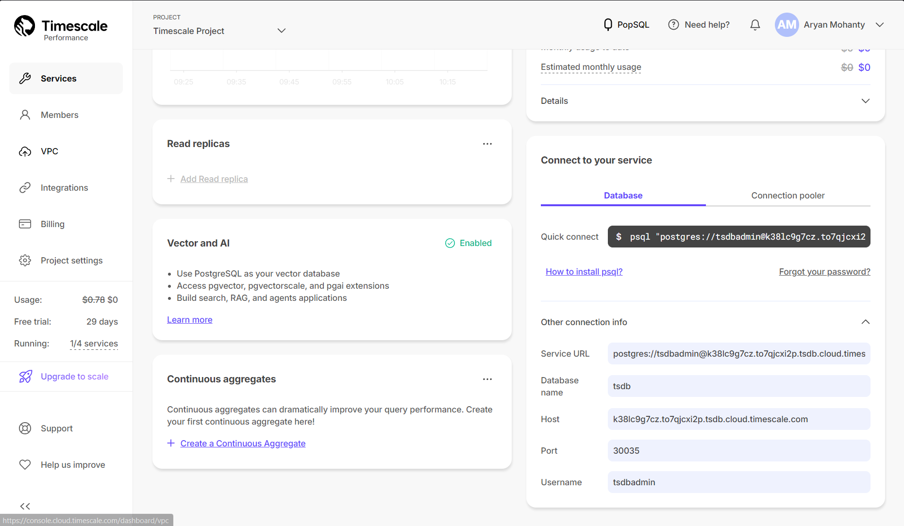
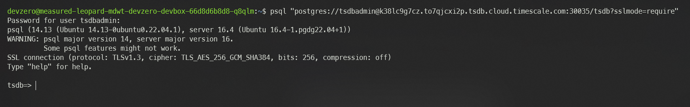
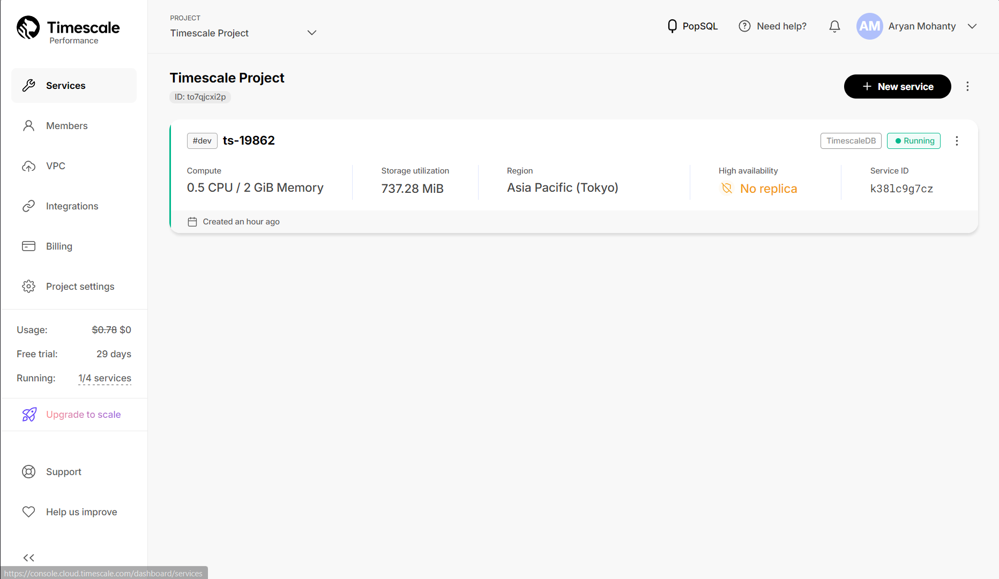

# Timescale

Comprehensive guide for connecting to a Timescale Service from your DevBox.

## Architecture Diagram


This would be done by setting up the cluster in your Project dashboard and accessing it through `psql` client tool.

## Prerequisites

- Before you begin, you should create your account with [Timescale](https://supabase.com/dashboard/sign-in) and create a new organisation.
- Follow the [Connecting to AWS](../existing-network/connecting-to-aws.md) guide to setup the advertise routes for DevBox to access AWS Services. This is necessary since we are going to use a VPC peering with timescale database service for secure connection.

## Existing Timescale Service

### Step 1: Creating the Recipe for Workspace

You will need to create a Recipe in DevZero equipped with the necessary tools like `psql`:

1. Go to **DevZero** Dashboard and open the **Recipes** tab.
2Databaseon **New Recipe** and enter the recipe's name.
3. Click on **Create a recipe**, and your recipe will be created.
4. Replace the recipe `yaml` file with the snippet below. Remember to replace the placeholder API key with the Databasenoted down in the above steps:


```
version: "3"

build:
  steps:
    - type: apt-get
      packages: ["build-essential", "curl", "git", "nano", "software-properties-common", "ssh", "sudo", "tar", "unzip", "vim", "wget", "zip", "postgresql-client"]
```



5. After editing the recipe, click on **Save and Build**.
6. When the build is successful, click on **Publish**.
7. After the recipe is published, click on **Launch** and create a new workspace by providing a **Workspace Name**.
8. Click on **Launch** and your workspace will be created.


### Step 2: Creating the VPC

To make your connection secure, we need to create a VPC within the Timescale Infrastructure and then peer it to the AWS VPC:

1. Go to **[Timescale Dashboard > VPC](https://console.cloud.timescale.com/dashboard/vpc)**.
2. Click on **New VPC** and enter the **Region**, **Name** and **IP Range** of the VPC.
3. Click on **Create** and after creation, click on **Add** under VPC Peering column.
4. Enter your AWS VPC details and click on **Add connection**.



### Step 3: Configure Timescale Service Environment

Follow the below steps to connect to the database instance:

1. Go to **[Timescale Dashboard > Services](https://console.cloud.timescale.com/dashboard/services)**.
2. Click on Service you want to access.
3. Click on **Triple dot** dialog menu on the top right corner.
4. Choose the **Change service environment** option and then go to the VPC tab.
5. Select the VPC and click on **Attach VPC**.

### Step 4: Connecting to the Database

Now with everything setup, you just need to use the connection string to access the database:

1. Go to **[Timescale Dashboard > Services](https://console.cloud.timescale.com/dashboard/services)**.
2. Click on Service you want to access.
3. Scroll down and copy the connection string you see.



4. Go to DevBox and paste the connection string and enter the password when prompted:


```
psql "postgres://<username>@<host-id>.<database-name>.cloud.timescale.com:30035/<database-name>?sslmode=require"
```




## New Timescale Workspace

If you need to make a new Timescale database and access it through DevBox, then follow the below steps:

### Step 1: Creating the VPC

To make your connection secure, we need to create a VPC within the Timescale Infrastructure and then peer it to the AWS VPC:

1. Go to **[Timescale Dashboard > VPC](https://console.cloud.timescale.com/dashboard/vpc)**.
2. Click on **New VPC** and enter the **Region**, **Name** and **IP Range** of the VPC.
3. Click on Create and after creation, click on **Add** under VPC Peering column.
4. Enter your AWS VPC details and click on **Add connection**.


### Step 2: Creating a Timescale Service

1. Go to **[Timescale Dashboard > Services](https://console.cloud.timescale.com/dashboard/services)**.
2. Click on **New Service** and pick your service type between **Time Series and Analytics** and **Dynamic PostgreSQL**.
3. Choose the **Region**, **Compute** configuration, and **Environment** type.
4. In the **VPC** section choose the vpc you justv created.
5. Click on **Create Service** and your database service will be created.



### Step 3: Creating the Recipe for Workspace

You will need to create a Recipe in DevZero equipped with the necessary tools like `psql`:

1. Go to **DevZero** Dashboard and open the **Recipes** tab.
2Databaseon **New Recipe** and enter the recipe's name.
3. Click on **Create a recipe**, and your recipe will be created.
4. Replace the recipe `yaml` file with the snippet below. Remember to replace the placeholder API key with the Databasenoted down in the above steps:


```
version: "3"

build:
  steps:
    - type: apt-get
      packages: ["build-essential", "curl", "git", "nano", "software-properties-common", "ssh", "sudo", "tar", "unzip", "vim", "wget", "zip", "postgresql-client"]
```



5. After editing the recipe, click on **Save and Build**.
6. When the build is successful, click on **Publish**.
7. After the recipe is published, click on **Launch** and create a new workspace by providing a **Workspace Name**.
8. Click on **Launch** and your workspace will be created.


### Step 4: Connecting to the Database

Now with everything setup, you just need to use the connection string to access the database:

1. Go to **[Timescale Dashboard > Services](https://console.cloud.timescale.com/dashboard/services)**.
2. Click on Service you want to access.
3. Scroll down and copy the connection string you see.


4. Go to DevBox and paste the connection string and enter the password when prompted:


```
psql "postgres://<username>@<host-id>.<database-name>.cloud.timescale.com:30035/<database-name>?sslmode=require"
```



