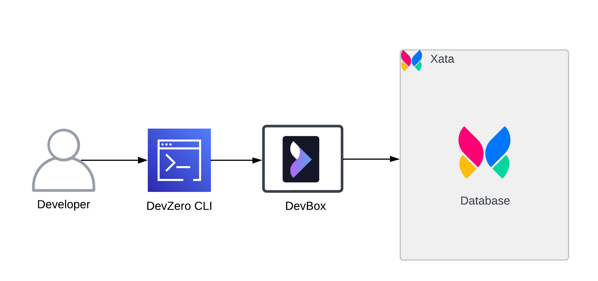
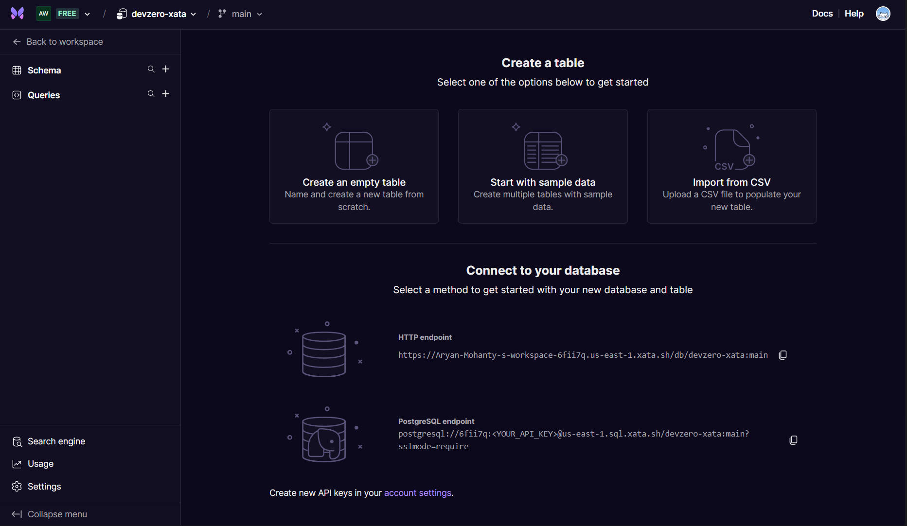
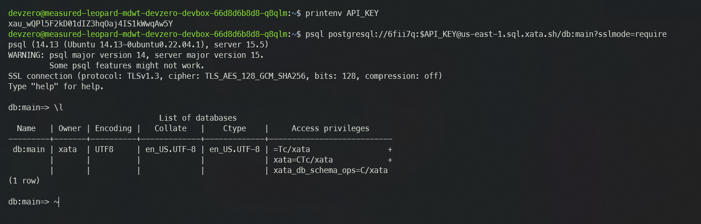
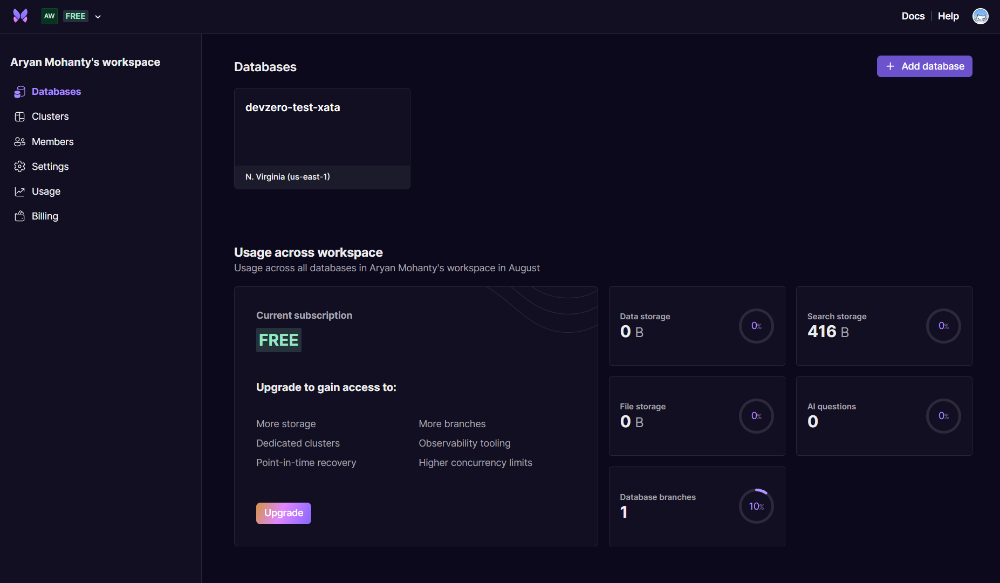
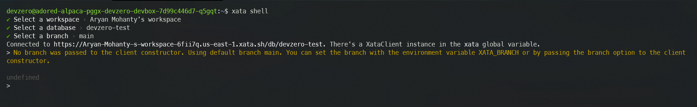

# Xata

Comprehensive guide for connecting to Xata Workspace Database from your DevBox.

## Architecture Diagram



[Xata](https://xata.io/docs/concepts/serverless-data-platform) is a serverless data platform for PostgreSQL that optimizes reliability, scalability, and developer experience. Xata provides features that make it easier to build modern applications, such as **Branching**, **Zero-downtime schema migrations**, **File attachments**, and more.
In this guide, we will walk you through the entire process of connecting your Xata Database to your DevBox step by step.

## Prerequisites

Before you begin, create your account with [Xata](https://app.xata.io/signin) and create a new Workspace.




## Existing Xata Database - PostgreSQL

### Step 1: Creating the API Key

First, you need to get the API access key so that we can connect to the Database:

1. Go to **[Xata Account Settings](https://app.xata.io/settings)**.
2. In the **Personal API keys** section, click on **Add a key** and enter the name of the key.
3. Note down the secret API key.

### Step 2: Creating the Recipe for Workspace

You will need to create a Recipe in DevZero equipped with the necessary tools like psql and store your API keys as well:

1. Go to **DevZero** Dashboard and open the **Recipes** tab.
2. Click on **New Recipe** and enter the recipe's name.
3. Click on **Create a recipe**, and your recipe will be created.
4. Replace the recipe `yaml` file with the snippet below. Remember to replace the placeholder API key with the key you noted down in the above steps:


```
version: "3"

build:
  steps:
    - type: apt-get
      packages: ["build-essential", "curl", "git", "nano", "software-properties-common", "ssh", "sudo", "tar", "unzip", "vim", "wget", "zip", "postgresql-client"]
      
runtime:
  environment:
    - name: XATA_API_KEY
      value: <api-key>
```



5. After editing the recipe, click on **Save and Build**.
6. When the build is successful, click on **Publish**.
7. After the recipe is published, click on **Launch** and create a new workspace by providing a **Workspace Name**.
8. Click on **Launch** and your workspace will be created.


### Step 3: Connecting to the Database

Follow the below steps to connect to the database instance:

1. Go to **[Xata Dashboard](https://app.xata.io/workspaces)**.
2. Open the Database that you want to access through DevBox.



3. Copy the connection  string for **PostgreSQL endpoint** and then use the following command to connect to the Database:


```
psql postgresql://<workspace-id>:$XATA_API_KEY@<region>.sql.xata.sh/<database-name>:<branch>?sslmode=require
```




## New Xata Database - PostgreSQL

If you need to make a new Xata database and access it through DevBox, then follow the below steps:

### Step 1: Creating a Workspace Database

1. Go to **[Xata Dashboard](https://app.xata.io/workspaces)**.
2. If you haven't created a database, the dashboard will automatically prompt you to create one, but if you have completed the initial setup, you need to click on **Add Database**.
3. Enter the database **Name**, choose the **Region** and enable the **Enable direct access to Postgres** option.
4. Click on **Create**, and your Database will be created and shown on your dashboard.



### Step 2: Creating the API Key

First, you need to get the API access key so that we can connect to the Database:

1. Go to **[Xata Account Settings](https://app.xata.io/settings)**.
2. In the **Personal API keys** section, click on **Add a key** and enter the name of the key.
3. Note down the secret API key.

### Step 3: Creating the Recipe for Workspace

You will need to create a **Recipe** in DevZero equipped with the necessary tools like `psql` and store your API keys as well:

1. Go to **DevZero** Dashboard and open the **Recipes** tab.
2. Click on **New Recipe** and enter the recipe's name.
3. Click on **Create a recipe**, and your recipe will be created.
4. Replace the recipe `yaml` file with the snippet below. Remember to replace the placeholder API key with the Key you noted down in the above steps:


```
version: "3"

build:
  steps:
    - type: apt-get
      packages: ["build-essential", "curl", "git", "nano", "software-properties-common", "ssh", "sudo", "tar", "unzip", "vim", "wget", "zip", "postgresql-client"]
      
runtime:
  environment:
    - name: XATA_API_KEY
      value: <api-key>
```



5. After editing the recipe, click on **Save and Build**.
6. When the build is successful, click on **Publish**.
7. After the recipe is published, click on **Launch** and create a new workspace by providing a **Workspace Name**.
8. Click on **Launch** and your workspace will be created.


### Step 4: Connecting to the Database

Follow the below steps to connect to the database instance:

1. Go to **[Xata Dashboard](https://app.xata.io/workspaces)**.
2. Open the database which you want to access through the DevBox.


3. Copy the connection  string for **PostgreSQL endpoint** and then use the following command to connect to the database:


```
psql postgresql://<workspace-id>:$XATA_API_KEY@<region>.sql.xata.sh/<database-name>:<branch>?sslmode=require
```







## Existing Xata Database - Xata

### Step 1: Creating the API Key

First you need to get the API access key so that we can connect to the database:

1. Go to **[Xata Account Settings](https://app.xata.io/settings)**.
2. In the **Personal API keys** section, click on **Add a key** and enter the name of the key.
3. Note down the secret API key.

### Step 2: Creating the Recipe for Workspace

You will need to create a **Recipe** in DevZero equiped with the neccesary tools like `node`, `xata` and store your API keys as well:

1. Go to **DevZero** Dashboard and open the **Recipes** tab.
2. Click on **New Recipe** and enter the name of recipe.
3. Click on **Create a recipe** and your recipe will be created.
4. Replace the recipe `yaml` file with the snippet below. Remember to replace the placeholder API key with the Key you noted down in the above steps:


```
version: "3"

build:
  steps:
    - type: apt-get
      packages: ["build-essential", "curl", "git", "nano", "software-properties-common", "ssh", "sudo", "tar", "unzip", "vim", "wget", "zip"]
    - type: command
      command: |
        curl -o- https://raw.githubusercontent.com/nvm-sh/nvm/v0.39.1/install.sh | bash
        echo 'export NVM_DIR=$HOME/.nvm' | sudo tee -a /etc/profile.d/nvm-installation.sh
        echo '[ -s $NVM_DIR/nvm.sh ] && \. $NVM_DIR/nvm.sh' | sudo tee -a /etc/profile.d/nvm-installation.sh
        . /etc/profile.d/nvm-installation.sh
        nvm install 21.0.0
        npm install -g @xata.io/cli
      
runtime:
  environment:
    - name: XATA_API_KEY
      value: <api-key>
```



5. After editing the recipe, click on **Save and Build**.
6. When the build is successful, click on **Publish**.
7. After the recipe is published, click on **Launch** and create a new workspace by providing a **Workspace Name**.
8. Click on **Launch** and your workspace will be created.

### Step 3: Connecting to the Database

Follow the below steps to connect to the database instance:

1. Go to DevBox and use the following command to authenticate your xata account:


```
xata auth login
```


2. Choose the `Use an existing API key` option while authenticating, and then hit **Enter/Return** with the API Key shown when prompted.
3. Use the following command for access the database through Xata shell:


```
xata shell
```


4. Select the **Workspace**, **Database** and **Branch** when prompted.



## New Xata Database - Xata

If you need to make a new Xata database and access it through DevBox, then follow the below steps:

### Step 1: Creating a Workspace Database

1. Go to **[Xata Dashboard](https://app.xata.io/workspaces)**.
2. If you haven't created a database, the dashboard will automatically prompt you to create one, but if you have completed the initial setup, you just need to click on **Add database**.
3. Enter the database **Name**, and choose the **Region**.
4. Click on **Create** and your Database will be created and will show up on your dashboard.


### Step 2: Creating the API Key

First, you need to get the API access key so that we can connect to the database:

1. Go to **[Xata Account Settings](https://app.xata.io/settings)**.
2. In the **Personal API keys** section, click on **Add a key** and enter the name of the key.
3. Note down the secret API key.

### Step 3: Creating the Recipe for Workspace

You will need to create a **Recipe** in DevZero equipped with the necessary tools like `node` and `xata` and store your API keys as well:

1. Go to **DevZero** Dashboard and open the **Recipes** tab.
2. Click on **New Recipe** and enter the recipe's name.
3. Click on **Create a recipe**, and your recipe will be created.
4. Replace the recipe `yaml` file with the snippet below. Remember to replace the placeholder API key with the Key you noted down in the above steps:


```
version: "3"

build:
  steps:
    - type: apt-get
      packages: ["build-essential", "curl", "git", "nano", "software-properties-common", "ssh", "sudo", "tar", "unzip", "vim", "wget", "zip"]
    - type: command
      command: |
        curl -o- https://raw.githubusercontent.com/nvm-sh/nvm/v0.39.1/install.sh | bash
        echo 'export NVM_DIR=$HOME/.nvm' | sudo tee -a /etc/profile.d/nvm-installation.sh
        echo '[ -s $NVM_DIR/nvm.sh ] && \. $NVM_DIR/nvm.sh' | sudo tee -a /etc/profile.d/nvm-installation.sh
        . /etc/profile.d/nvm-installation.sh
        nvm install 21.0.0
        npm install -g @xata.io/cli
      
runtime:
  environment:
    - name: XATA_API_KEY
      value: <api-key>
```



5. After editing the recipe, click on **Save and Build**.
6. When the build is successful, click on **Publish**.
7. After the recipe is published, click on **Launch** and create a new workspace by providing a **Workspace Name**.
8. Click on **Launch** and your workspace will be created.

### Step 4: Connecting to the Database

Follow the below steps to connect to the database instance:

1. Go to DevBox and use the following command to authenticate your Xata account:


```
xata auth login
```


2. Choose the `Use an existing API key` option while authenticating and then hit **Enter/Return** without entering the API Key when prompted.
3. Use the following command to access Databasebase through the Xata shell:


```
xata shell
```


4. Select the **Workspace**, **Database** and **Branch** when prompted.




