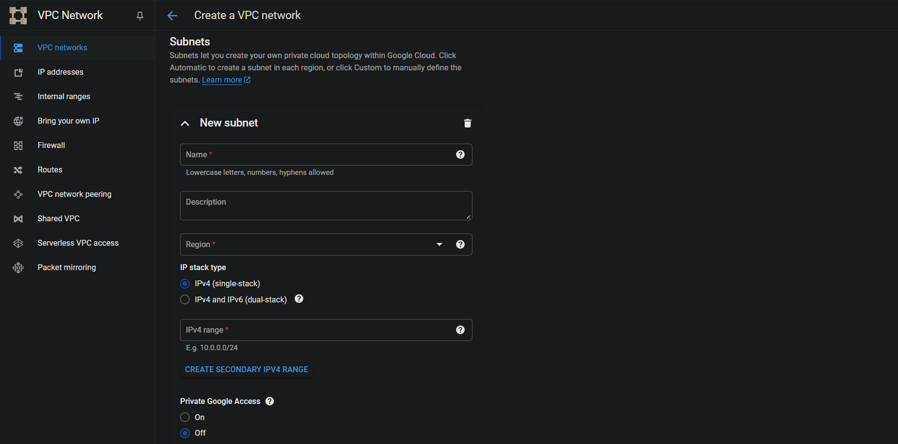
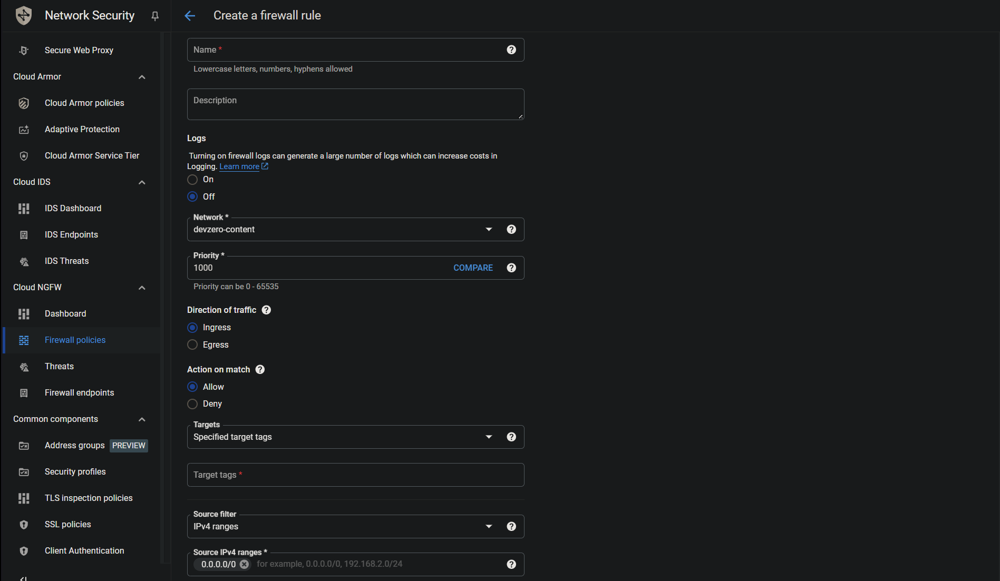
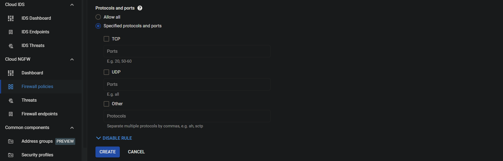

# Connecting to GCP

## Step 1: Create a VPC

1. Go to **VPC Network > VPC Networks**.
2. Select **Create VPC Network.**
3. Enter VPC name, and under **Subnets** choose region, IP Stack option and **IP CIDR** range. Remember to select **On** option for **Private Google Access** while creating the private subnet.
4. Here we are using **10.0.1.0/24** for public subnet range and **10.0.2.0/24** for private subnet range. Customize the IPv4 CIDR block if needed.



5. Click on **Create** and it will generate the VPC Network for you.
6. After the VPC network creation, go to **VPC-Name > Firewalls**. Select **Add Firewall Rule** and then enter the rule name, and source IP range (Source = **0.0.0.0/0**).



7. After that you will be asked to select the ingress ports and protocols. Allow inbound SSH (Port range = **22**). We’ll need this during initial setup but can close the firewall later.‍



## Step 2: Create a Bastion Host

<!-- markdown-link-check-disable-next-line -->
1. Use one of the [supported linux distros](https://console.cloud.google.com/compute/images).
2. Go to **Compute Engine > Create an Instance > Advanced Options > Networking** section.
3. Add the respective firewall tags in the **Network Tags** box.
4. Attach public subnet to the instance from the VPC and assign it a public IP Address.
5. SSH into the machine and Install the DevZero CLI from the script:


```
curl -fsSL https://get.devzero.io | sh
```


6. Log into your account by executing:


```
dz auth login
```


7. Enable IP forwarding to access resources on VPC CIDR:


```
echo 'net.ipv4.ip_forward = 1' | sudo tee -a /etc/sysctl.conf
echo 'net.ipv6.conf.all.forwarding = 1' | sudo tee -a /etc/sysctl.conf
sudo sysctl -p /etc/sysctl.conf
```


8. Connect to DevZero network:


```
sudo dz net connect --ssh --advertise-routes=<VPC-CIDR>
```


9. Verify that the machine was connected to your DevZero network:


```
dz net status
```



You should see the GCP virtual machine hostname.

10. Now you will be able to access Private GCP Resources from your DevBox.
