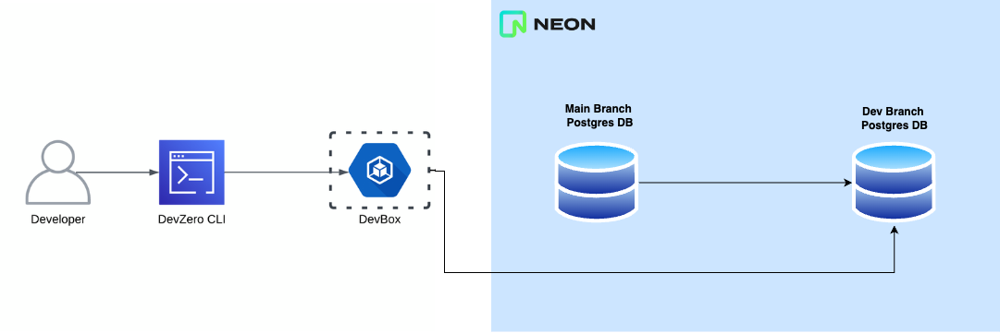
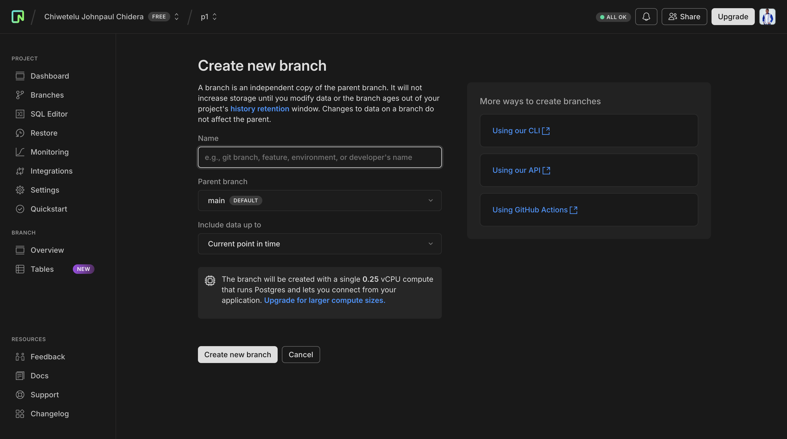

# Neon DB

## Architecture Diagram



## Prerequisites

Basic knowledge of [Neon DB](https://neon.tech/docs) and [Neon DB branching](https://neon.tech/docs/introduction/branching)

### Creating a Branch

1. Go to **Your Project > Project Dashboard.**
2. Click on **Branch** , create a new branch.
3. Give it a name and select **Current point in time** to create the branch off the current state of your main database.



Once the branch is created, please copy the connection string and add it to your [user environment secrets](../../environment-variables/personal.md#saving-an-user-scoped-environment-variable). In this guide, it is saved as `DATABASE_URL`.

### Building a Todo App

For the purpose of this guide, we will be using a [todo app](https://github.com/myestery/todo-app) built with nextjs that requires an environment variable called `DATABASE_URL` . We will be creating a recipe for this application and we will launch a workspace based on it.

#### Build Steps

* install linux helper packages
* clone repo
* install nodejs
* run `npm install`
* run `npm run build`: in this step, we need the database URL to be present so we can run some [prisma](https://www.prisma.io/) commands that are required for manipulating the database

#### Launch Steps

* `npm start`: to start the application

### Creating a Recipe for our ToDo App

When asked for repository, feel free to use [https://github.com/myestery/todo-app](https://github.com/myestery/todo-app) or create a fork of it if you want to follow this guide.

We will be implementing the above steps using the recipe file below

````yaml
```yaml
version: "3"
config:
  volumes:
    - sub_path: home
      path: /home/devzero
  code_clone_root: /home/devzero
  code_clone_credentials: null
build:
  environment:
  - name: DATABASE_URL
    value: "{{secret:team.DATABASE_URL}}"
  steps:
    # Install base OS packages
    - type: apt-get
      packages:
        - build-essential
        - curl
        - git
        - nano
        - software-properties-common
        - ssh
        - sudo
        - tar
        - unzip
        - vim
        - wget
        - zip
        - postgresql-client
    # cloned to /home/devzero
    - type: git-clone
      url: https://github.com/Myestery/todo-app
      branch: ""
      credentials: null
      directory: ""
    # Download and install NVM, Rationale: File: package.json
    # Install Node.js 21.0.0, Rationale: No Node.js version specified; using default
    - type: command
      command: |
        curl -o- https://raw.githubusercontent.com/nvm-sh/nvm/v0.39.1/install.sh | bash
        echo 'export NVM_DIR=$HOME/.nvm' | sudo tee -a /etc/profile.d/nvm-installation.sh
        echo '[ -s $NVM_DIR/nvm.sh ] && \. $NVM_DIR/nvm.sh' | sudo tee -a /etc/profile.d/nvm-installation.sh
        . /etc/profile.d/nvm-installation.sh
        nvm install 21.0.0
      directory: /home/devzero
      user: devzero
    # Install and build
    - type: command
      command: |
        . /etc/profile.d/nvm-installation.sh
        npm install
        npm run build
      directory: todo-app
      user: devzero
launch:
  environment:
    - name: DATABASE_URL
      value: "{{secret:team.DATABASE_URL}}"
  steps:
    - type: command
      command: |
        # Test PostgreSQL connection
        if psql "$DATABASE_URL" -c '\l'; then
          echo "PostgreSQL connection successful!"
        else
          echo "Failed to connect to PostgreSQL"
          exit 1
        fi
      directory: todo-app
      user: devzero
runtime:
  environment: []

```
````

The Recipe page has some helper snippet to guide you in generating such files

### Creating a workspace

Now that we have a working recipe, we can create a workspace off it from the [recipes page](https://www.devzero.io/dashboard/recipes/recipe-library) by clicking launch.

### Video Walkthrough


