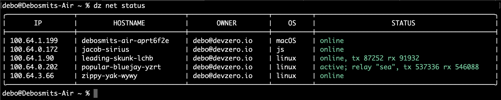

# Accessing your workspace

First, find the workspace you care about by running

```bash
dz network status
```


You will see an output that looks like this
<figure><figcaption><p>dz network status</p></figcaption></figure>

The next steps will show you a few ways to interact with your workspace...


Within the context of this page, let's focus on `popular-bluejay-yzrt` (the MagicDNS hostname) which has an IP address of `100.64.0.202`.


## cURL 

Say you're running a server on port 8080. To access that server from any machine that's running an authenticated `dz` CLI, just run

```bash
curl popular-bluejay-yzrt:8080

## OR

curl 100.64.0.202:8080
```


## Browser

To see a webapp running on port 8000, visit `popular-bluejay-yzrt:8000` or `100.64.0.202:8000` in your browser

## SSH

To access your workspace from any machine that's running an authenticated `dz` CLI, just run

```bash
ssh devzero@popular-bluejay-yzrt

# or if you want to forward your SSH agent
ssh -A devzero@popular-bluejay-yzrt

# or you wish to use the niceties of the CLI
dz ws connect popular-bluejay-yzrt
```


## Anything else

You can access the workspace using either the MagicDNS hostname (`popular-bluejay-yzrt`) or its private IP address (`100.64.0.202`) just like you would any application. You don't need to forward any ports etc since the `0.0.0.0` network interface of the workspace is available via either of those 2 approaches. 
