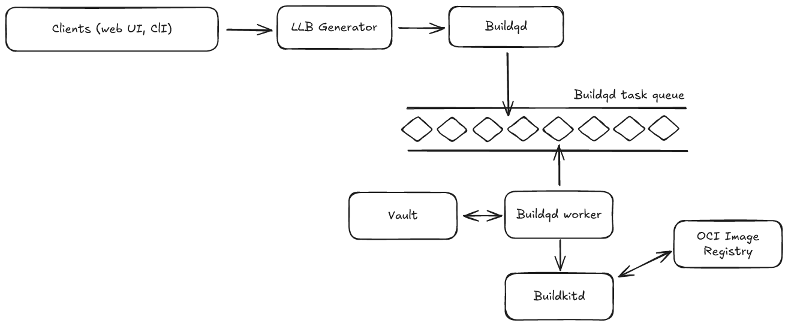

# Build Process

## User Experience

When you create a Recipe on the dashboard (at [DevZero: Create a new recipe](https://www.devzero.io/dashboard/recipes/new)), this is what you see...

To learn more about the various stages of the recipe specification, go to [Execution Stages](exec-stages.md). To learn more about the specification, go to [Recipe Syntax](syntax.md).

## Underlying Architecture

The broad set of steps that go into building and publishing a recipe, and subsequently launching a workspace are as follows:

1. YAML recipe converted into an [LLB](https://docs.docker.com/build/buildkit/#llb).&#x20;
   1. If environment variables are referenced (stored under [Environment Variables](https://www.devzero.io/dashboard/environment-variables)), they are validated and referenced directly in the LLB.
   2. Environment variables are injected directly into the LLB, and sensitive values (secrets, that are stored in a [Vault](https://github.com/hashicorp/vault) instance) are referenced and made avaiable to the relevant [BuildKit](https://github.com/moby/buildkit) worker (more on this in step 2.2).
   3. All steps that involve commands being run are base64-encoded and passed as input to a binary called `dzlaunch` (for cleaner handling of outputs from commands) - this binary is also available in a launched workspace.
   4. Once the LLB is ready, its sent to an async queue (`buildqd`) for it to get built and made available to be launched as a workspace.
2. `Buildqd` workers are responsible for building OCI-compatible images and pushing it to a team-specific OCI image registry (completely namespaced/isolated)
   1. First, LLBs are sent to [`buildkitd`](https://github.com/moby/buildkit/tree/master/cmd/buildkitd) following a similar pattern to how [`buildctl`](https://github.com/moby/buildkit/tree/master/cmd/buildctl) handles it (but using a [buildkit client](https://github.com/moby/buildkit/tree/master/client) directly) - we do this to be able to give the user raw as well as well structured logs.
   2. Secrets, if any, are retrieved from [Vault](https://github.com/hashicorp/vault) and injected into the build worker - this is one of the ways to ensure logical isolation.
   3. If there were previous builds of the recipe, those caches are retrieved from the isolated OCI image registry to enable faster builds.
   4. While the build is running, logs are streamed into a message queue to be made available to the different clients (web UI, CLI, etc). (d) Once the build is completed, the image (and cached layers) are pushed to the team-specific OCI image registry.

### How It Works

