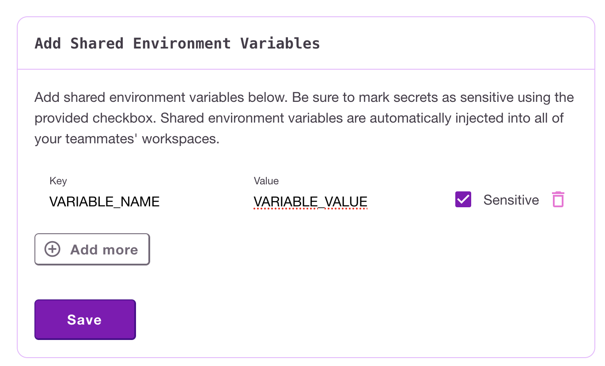

# Secrets and Environment variables

## Managing secrets

Both secrets and environment variables (or just variables) are managed using the same user interface. The only difference between environment variables and secrets is whether they are considered to be sensitive, and thus their value cannot be accessed through the UI once they are saved, and not sensitive, visible to all the members of the team from the UI.

You can manage variables for your user in the [user secret management page](https://www.devzero.io/dashboard/environment-variables/personal) and for your team on the [team secret management page](https://www.devzero.io/dashboard/environment-variables/team).

Adding a new secret looks the same in both of them:

<figure><figcaption><p>Add Secret Dialog</p></figcaption></figure>

As you can see - it is up to you to pick whether this value is a sensitive one or not.

As secrets sometimes contain things like private ssh keys, we support multi-line secrets, though exposing them as environment variables to your workspace is not recommended.

## Using secrets and environment variables

Once you add a variable to one of the registries you need to actually include it in the recipe definition for it to show up anywhere. At the moment the variable can be used as:

Content of a file:

```
    - type: file
      path: /home/devzero/.ssh/id_rsa
      content: "{{secret:user.PRIVATE_SSH_KEY}}"
```

Environment variable available to a command:

```
    - type: command
      command: echo $GITHUB_ACCESS_TOKEN
      environment:
        - name: GITHUB_ACCESS_TOKEN
          value: "{{secret:devzero.GITHUB_ACCESS_TOKEN}}"
```

Or as an environment variable available during a phase of the recipe execution (phases being build, launch and runtime)

```
build:
  environment:
    - name: NPM_KEY
      value: "{{secret:team.NPM_KEY}}"
  steps:
    - type: command
      command: npm install

runtime:
  environment:
    - name: GOPRIVATE
      value: "{{secret:team.GOPRIVATE}}"
```

Any environment variables in the runtime environment configuration will be available when connected to a workspace either through ssh or Visual Studio Code. While variables in the build section will be visible to the step in the build section only.

You can read more about the syntax and ways of using variables in your recipes in the [recipe syntax](../references/recipe-syntax.md) page.
