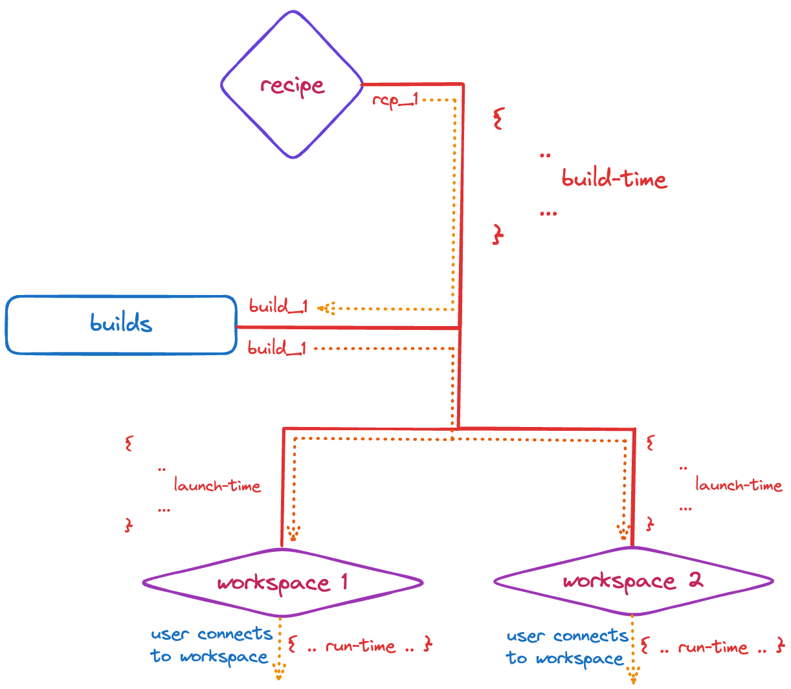
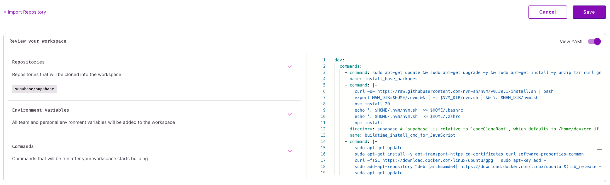
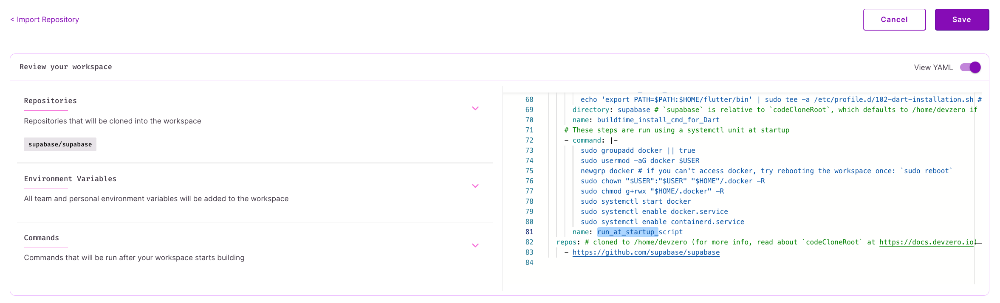

# Execution Stages

## Overview

Recipes have two execution stages that you can customize:

1. **Build-time:** when recipe is getting saved, after validation.
2. **Launch-time:** when a workspace is being launched from a recipe.
3. **Run-time**: when a workspace is running (your active coding, app runtime environment)

Irrespective of the stage, [command](../references/recipe-syntax.md#command) blocks will be executed in the order in which they are specified in the recipe.

<figure><figcaption><p>Execution stages (difference between built- and launch-time)</p></figcaption></figure>

<details>

<summary>What won't work</summary>

Anything that requires user-input to proceed. Build- and launch-time steps are executed by processes in a completely headless mode. As such, if your setup command requires user-input or needs to be attached to a TTY, it will unfortunately not work. You will see it get stuck in the logs, and the best you will be able to do is cancel that build.

**Common cases where this is true:**

* Adding `-y` for apt-get operations: `sudo apt-get install -y curl`
* Prepending apt-get operations with `DEBIAN_FRONTEND=noninteractive`: `DEBIAN_FRONTEND=noninteractive sudo apt-get install -y tzdata`

</details>

## Build-time

This stage should be used when caching of the build is helpful, i.e., pre-builds. Our builder uses the YAML specification to create container images that are then run as workspaces, the build images are layered and cached to improve subsequent workspace launch times.

Each command block can be thought of as a layer in a Docker image. They are wrapped in a script and executed within a bash context. In case `directory` is specified:

* if absolute, it will be used
* if relative, it will be relative to `/home/devzero`
* if unspecified, it will default to `/home/devzero`

`name` is used to help reference and understand what is being achieved in a command block.


**Note** When invoking binaries, its always best-practice to reference them by their absolute paths. For example, `/usr/local/go/bin/go` instead of `go`. This relates to the following `warning` block.



**Warning** Environment variable set by calling `export` are not going to be available in subsequent command blocks. To use them in subsequent blocks, either write to some file, or to `/etc/environment`. Please see the previous `info` section for more ways to better utilize this.


While recipe builds are cached, updating a lower layer (eg: the first step in your build steps) will cause the cache to get invalidated for all future steps. Therefore, if you edit step 1 in a 5-step recipe, steps 2, 3, 4 and 5 will get rebuilt. If you just edit step 5, the previous steps will be served out of the cache.

Here's an example of some build-time steps:


```yaml
version: "3"
build:
  steps:
    - type: apt-get
      packages: ["curl", "gnupg", "software-properties-common", "tar", "unzip", "zip"]
    # install NVM
    - type: command
      command: |
        curl -o- https://raw.githubusercontent.com/nvm-sh/nvm/v0.39.1/install.sh | bash
        export NVM_DIR=$HOME/.nvm && [ -s $NVM_DIR/nvm.sh ] && \. $NVM_DIR/nvm.sh
        nvm install 21.0.0
        echo '. $HOME/.nvm/nvm.sh' >> $HOME/.bashrc
        echo '. $HOME/.nvm/nvm.sh' >> $HOME/.zshrc
        npm install --global yarn
    # install Docker
    - type: apt-get
      packages: ["docker-ce", "docker-ce-cli", "containerd.io"]
      extra_repositories:
      - key_url: https://download.docker.com/linux/ubuntu/gpg
        repository: https://download.docker.com/linux/ubuntu
    - type: command
      command: |
        sudo curl -L "https://github.com/docker/compose/releases/download/1.29.2/docker-compose-$(uname -s)-$(uname -m)" -o /usr/local/bin/docker-compose
        sudo chmod +x /usr/local/bin/docker-compose

        groupadd docker || true
        usermod -aG docker devzero
        mkdir -p /home/devzero/.docker
        newgrp docker
        chown devzero:devzero /home/devzero/.docker -R
        chmod g+rwx /home/devzero/.docker -R
        systemctl enable docker.service
        systemctl enable containerd.service
      directory: /home/devzero
      user: root
```


For more examples, see check the build commands in our [starter-templates](../references/starter-templates/ "mention").

Use-cases:

* Users in your team don't need to wait for workspaces to build.
* Users in your team want to start with workspaces that are already configured with golden paths.

<figure><figcaption><p>Code block in a recipe</p></figcaption></figure>

<details>

<summary>What doesn't belong in the build steps?</summary>

Do not use build steps for executing any sort of daemonized process (eg: `sudo systemctl start ...`)

While calling operations to kick-off indexing in IDEs is technically feasible in the build-time stage, it's best left to the launch-time stage.

</details>

## Launch-time

These steps are run using `systemctl` units at launch-time. Command blocks will be executed in the order in which they are specified in the recipe.


The **launch** block is used for commands to be executed as launch-time steps.


Other than that, the same rules from the [Build-time](exec-stages.md#build-time) stage apply.

Here's an example of some launch-time steps:


```yaml
launch:
  steps:
    - type: command
      command: |
        systemctl start docker
      directory: /home/devzero
      user: root
    - type: command
      command: |
        systemctl start postgresql.service
        echo 'postgres     ALL=NOPASSWD: ALL' | sudo tee /etc/sudoers.d/100-postgres
        sudo -u postgres bash -c "psql -c \"CREATE USER pguser WITH PASSWORD 'test1234';\""
        sudo -u postgres createdb testdb -O pguser
      directory: /home/devzero
      user: root
```


<figure><figcaption><p>Code block in a recipe</p></figcaption></figure>

<details>

<summary>What doesn't belong in the launch steps?</summary>

Cacheable steps that make filesystem updates are better placed in the build-time stage

Binaries, files, and interfaces that you expect the user to access as soon as they get into their workspace.

</details>
