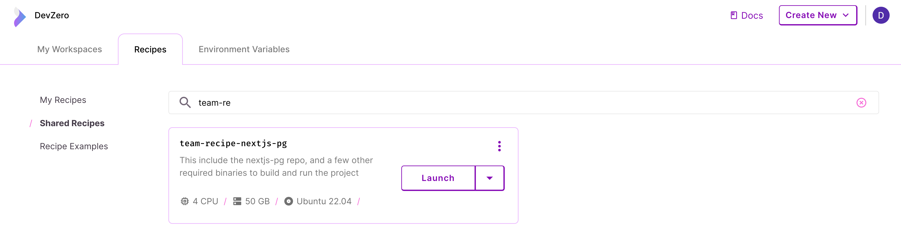

# Building new recipes

Using the webapp:

<figure><figcaption><p>Creating a new recipe</p></figcaption></figure>


_If you want to use the CLI tool instead, please visit_ [_this section_](new-recipe.md#using-the-dz-cli-tool)_._


1. A recipe always start from a repository. To get started, first visit the [DevZero Console](devzero.io/dashboard/).
2. Create a recipe by clicking `Create New` (top-right) >> `Create New Recipe`. This will take you to the [new repo](https://www.devzero.io/dashboard/new/repo) page.
3. Either start typing or enter the URL of any repo hosted on GitHub (eg:  [https://github.com/facebook/react](https://github.com/facebook/react)).


If you're not using GitHub, check out this section on [custom cloning source code](code.md#advanced-custom-ways-of-clone-code).


4. Modify your recipe, then click `Save` (top-right).
5. Give the recipe a name and description (so you can find it later!), **check the toggle** for team recipe, and save it! To save it as a draft recipe, see the ['User Recipes' section](types.md#user-or-draft-recipes).
6. If you want to give other access to the recipe, save it in the "shared recipes". We recommend updating the recipe while saving it in "My Recipes" and moving to the shared recipes once you tested it and made sure it works properly.
7. The initial build process might take a few minutes. We expose the logs during the process in case you need to troubleshoot anything. Once done the status next to the recipe name will turn green and "Launch Workspace Now" will be enabled.&#x20;

<figure><figcaption><p>Build completed</p></figcaption></figure>

4. Depending on where you stored the recipe, visit "My Recipes" or the [shared recipes](https://www.devzero.io/dashboard/recipes#shared) page, to verify that the recipe has been saved!

<figure><figcaption><p>Team Recipe View</p></figcaption></figure>

## Using the `dz` CLI tool


_This section is undergoing active development and will change in the near future._


1. Install the CLI tool if you haven't installed it already by following the [Download CLI](broken-reference) page.
2. `cd` into your repository directory on your local machine and run


```bash
dz workspace suggest
```


3. Inspect the contents and this time, write the contents to a file called `recipe.yml`


```bash
dz workspace suggest > recipe.yml
```



Be sure to set up your GitHub provider before continuing to the next step. If you're not using GitHub, check out this section on [custom cloning source code](code.md#advanced-custom-ways-of-clone-code).


4. Run a build for the specification


```bash
dz workspace build --recipe-file=recipe.yml
```


5. Once the build completes, there will be output that looks like this


```bash
🚀	Build was successful!
👉	To launch a workspace from this build:
		dz workspace create --build-id build-f10bafd5ee0a4fba91ff6bba54f23e9c --recipe-id recipe-9a33ea10b2554b00ae7e73c02b341048
```


6. Now that you have a valid build, you can save this as a recipe. Copy the contents of `recipe.yml` and continue from step 3 in the [Web Dashboard](new-recipe.md#using-the-web-dashboard) section.
