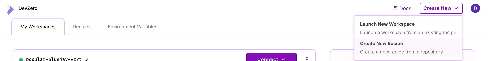
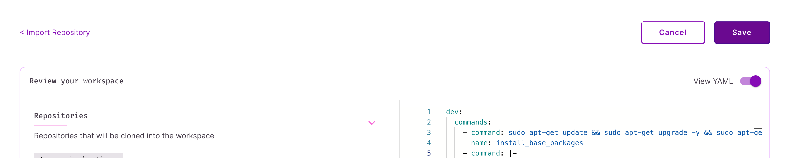
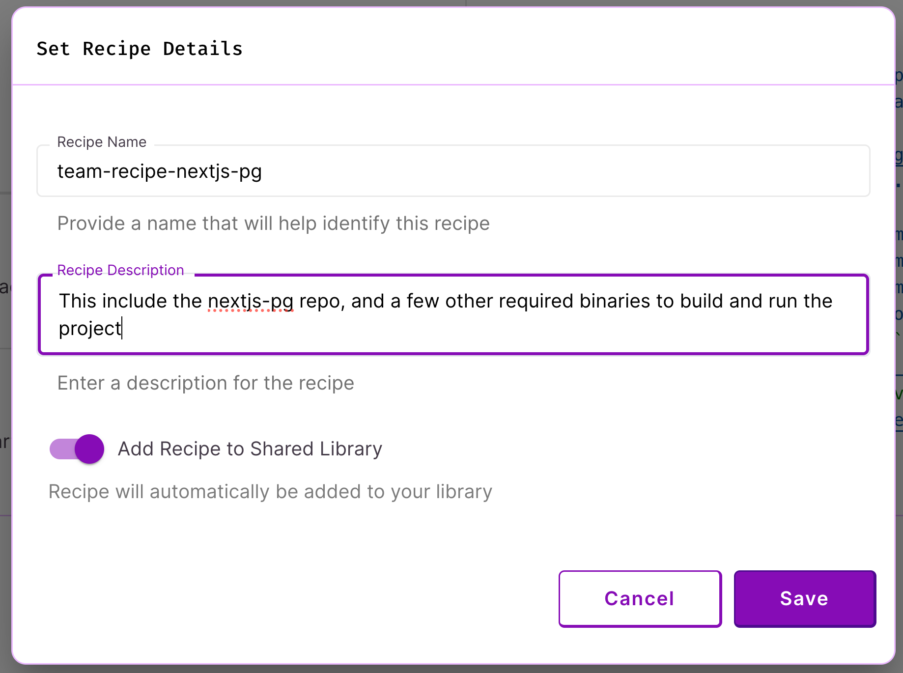

# Creating a new recipe

## Using the web dashboard


_If you want to use the CLI tool instead, please visit [this section](#using-the-dz-cli-tool)._


1. A recipe always start from a repository. To get started, first visit the [DevZero Console](devzero.io/dashboard). 

2. Create a recipe by clicking `Create New` (top-right) >> `Create New Recipe`. This will take you to the [new repo](https://www.devzero.io/dashboard/new/repo) page.
<figure><figcaption><p>Create New Recipe</p></figcaption></figure>

3. Either start typing or enter the URL of any repo hosted on GitHub (eg: `https://github.com/vercel/vercel`).

4. Modify your recipe, then click `Save` (top-right).
<figure><figcaption><p>Save New Recipe</p></figcaption></figure>

5. Give the recipe a name and description (so you can find it later!), **check the toggle** for team recipe, and save it! To save it as a draft recipe, see the ['User Recipes' section](types.md#user-or-draft-recipes).
<figure><figcaption><p>Save New Recipe with Metadata</p></figcaption></figure>

6. Visit the [shared recipes](https://www.devzero.io/dashboard/recipes#shared) page, to verift that the recipe has been saved!
<figure><figcaption><p>Save New Recipe with Metadata</p></figcaption></figure>


## Using the `dz` CLI tool


_This section is undergoing active development and will change in the near future._


1. Install the CLI tool if you haven't installed it already by following the [Download CLI](../getting-started/install-devzero/download.md) page.

2. `cd` into your repository directory on your local machine and run

```bash
dz workspace suggest
```


3. Inspect the contents and this time, write the contents to a file called recipe.yml

```bash
dz workspace suggest > recipe.yml
```



Be sure to set up your GitHub provider before continuing to the next step. If you're not using GitHub, check out this section on [custom cloning source code](code.md#advanced-custom-ways-of-clone-code).


4. Run a build for the specification

```bash
dz workspace build --recipe-file=recipe.yml
```


5. Once the build completes, there will be output that looks like this

```bash
🚀	Build was successful!
👉	To launch a workspace from this build:
		dz workspace create --build-id build-f10bafd5ee0a4fba91ff6bba54f23e9c --recipe-id recipe-9a33ea10b2554b00ae7e73c02b341048
```


6. Now that you have a valid build, you can save this as a recipe. Copy the contents of `recipe.yml` and continue from step 3 in the [Web Dashboard](#using-the-web-dashboard) section.
