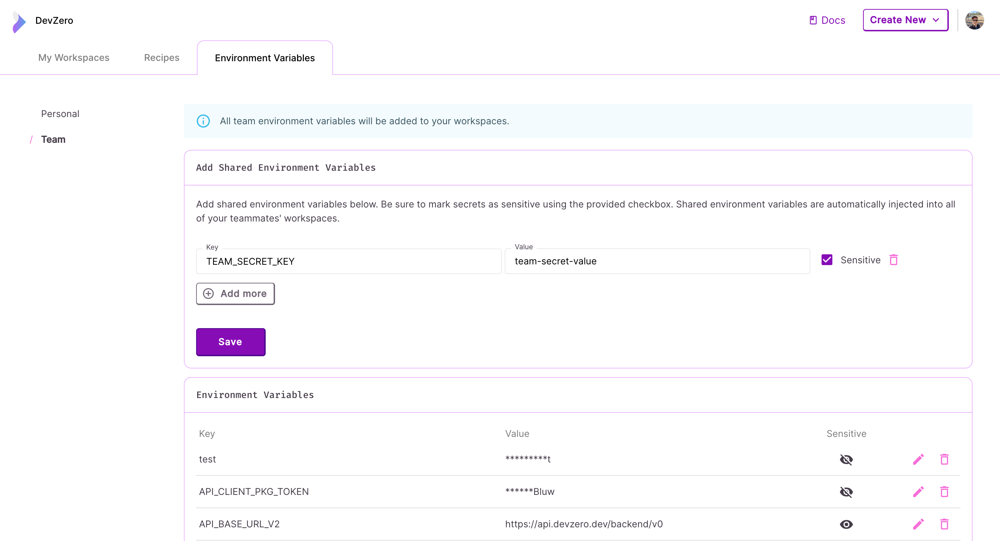
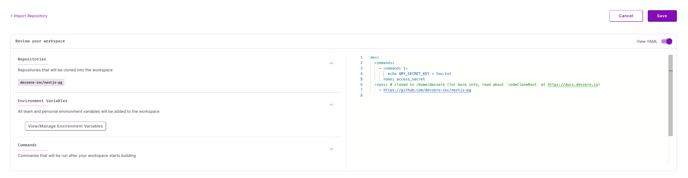

# Personal Secrets

## Saving a secret

Visit the Environment Variables section at https://www.devzero.io/dashboard/settings/environment-variables#team to add, remove or update your secrets.


Make sure the `Sensitive` field **is checked**.


<figure><figcaption>
Team Secrets
</figcaption></figure>

## Using a secret

Using an secret within your workspace is how you would normally use any environment variable (eg: `echo $SECRET_KEY`).

To use it in a build, you can reference it the same way. If your environment variable is called `MY_SECRET_KEY`:
<figure><figcaption>
Secrets during build-stage
</figcaption></figure>

For more info on secrets, visit the main [Secrets](README.md) page.
