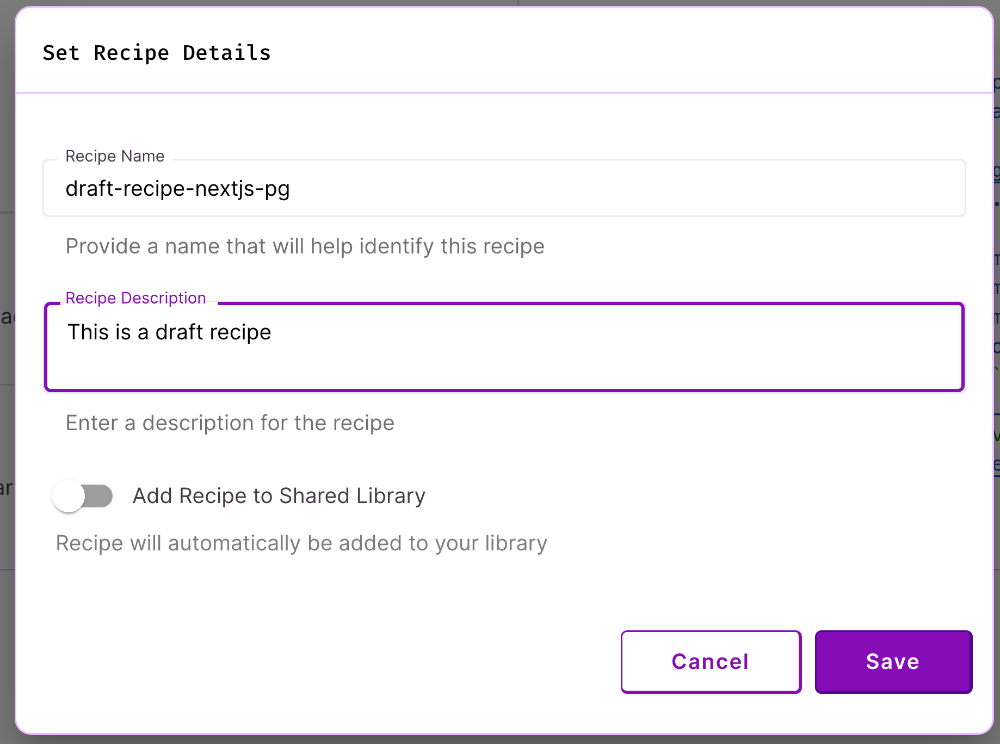

# Overview

## What is a Recipe?

[Recipe specifications](../references/terminology.md#recipe) define the resources, infrastructure, and configuration of a DevZero [workspace](../references/terminology.md#workspace). They are expressed in YAML. DevZero stores and version-controls your team's recipe specifications. Recipes can be shared your team via the [Recipe Library](../references/terminology.md#recipe-library). Members of your DevZero team can use this centralized library to launch workspaces. This ensures that your team always uses up-to-date and consistent environments for their development and testing. Recipe specifications most commonly define the "golden path" for the development and testing of a specific application or set of microservices.&#x20;

## Sharing Recipes

You can see your recipes on the [My Recipes](https://www.devzero.io/dashboard/recipes#user) page. By default, recipes are private to the author. If you'd like to share your recipe specification with your team, be sure to toggle the button on the recipe details page to "Add Recipe to Shared Library". We only recommend doing this once you have fully testing and confirmed that your recipe generates a workspace successfully.&#x20;

You can learn more about this on our [Saving Recipes](saving-recipes.md) page.&#x20;

<figure><figcaption>
Save New Recipe with Metadata
</figcaption></figure>
