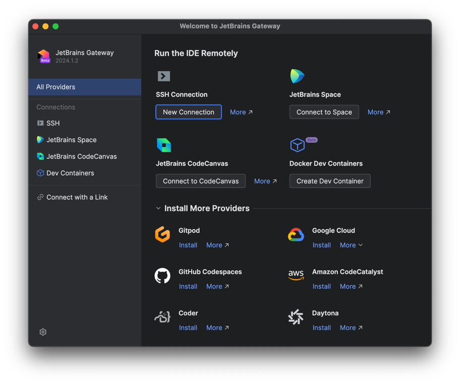
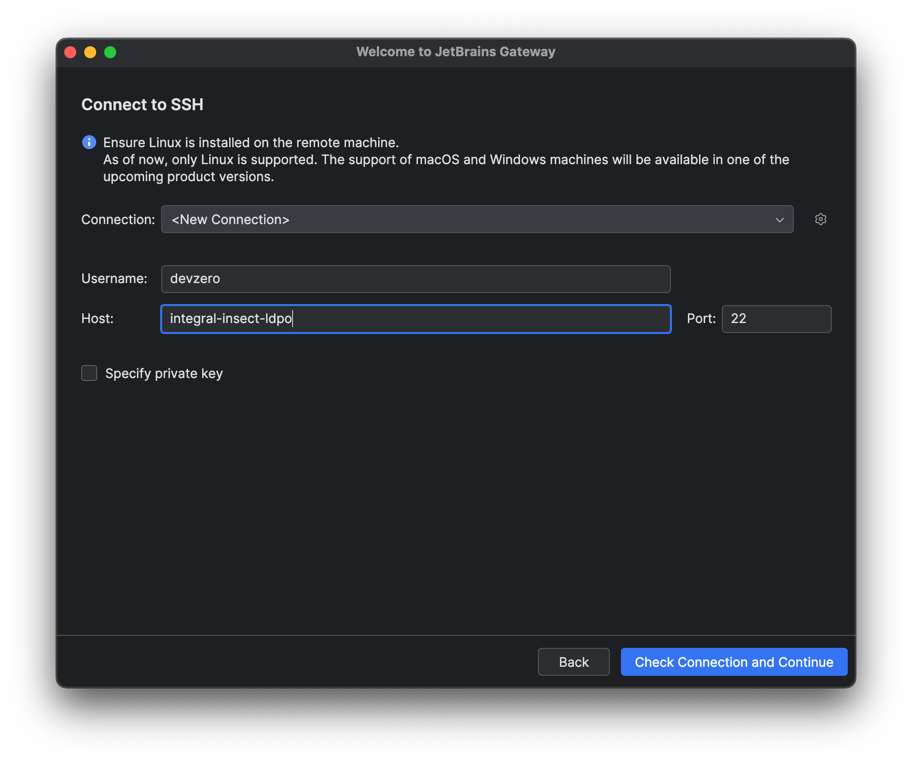
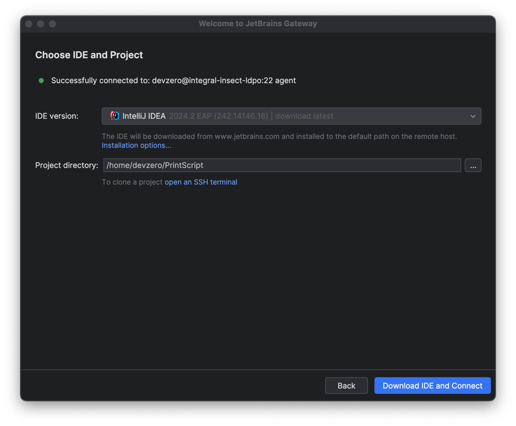
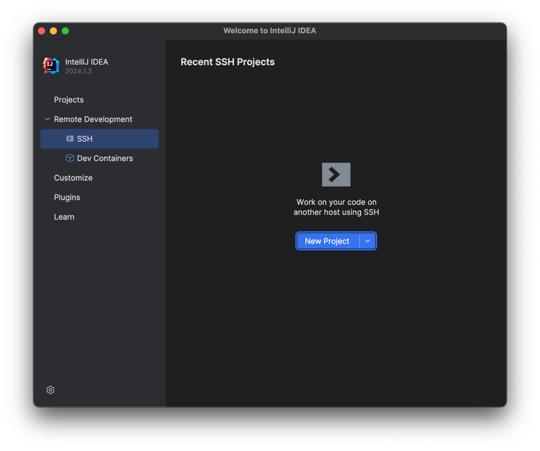
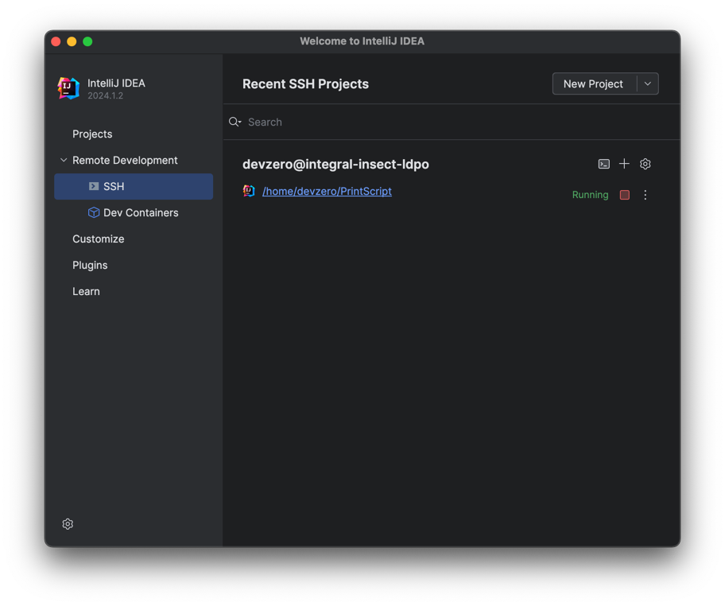

# Connect to a workspace using JetBrains IDEs

## Using Jetbrains Gateway

1. Сlick **New Connection** under the **SSH** connection provider.
   <figure><figcaption>
Connect using SSH
</figcaption></figure>

2. Create a new connection using username "devzero" and the workspace you want to connect to in host. Then click on **Check Connection and Continue**.
   <figure><figcaption>
Specify your workspace
</figcaption></figure>

3. Select the IDE of your preference and the path of your codebase. Then click on **Download IDE and Connect**.
   <figure><figcaption>
Select your IDE
</figcaption></figure>


   The default path for your cloned code is `/home/devzero`.


4. Under **Connections > SSH**, you should see your workspace listed.
   <figure><figcaption>
Your workspaces
</figcaption></figure>

## Using any JetBrains IDE

1. Create a new project under **Remote Development > SSH**.
   <figure><figcaption>
Create Remote Project
</figcaption></figure>

2. Create a new connection using username "devzero" and the workspace you want to connect to in host. Then click on **Check Connection and Continue**.
   <figure><figcaption>
Specify your workspace
</figcaption></figure>

3. Select the IDE of your preference and the path of your codebase. Then click on **Download IDE and Connect**.
   <figure><figcaption>
Select your IDE
</figcaption></figure>


The default path for your cloned code is `/home/devzero`.


4. Under **Remote Development > SSH**, you should see your workspace listed.
   <figure><figcaption>
Your workspaces
</figcaption></figure>
