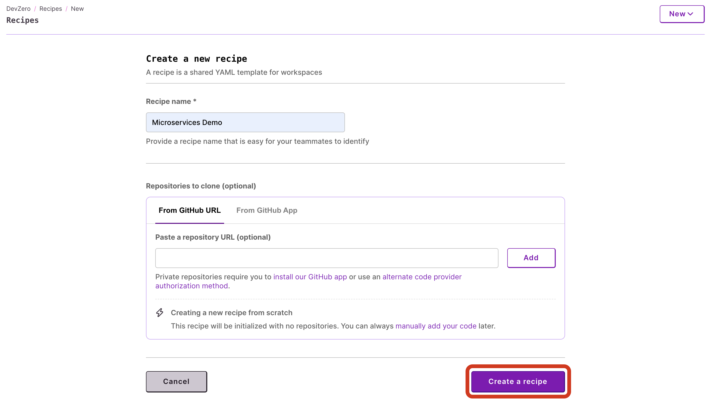

# Workspace Cluster

User workspaces are deploying with an [ephemeral, namespaced Kubernetes cluster](../references/terminology.md#workspace-cluster). If you need to interact with this cluster...

If you prefer video from, [click here](kubernetes-cluster.md#tutorial-video) for a 5min video!

## From Anywhere

To view the config, run


```bash
dz workspace kubeconfig <workspace-name>

# to get the workspace name
dz workspace ls
```


To write the config to the default Kubernetes configuration location, run


```bash
dz workspace kubeconfig <workspace-name> --update-kubeconfig
```


Then run commands like


```bash
kubectl get pods
```


## From Inside a DevBox

When inside a [DevBox](../references/terminology.md#devbox) context (i.e. when connected to a workspace), the CLI is able to retrieve environmental information from `/etc/devzero`. It is possible to replace the `<workspace-name>` with `.`. For example,


```bash
dz workspace kubeconfig . --update-kubeconfig
```


Then run commands like


```bash
kubectl get pods
```



DevZero reserves the `default` namespace for it's managed deployments. **Do not** operate on this namespace. Adding or removing resources in this namespace will lead to undocumented behaviors and cause potential data loss.



```bash
dz workspace kubeconfig -h 
This kubeconfig can be used by any kubectl to interact with the virtual cluster backing a workspace.
Usage: kubectl --kubeconfig <(dz ws kubeconfig <workspace_id | workspace_name>) ...

Usage:
  dz workspace kubeconfig <workspace_id | workspace_name> [flags]

Aliases:
  kubeconfig, kc

Flags:
  -h, --help                help for kubeconfig
  -u, --update-kubeconfig   update local kubeconfig (default: $HOME/.kube/config)

Global Flags:
      --verbose   Get detailed output
```


## Tutorial Video

Here's a video covering how you can access and deploy apps to your workspace's Kubernetes cluster...

{% embed url="https://devzero.b-cdn.net/Kubernetes%20demo.mp4" %}

<details>

<summary>Tutorial Steps</summary>

1. Create a recipe that you can use at [devzero.io/dashboard/recipes/new](https://www.devzero.io/dashboard/recipes/new) (give it any name and leave everything else blank and click `Create a recipe`).

<figure><figcaption><p>Recipe with no repo</p></figcaption></figure>

Use the following recipe, then `Save and Build` and then `Publish` once the build completes successfully (it uses Google Cloud Platform's [`microservices-demo`](https://github.com/GoogleCloudPlatform/microservices-demo) repo).


```yaml
version: "3"
build:
  steps:
    - type: apt-get
      packages: ["apt-transport-https", "build-essential", "ca-certificates", "curl", "git", "nano", "software-properties-common", "ssh", "sudo", "tar", "unzip", "vim", "wget", "zip"]
    - type: git-clone
      url: https://github.com/GoogleCloudPlatform/microservices-demo
    - type: command
      command: |
        curl -LO "https://dl.k8s.io/release/$(curl -L -s https://dl.k8s.io/release/stable.txt)/bin/linux/amd64/kubectl"
        sudo install -o root -g root -m 0755 kubectl /usr/local/bin/kubectl && rm kubectl
    - type: command
      command: |
        curl -fsSL -o get_helm.sh https://raw.githubusercontent.com/helm/helm/main/scripts/get-helm-3
        chmod 700 get_helm.sh && ./get_helm.sh && rm get_helm.sh
    - type: command
      command: |
        curl -Lo skaffold https://storage.googleapis.com/skaffold/releases/latest/skaffold-linux-amd64 && \
        sudo install skaffold /usr/local/bin/
    - type: apt-get
      packages: ["docker-ce", "docker-ce-cli", "containerd.io"]
      extra_repositories:
        - key_url: https://download.docker.com/linux/ubuntu/gpg
          repository: https://download.docker.com/linux/ubuntu
          components: []
          distribution: ""
    - type: command
      command: |
        usermod -aG docker devzero
        systemctl enable docker.service
        systemctl enable containerd.service
      user: root
```


Build a workspace from the recipe, and run the following in your terminal:


```bash
dz workspace connect <workspace-name>
```


Then, run the following steps inside the SSH session that's connected to your workspace:


```bash
dz workspace kubeconfig . --update-kubeconfig  # will ask to login
kubectl get pods  # verification                 

cd /home/devzero/microservices-demo
skaffold run --default-repo ttl.sh  # this will take a bit of time since its building multiple docker images (~5mins)
kubectl port-forward --address 0.0.0.0 deployment/frontend 8088:8080
```


To verify that all the pods are running:


```bash
kubectl get pods
```


Visit, `<workspace-name>:8088` in your browser to see the running frontend!

</details>
