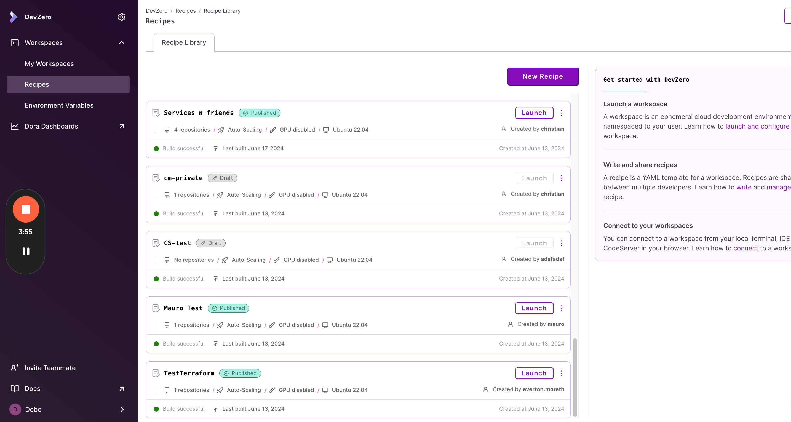
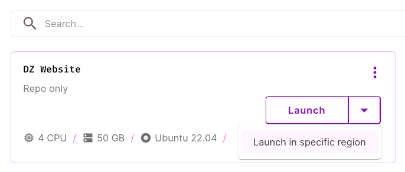
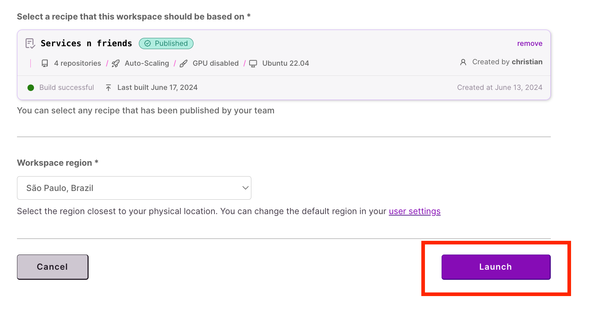

# Regions

Workspaces can be launched in any supported DevZero region, provided your team and subscription tier allow for it. When you sign-up for DevZero, you have a default region set. You can change this preference from your [user settings page](https://www.devzero.io/dashboard/settings/user-settings).

1. To launch a workspace in a certain region, first go to the recipes page at [https://www.devzero.io/dashboard/recipes/recipe-library](https://www.devzero.io/dashboard/recipes/recipe-library)

<figure><figcaption>
Recipe Library
</figcaption></figure>

2. Click on the recipe you want to launch. Then select the appropriate region in the `Workspace region` section:

<figure><figcaption>
Region selector
</figcaption></figure>

3. After you've selected the region you want your workspace to be in, click on `Launch`!

<figure><figcaption>
Launching a workspace in a region
</figcaption></figure>
