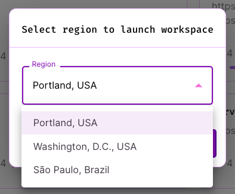

# Regions

Workspaces can be launched in any supported DevZero region, provided your team and subscription tier allows for it. 

To launch a workspace in a certain region, first go to the recipes page at https://www.devzero.io/dashboard/recipes

<figure><figcaption>
Recipe Library
</figcaption></figure>

Then, click on the down-arrow and select `Launch in specific region`

<figure><figcaption>
Region selector
</figcaption></figure>

Then select the appropriate region

<figure><figcaption>
Picking a region
</figcaption></figure>

And click launch!
