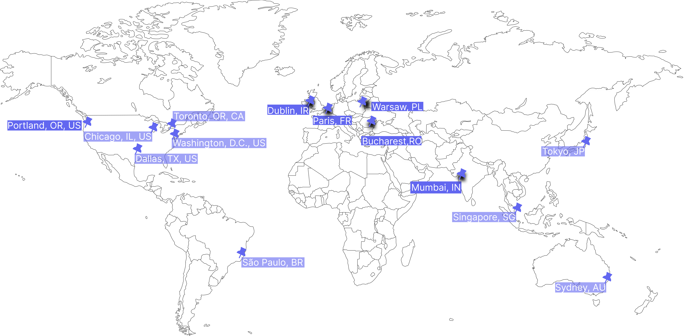

# Supported Regions

<figure><figcaption></figcaption></figure>

| Region Code | City Code  | Geographic Location        | Status               |
| ----------- | ---------- | -------------------------- | -------------------- |
| usw2        | PDX        | Portland, Oregon, USA      | :white\_check\_mark: |
| use1        | IAD        | Washington, D.C., USA      | :white\_check\_mark: |
| sae1        | GRU        | São Paulo, Brazil          | :white\_check\_mark: |
| aps1        | BOM        | Mumbai, India              | :construction:       |
| apse1       | SIN        | Singapore, SG              | :construction:       |
| euw1        | DUB        | Dublin, Ireland            | :construction:       |
| apse2       | SYD        | Sydney, Australia          | :construction:       |
| apne1       | HND        | Tokyo, Japan               | :soon:               |
| -           | OTP        | Bucharest, Romania         | :soon:               |
| -           | DFW        | Dallas, Texas, USA         | :soon:               |
| -           | ORD        | Chicago, Illinois, USA     | :soon:               |
| afs1        | JNB        | Johannesburg, South Africa | :soon:               |
| cac1        | YYZ        | Toronto, Ontario, Canada   | :soon:               |
| -           | WAW        | Warsaw, Poland             | :soon:               |
